import { ConceptTemplate } from '@/features/kb/components/templates/ConceptTemplate'
import { Callout } from '@/features/kb/components/mdx/Callout'

export default function Layout({ children }) {
  return (
    <ConceptTemplate title="Ada">
      {children}
    </ConceptTemplate>
  )
}

Named after Ada Lovelace, the first computer programmer, **Ada** was developed in the late 1970s under a contract from the United States Department of Defense (DoD). Its primary goal was to replace the hundreds of different programming languages used across military hardware with a single, ultra-reliable standard.

## 1. Deep Dive & Mechanics

Ada is a structured, statically typed, imperative, and object-oriented high-level programming language. It is built around the philosophy that **code is read much more often than it is written**. Because of this, Ada prioritizes verbosity, extreme strong typing, and explicit declarations over syntactic sugar or conciseness.

Under the hood, the Ada compiler acts as an aggressive static analyzer. It forces the developer to define exact bounds for data types. If an integer is supposed to represent a day of the month, you do not declare it as an `int` (which could hold millions of values). You declare it as a restricted range: `type Day is range 1 .. 31;`.

If the program attempts to assign the value `32` to a `Day` variable, the program will throw a constraint error. The SPARK subset of Ada takes this further, allowing developers to mathematically prove that these boundary violations can *never happen at runtime*.

## 2. Mathematical / Theoretical Foundation

Ada's design is heavily influenced by **Design by Contract (DbC)**. A contract is a formal agreement between a software component and its callers. In Ada, this is implemented via pre-conditions and post-conditions.

When writing an algorithm, you mathematically guarantee its correctness. For example, if a function calculates the square root of a number $x$, the pre-condition mathematically states $x \ge 0$, and the post-condition states $result \times result \approx x$.

## 3. Real-World Implementation

Here is an example of Ada's strict range typing and task concurrency (multithreading). Notice the explicit verbosity.

```ada
with Ada.Text_IO; use Ada.Text_IO;

procedure Launch_System is

   -- 1. Strictly defined bounds
   type Altitude is range 0 .. 100_000;
   Current_Alt : Altitude := 0;

   -- 2. Concurrency (Tasks)
   task Engine_Monitor;
   
   task body Engine_Monitor is
   begin
      Put_Line("Engine Monitor Started.");
      -- Monitor logic here
   end Engine_Monitor;

begin
   Current_Alt := 50_000;
   Put_Line("Altitude reached: " & Altitude'Image(Current_Alt));
   
   -- Attempting Current_Alt := 150_000; would result in a fatal error!
end Launch_System;
```

## 4. Visualizations

```mermaid
architecture-beta
    group compiler(cloud)[Ada Compilation Workflow]

    service src(document)[Source Code] in compiler
    service parser(server)[Lexical Analysis] in compiler
    service binder(server)[Binder] in compiler
    service spark(server)[SPARK Prover] in compiler
    service exec(disk)[Executable] in compiler

    src:R --> L:parser
    parser:R --> L:binder
    parser:B --> T:spark
    binder:R --> L:exec
```



## 5. Interview Prep

**Q: What is the SPARK subset of Ada?**
**A:** SPARK is a formally defined computer programming language based on a subset of Ada. It removes features that are hard to verify (like dynamic memory allocation) and allows developers to write mathematical proofs. This guarantees the software will be free from runtime exceptions like buffer overflows, division by zero, or null pointer dereferences.

**Q: Explain Ada's approach to concurrency.**
**A:** Ada has built-in concurrency at the language level using constructs called "Tasks" and "Protected Objects," rather than relying entirely on OS-level threading libraries (like `pthreads` in C). Tasks communicate via a mechanism called "Rendezvous," ensuring safe synchronization without manual mutex locks.

**Q: Why is Ada considered more readable than C for critical systems?**
**A:** Ada avoids cryptic symbols and relies on explicit English keywords (`begin`, `end loop`, `procedure`). It also forbids implicit type conversions (coercion), meaning you cannot accidentally add a float to an integer without an explicit cast, preventing massive scientific computing errors.

## 6. Production Use Cases

Ada is not used for typical web development or mobile apps. It is the gold standard for **High-Assurance Systems**.

- **Avionics:** The Boeing 777 fly-by-wire flight software is heavily written in Ada. The Airbus A380 also relies on it for critical flight control.
- **Space Exploration:** NASA and the European Space Agency (ESA) use Ada for satellite control and spacecraft.
- **Air Traffic Control:** The UK's NATS (National Air Traffic Services) uses heavily verified Ada software to manage millions of flights safely.

<Callout icon="shield" title="The Ariane 5 Explosion">
Ironically, one of the most famous software bugs in history occurred in an Ada system. The Ariane 5 rocket exploded 40 seconds after launch because a 64-bit floating-point number was converted into a 16-bit integer, causing an overflow. The variable was not protected by Ada's strict constraints because the engineers disabled the check to save CPU cycles!
</Callout>
