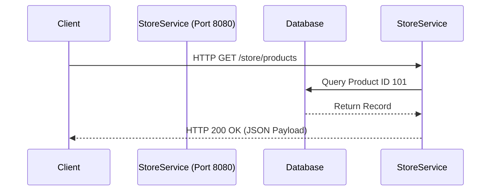

import { ConceptTemplate } from '@/features/kb/components/templates/ConceptTemplate'
import { Callout } from '@/features/kb/components/mdx/Callout'

export default function Layout({ children }) {
  return (
    <ConceptTemplate title="Ballerina">
      {children}
    </ConceptTemplate>
  )
}

**Ballerina** is a relatively new, open-source, statically typed programming language developed by WSO2. Unlike general-purpose languages like Python or Java that treat networking as an afterthought handled by third-party libraries, Ballerina treats **networking as a first-class citizen**.

It is uniquely designed for the modern cloud-native era, where microservices, API integrations, JSON, and network resilience are the core requirements of almost every application.

## 1. Deep Dive & Mechanics

In most languages, making an HTTP request or handling a JSON payload requires importing libraries, setting up complex I/O streams, and manually serializing objects.

In Ballerina, networking concepts (APIs, JSON, XML, endpoints) are built directly into the language's syntax and type system. 

Ballerina uses a **Structural Type System** rather than a Nominal one (like Java). This means that shapes of data (like a JSON payload) can be directly validated against a type definition without writing boilerplate parsing logic. If an API returns a JSON object with a string `name` and int `age`, Ballerina natively understands this shape at compile time.

Additionally, Ballerina programs are automatically visualizable. Every piece of Ballerina code can be instantly translated into a Sequence Diagram, making it incredibly easy to document and understand microservice interactions.

## 2. Mathematical / Theoretical Foundation

Ballerina's approach to network communication is rooted in **Sequence Calculus** and **Actor Models**. When services communicate over a network, Ballerina represents these interactions geometrically. 

Because network calls are guaranteed to fail eventually (due to latency, DNS drops, etc.), Ballerina natively implements the theoretical principles of **Fault Tolerance** directly in the syntax, providing native language constructs for Retries, Timeouts, and Circuit Breakers without needing a library like resilience4j or Istio.

## 3. Real-World Implementation

Here is an example of a simple HTTP API built in Ballerina. Notice how HTTP concepts are native keywords, and JSON is deeply integrated.

```ballerina
import ballerina/http;
import ballerina/io;

// Define a network-bound service on port 8080
service /store on new http:Listener(8080) {

    // A resource function responding to HTTP GET requests
    resource function get products(http:Caller caller, http:Request req) returns error? {
        
        // Native JSON manipulation
        json payload = {
            id: 101,
            name: "Cloud-Native Book",
            price: 29.99
        };

        // Send response back to caller
        check caller->respond(payload);
        io:println("Response sent successfully.");
    }
}
```

## 4. Visualizations



## 5. Interview Prep

**Q: What does it mean that Ballerina treats networking as a "first-class citizen"?**
**A:** It means network concepts like Services, Endpoints, HTTP protocols, and data formats (JSON, XML) are part of the core language syntax, not imported as external libraries. The compiler deeply understands network interactions.

**Q: How does Ballerina handle distributed transactions?**
**A:** Ballerina provides native support for distributed transactions, allowing developers to define a transaction block. If an error occurs in one service, Ballerina can automatically coordinate rollbacks across multiple microservices without requiring the developer to write manual compensation logic (like the Saga pattern).

**Q: Explain Ballerina's structural typing vs Java's nominal typing.**
**A:** In Java (nominal), two classes with identical fields are considered different types because they have different names. In Ballerina (structural), types are defined by their structure. If a JSON payload matches the exact fields of a Ballerina `record`, the compiler accepts it, making API data binding incredibly seamless.

## 6. Production Use Cases

Ballerina is utilized heavily in enterprise integration and cloud orchestration:
- **API Gateways:** Acting as a secure, fast proxy between client applications and internal microservices.
- **Enterprise Service Buses (ESB) Replacement:** Modernizing legacy architectures by replacing heavy ESBs with lightweight, scalable Ballerina microservices.
- **Data Integration:** Rapidly pulling data from Salesforce, transforming the JSON/XML payloads, and pushing it to an internal SQL database.

<Callout icon="info" title="The Sequence Diagram Equivalency">
WSO2 built Ballerina with a powerful IDE plugin. You can drag and drop visual nodes to create a sequence diagram, and the plugin will automatically generate the Ballerina source code. Conversely, you can write the source code, and it will generate the diagram. They have true 1:1 equivalency.
</Callout>
