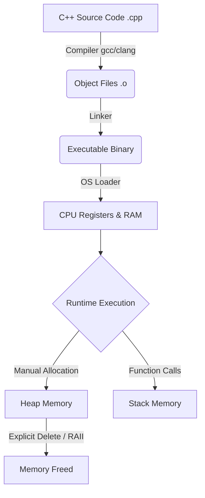

import { ConceptTemplate } from '@/features/kb/components/templates/ConceptTemplate'
import { Callout } from '@/features/kb/components/mdx/Callout'

export default function Layout({ children }) {
  return (
    <ConceptTemplate title="C++">
      {children}
    </ConceptTemplate>
  )
}

Created by Bjarne Stroustrup in 1979 at Bell Labs, **C++** was originally named "C with Classes." It was designed to add object-oriented programming (OOP) and high-level abstractions to the lightning-fast, hardware-level capabilities of the C language.

Today, C++ is the undisputed king of performance-critical software. From AAA video games to high-frequency trading platforms, C++ provides developers with unparalleled control over system memory and CPU cycles.

## 1. Deep Dive & Mechanics

C++ is a statically typed, compiled, multi-paradigm language. Unlike managed languages (like Java or C#) that run on a Virtual Machine and use a Garbage Collector to automatically clean up memory, C++ compiles directly down to raw machine code specific to the target architecture (x86, ARM, etc.).

This raw execution speed comes with immense responsibility. Developers must manually manage the heap using `new` and `delete` (or modern smart pointers). 

Modern C++ (C++11, C++14, C++20) introduced a paradigm shift away from manual raw pointers, introducing RAII (Resource Acquisition Is Initialization). In RAII, resource lifecycle (memory, file handles, mutexes) is bound to the lifespan of an object. When the object goes out of scope, its destructor is automatically called, instantly freeing the resource without the non-deterministic lag of a garbage collector.

## 2. Mathematical / Theoretical Foundation

At a theoretical level, C++'s greatest achievement is **Zero-Cost Abstractions**. 
In computer science, abstraction (like using generic templates, classes, or polymorphism) usually incurs a runtime performance penalty. 

Stroustrup's foundational rule for C++ was: *"What you don't use, you don't pay for. And further: What you do use, you couldn't hand code any better."* 

When a developer uses a C++ `template` to create a generic data structure, the compiler generates a heavily optimized, type-specific version of that code at compile-time (Monomorphization). The resulting machine code executes exactly as fast as if the developer had manually written the raw C code for that specific type, ensuring absolute mathematical efficiency ($O(1)$ overhead).

## 3. Real-World Implementation

Here is an example of Modern C++ utilizing RAII with Smart Pointers to ensure memory safety without a garbage collector.

```cpp
#include <iostream>
#include <memory>
#include <string>

class HighPerformanceEngine {
public:
    HighPerformanceEngine() {
        std::cout << "Engine initialized in memory." << std::endl;
    }
    ~HighPerformanceEngine() {
        std::cout << "Engine destroyed, memory freed safely." << std::endl;
    }
    void rev() {
        std::cout << "Vroom!" << std::endl;
    }
};

int main() {
    // A scope block
    {
        // Using C++14 std::make_unique. 
        // This allocates memory on the heap safely.
        std::unique_ptr<HighPerformanceEngine> engine = std::make_unique<HighPerformanceEngine>();
        
        engine->rev();
        
    } // The scope ends here. 'engine' goes out of scope.
      // The destructor is automatically called, and memory is instantly freed!

    std::cout << "Program exiting cleanly." << std::endl;
    return 0;
}
```

## 4. Visualizations



## 5. Interview Prep

**Q: What is a Virtual Function, and how does a VTable work?**
**A:** A virtual function allows a derived class to override a base class method, achieving runtime polymorphism. Under the hood, the compiler creates a Virtual Table (VTable) for the class—an array of function pointers. When the virtual function is called on an object pointer, the program looks up the actual function address in the VTable at runtime. This incurs a slight performance penalty (dynamic dispatch).

**Q: Explain RAII (Resource Acquisition Is Initialization).**
**A:** RAII is the core memory management philosophy of C++. It dictates that a resource (memory, file, socket) should be acquired in an object's constructor and released in its destructor. Since C++ guarantees that destructors are called when an object goes out of scope, resources are deterministically freed without needing a Garbage Collector.

**Q: What is the difference between `std::unique_ptr` and `std::shared_ptr`?**
**A:** `unique_ptr` represents exclusive ownership of a heap object; it cannot be copied, only moved, and has zero runtime overhead. `shared_ptr` allows multiple pointers to own the same object, using an internal reference counter. When the reference count drops to zero, the memory is freed.

## 6. Production Use Cases

If you need pure performance, you write it in C++:
- **Video Game Engines:** Unreal Engine is entirely written in C++. Games require rendering 60+ frames per second, making garbage collection pauses unacceptable.
- **High-Frequency Trading (HFT):** Wall Street trading algorithms that must execute trades in microseconds use C++ to minimize network and memory latency.
- **Operating Systems & Browsers:** Portions of Windows, macOS, and the core rendering engines of Chrome (Blink/V8) and Firefox (Gecko) are built in C++.

<Callout icon="warning" title="Memory Leaks & Segfaults">
Because C++ gives you raw access to memory via pointers, accessing memory that has already been freed or attempting to read past the bounds of an array results in an immediate Segmentation Fault, crashing the entire application. Modern C++ mitigates this via Smart Pointers, but the danger is always present.
</Callout>