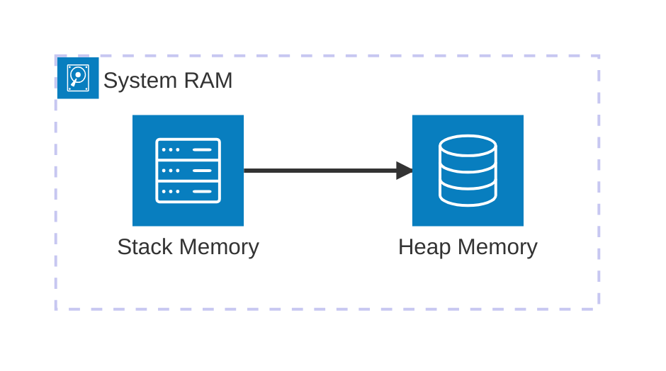

import { ConceptTemplate } from '@/features/kb/components/templates/ConceptTemplate'
import { Callout } from '@/features/kb/components/mdx/Callout'

export default function Layout({ children }) {
  return (
    <ConceptTemplate title="C">
      {children}
    </ConceptTemplate>
  )
}

Created by Dennis Ritchie at Bell Labs in 1972 to rewrite the UNIX operating system, **C** is arguably the most important programming language in history. 

It acts as the bedrock of modern computing. Almost every modern higher-level language (Python, Java, JavaScript) has its core interpreter or virtual machine written in C. It provides the closest possible interaction with hardware while remaining human-readable.

## 1. Deep Dive & Mechanics

C is a compiled, imperative, procedural language. It does not have objects, classes, or garbage collection. It views data as raw bytes in memory.

The defining characteristic of C is its extensive use of **Pointers**. A pointer is a variable that stores the raw hexadecimal memory address of another variable in RAM. By manipulating pointers, a developer can traverse arrays, construct linked lists, and interact directly with hardware registers without any abstraction getting in the way.

C relies heavily on the Standard Library (`libc`), which provides fundamental functions like `printf` for console output and `malloc` / `free` for dynamic heap memory allocation. Because C trusts the programmer implicitly, it does absolutely no bounds checking. If you allocate an array of 5 integers and write to the 10th index, C will happily overwrite random memory, potentially corrupting the OS or causing a catastrophic security vulnerability (Buffer Overflow).

## 2. Mathematical / Theoretical Foundation

C's architecture is deeply tied to the **Von Neumann Architecture** of modern computers, consisting of a CPU, memory, and I/O devices. 

When analyzing the time and space complexity of algorithms in C, developers must consider the hardware-level implications of memory access. For example, traversing a contiguous array in C is mathematically $O(N)$, but due to **CPU Cache Spatial Locality**, it executes significantly faster in hardware than traversing a Linked List, even though a Linked List traversal is also theoretically $O(N)$. C forces the developer to understand how the L1/L2 processor caches fetch blocks of bytes.

## 3. Real-World Implementation

Here is an example demonstrating manual memory allocation and pointers. Notice the raw interaction with bytes using the `sizeof` operator.

```c
#include <stdio.h>
#include <stdlib.h>

int main() {
    // 1. A pointer that will hold the memory address of our array
    int *array;
    int size = 5;

    // 2. Dynamically allocate memory on the Heap
    // We request (5 * 4 bytes) = 20 bytes of continuous memory
    array = (int*) malloc(size * sizeof(int));

    if (array == NULL) {
        printf("Memory allocation failed!\n");
        return 1;
    }

    // 3. Populate the array via pointer arithmetic
    for (int i = 0; i < size; i++) {
        array[i] = i * 10;
        printf("Address: %p | Value: %d\n", (void*)&array[i], array[i]);
    }

    // 4. Manual cleanup is strictly required to prevent a Memory Leak
    free(array);

    return 0;
}
```

## 4. Visualizations


*(When `malloc` is called, a pointer is stored in the Stack, but the actual data payload is reserved in the Heap).*

## 5. Interview Prep

**Q: What is a pointer, and how does it differ from a reference?**
**A:** A pointer is a variable that stores a raw memory address. You can perform arithmetic on pointers (e.g., `ptr + 1` moves to the next memory block) and they can be reassigned or be NULL. C does not have references (those were introduced in C++). A reference acts as an immutable alias to an existing variable and cannot be NULL.

**Q: Explain what a Buffer Overflow vulnerability is.**
**A:** Because C does no bounds checking, if a user provides an input string that is larger than the memory buffer allocated to store it (e.g., using the unsafe `gets()` function), the excess data will spill over and overwrite adjacent memory. Attackers use this to overwrite the function return pointer, hijacking execution to run malicious shellcode.

**Q: What is a Memory Leak in C?**
**A:** A memory leak occurs when a programmer allocates heap memory using `malloc` or `calloc`, but forgets to release it using `free` before the pointer goes out of scope. The memory remains locked and inaccessible. If this happens repeatedly (e.g., inside a loop or server process), the system will eventually run out of RAM and crash.

## 6. Production Use Cases

C is utilized wherever the highest possible efficiency and minimal footprint are required:
- **Operating Systems:** The Linux Kernel, Windows core, and macOS XNU kernel are primarily written in C.
- **Embedded Systems:** Microcontrollers in cars, microwaves, and pacemakers run C code because it operates beautifully with only a few kilobytes of RAM.
- **Interpreters:** CPython (the standard implementation of Python) and the JVM (Java Virtual Machine) are written in C/C++.

<Callout icon="danger" title="Undefined Behavior">
The C standard frequently uses the phrase "Undefined Behavior" (UB). If a program performs an illegal operation (like shifting an integer by a negative number, or reading an uninitialized variable), the compiler is not required to throw an error. It is allowed to do absolutely anything—crash, produce random numbers, or appear to work normally. Finding UB bugs is notoriously difficult.
</Callout>