import { ConceptTemplate } from '@/features/kb/components/templates/ConceptTemplate'
import { Callout } from '@/features/kb/components/mdx/Callout'

export default function Layout({ children }) {
  return (
    <ConceptTemplate title="Delphi-Object Pascal">
      {children}
    </ConceptTemplate>
  )
}

**Delphi** (technically an IDE built around the **Object Pascal** language) is one of the most historically significant programming environments in software engineering. Developed by Borland in 1995 (lead architect Anders Hejlsberg, who later created C# and TypeScript), Delphi revolutionized how desktop applications were built.

Before Delphi, building a Windows GUI application using C++ and the Win32 API was a tortuous, deeply complex process. Delphi introduced **RAD (Rapid Application Development)** through a visual drag-and-drop component system (the VCL), backed by a blazingly fast, statically typed, compiled object-oriented language.

## 1. Deep Dive & Mechanics

Delphi uses the **Object Pascal** language, which is an object-oriented extension of the classic Pascal language.

Mechanically, Delphi is a **Single-Pass Compiler**. Unlike C++, which requires multiple passes to resolve headers and macros, Delphi's compiler reads the source code exactly once from top to bottom. This architectural decision makes Delphi's compilation speed legendary—even in the 1990s, it could compile massive enterprise applications in seconds, a feat that C++ compilers struggled with for decades.

Delphi generates raw, native, statically linked machine code executables. There is no runtime VM (like Java) or JIT compiler (like .NET). You compile the program, and you get a single `.exe` file that requires zero dependencies to run on a target machine.

## 2. Mathematical / Theoretical Foundation

Delphi was one of the earliest mainstream pioneers of **Component-Oriented Programming (COP)**.

While Object-Oriented Programming (OOP) focuses on classes and inheritance, Component-Oriented Programming focuses on independent, interchangeable software modules (Components) that can be manipulated visually at design time. Theoretically, this relies heavily on **Runtime Type Information (RTTI)**, which allows the Delphi IDE to inspect compiled classes on the fly and expose their properties (like a Button's Color or Width) to a visual Object Inspector, dynamically linking the visual UI to the underlying Pascal code.

## 3. Real-World Implementation

Here is a look at what modern Object Pascal looks like. Notice the strict separation of the interface (declaration) and the implementation, a hallmark of Pascal's design for readability and strict typing.

```pascal
unit PlayerModule;

// 1. The Interface section defines WHAT the unit does.
interface

uses
  System.SysUtils;

type
  // Define a class inheriting from TObject
  TPlayer = class(TObject)
  private
    FName: String;
    FScore: Integer;
  public
    constructor Create(const AName: String; AScore: Integer);
    procedure AddScore(Points: Integer);
    function GetStatus: String;
    
    // Properties define getter/setter behavior
    property Name: String read FName;
    property Score: Integer read FScore;
  end;

// 2. The Implementation section defines HOW the unit does it.
implementation

constructor TPlayer.Create(const AName: String; AScore: Integer);
begin
  FName := AName;
  FScore := AScore;
end;

procedure TPlayer.AddScore(Points: Integer);
begin
  // Inc is a highly optimized built-in for incrementing
  Inc(FScore, Points); 
end;

function TPlayer.GetStatus: String;
begin
  // String formatting
  Result := Format('Player: %s | Score: %d', [FName, FScore]);
end;

end.
```

## 4. Visualizations

```mermaid
architecture-beta
    group delphi(cloud)[Delphi Rapid Application Development]

    service ide(server)[Visual Form Designer] in delphi
    service vcl(database)[VCL Component Library] in delphi
    service pascal(document)[Object Pascal Source] in delphi
    service compiler(server)[Single-Pass Native Compiler] in delphi
    service exe(disk)[Standalone Executable (.exe)] in delphi

    ide:B --> T:vcl
    vcl:R --> L:pascal
    pascal:B --> T:compiler
    compiler:B --> T:exe
```



## 5. Interview Prep

**Q: Why was Delphi's compilation speed so vastly superior to C++?**
**A:** C++ relies on a preprocessor and `#include` headers, meaning the compiler often has to parse the exact same massive header files thousands of times for a single build. Delphi uses a strict Module (Unit) system and a single-pass compiler architecture. Once a Unit is compiled, its interface is cached, and the compiler never needs to parse it again, resulting in compilation speeds orders of magnitude faster than C++.

**Q: What is the VCL (Visual Component Library)?**
**A:** The VCL is Delphi's object-oriented framework that wraps the complex, low-level Windows API into easily manageable, reusable components (like Buttons, Grids, and Sockets). It allows developers to visually build applications by dragging and dropping these components onto a form, drastically reducing development time.

**Q: Is Delphi still used today?**
**A:** Yes! While it lost massive market share to C# and .NET in the 2000s, it maintains a strong niche in enterprise software, POS (Point of Sale) systems, and legacy medical/financial software. Modern Delphi (maintained by Embarcadero) now compiles natively for Windows, macOS, iOS, Android, and Linux from a single codebase using the FireMonkey (FMX) framework.

## 6. Production Use Cases

Delphi's ability to produce single-binary, high-performance applications made it the tool of choice for many legendary programs:
- **FL Studio (FruityLoops):** One of the most popular Digital Audio Workstations in the world was entirely written in Delphi.
- **Skype (Original Versions):** The original Windows desktop client for Skype was built using Delphi.
- **Enterprise Software:** Countless warehouse management, banking, and retail POS systems written in the late 90s and early 2000s are still actively maintained in Delphi today due to the extreme difficulty of rewriting millions of lines of Object Pascal into C#.

<Callout icon="info" title="The Architect's Legacy">
Anders Hejlsberg, the chief architect of Delphi, was heavily recruited by Microsoft in 1996. He took the incredibly successful concepts of Delphi (RAD, components, and properties) and used them as the direct foundation for designing **C#** and the .NET Framework, effectively transferring Delphi's DNA into the modern Microsoft ecosystem.
</Callout>
