import { ConceptTemplate } from '@/features/kb/components/templates/ConceptTemplate'
import { Callout } from '@/features/kb/components/mdx/Callout'

export default function Layout({ children }) {
  return (
    <ConceptTemplate title="Objective-C">
      {children}
    </ConceptTemplate>
  )
}

**Objective-C** is a general-purpose, object-oriented programming language that adds Smalltalk-style messaging to the C programming language. Created in the early 1980s by Brad Cox and Tom Love, it was subsequently licensed by Steve Jobs for his NeXT company, and ultimately became the absolute foundation of Apple's entire software ecosystem (macOS and iOS) for over two decades.

If you have ever used an iPhone prior to 2018, every single app you interacted with was built using Objective-C and the Cocoa Touch framework.

## 1. Deep Dive & Mechanics

Objective-C is a **strict superset of C**. This means that any valid C program is a valid Objective-C program. The language simply adds object-oriented capabilities on top of C via a highly dynamic runtime.

Its defining mechanic is its **Messaging System**. 
In languages like C++ or Java, when you call a method on an object (`car.drive()`), the compiler mathematically links that method call to a specific memory address at compile-time (Static Binding). 
Objective-C uses Dynamic Binding (like Smalltalk or Ruby). You do not "call methods" in Objective-C; you **"send messages"**. When you write `[car drive]`, the compiler does not link a memory address. Instead, at runtime, the Objective-C Runtime Engine looks at the `car` object, asks if it can respond to the `"drive"` message, and dynamically routes it. If the object cannot respond, the app crashes with the infamous `unrecognized selector sent to instance` error.

## 2. Mathematical / Theoretical Foundation

Objective-C's dynamic messaging relies on **Hash Tables and the Dispatch Engine (`objc_msgSend`)**.

Every class in Objective-C is represented as a C struct containing a pointer to its superclass and a "Dispatch Table" (a hash map linking string selectors like `"drive"` to function pointers). When a message is sent, the highly optimized, assembly-written `objc_msgSend` function executes. It takes the object, looks up its class's dispatch table, hashes the selector, and finds the C-function pointer. 

Because of this mathematical indirection, developers can do incredible things at runtime: you can "swizzle" methods, actively swapping the implementation of `[car drive]` with `[boat sail]` while the app is running!

## 3. Real-World Implementation

Here is an example demonstrating Objective-C's unique syntax (bracket notation for messaging) and its separation of Interface (`.h`) and Implementation (`.m`) files.

```objc
// --- Player.h (Interface file) ---
#import <Foundation/Foundation.h>

// 1. Defining the class interface. Inherits from NSObject.
@interface Player : NSObject

// 2. Defining properties (automatically generates getters/setters)
@property (nonatomic, strong) NSString *name;
@property (nonatomic, assign) NSInteger score;

// 3. Defining a method. 
// Syntax: - (returnType)methodName:(argType)argName;
- (instancetype)initWithName:(NSString *)name;
- (void)addScore:(NSInteger)points;

@end


// --- Player.m (Implementation file) ---
#import "Player.h"

@implementation Player

// 4. Constructor implementation
- (instancetype)initWithName:(NSString *)name {
    self = [super init]; // Send 'init' message to superclass
    if (self) {
        _name = name; // Access backing instance variable
        _score = 0;
    }
    return self;
}

- (void)addScore:(NSInteger)points {
    self.score += points;
    // 5. Sending messages using Bracket Notation [receiver message]
    NSLog(@"%@ now has %ld points!", self.name, (long)self.score);
}

@end
```

## 4. Visualizations

```mermaid
architecture-beta
    group objc(cloud)[Objective-C Dynamic Messaging]

    service caller(server)[Sender Object] in objc
    service msg_send(database)[objc_msgSend (C/Assembly)] in objc
    
    group receiver_class(server)[Receiver Class Struct] in objc
    service dispatch(document)[Method Dispatch Table] in receiver_class
    
    service c_func(disk)[Compiled C Function Block] in objc

    caller:B --> T:msg_send
    msg_send:R --> L:dispatch
    dispatch:B --> T:c_func
```



## 5. Interview Prep

**Q: What is the difference between calling a method in C++ and sending a message in Objective-C?**
**A:** In C++, method calls are mostly resolved at compile-time (Static Binding). The compiler hardcodes the memory address of the function to execute. In Objective-C, methods are resolved entirely at runtime (Dynamic Binding). The sender sends a string "selector" to the receiver, and the Objective-C Runtime dynamically looks up the function pointer in the receiver's dispatch table.

**Q: What is Method Swizzling?**
**A:** Because Objective-C uses dynamic dispatch tables at runtime, Method Swizzling is the process of intercepting those tables and swapping the implementations of two methods while the program is running. It is often used for logging, analytics, or hacking third-party frameworks by replacing their default behavior with custom logic.

**Q: What is ARC (Automatic Reference Counting)?**
**A:** Objective-C does not use a Garbage Collector. Originally, developers had to manually call `[object retain]` and `[object release]` to manage memory. Apple introduced ARC to automate this. ARC is a compiler feature that mathematically analyzes your code and automatically inserts the `retain` and `release` calls at exactly the right places during compilation, ensuring objects are deallocated when no longer needed without the overhead of a runtime GC pause.

## 6. Production Use Cases

Objective-C is a legacy language. Apple introduced Swift in 2014, and practically all new iOS/macOS development is done in Swift. However, Objective-C remains highly relevant:
- **Massive Legacy Codebases:** Apps like Facebook, Uber, and WhatsApp still have millions of lines of heavily tested Objective-C code powering their core infrastructure that would be too expensive to rewrite in Swift.
- **Apple's Core Frameworks:** Many of Apple's foundational frameworks (like Foundation and UIKit) are still heavily rooted in Objective-C under the hood. Swift relies heavily on Objective-C interoperability to function on iOS.
- **Reverse Engineering & Jailbreaking:** Because the Objective-C runtime is so dynamic, hackers and security researchers rely on Objective-C to write tweaks and injected payloads that "swizzle" methods in compiled apps on jailbroken iOS devices.

<Callout icon="warning" title="The Syntax Barrier">
Objective-C's syntax is notoriously bizarre to developers coming from Java or Python. The heavy use of `[]` brackets for method calls, the `@` symbol for strings (`@"Hello"`), and the extreme verbosity of its method names (e.g., `stringByReplacingOccurrencesOfString:withString:`) make it a notoriously difficult language to read for beginners.
</Callout>
