import { ConceptTemplate } from '@/features/kb/components/templates/ConceptTemplate'
import { Callout } from '@/features/kb/components/mdx/Callout'

export default function Layout({ children }) {
  return (
    <ConceptTemplate title="Pascal">
      {children}
    </ConceptTemplate>
  )
}

**Pascal** is an imperative and procedural programming language designed by Niklaus Wirth in 1970. Named in honor of the French mathematician Blaise Pascal, it was created with a very specific academic goal: to teach students structured programming and data structuring.

In the 1970s and 1980s, the programming landscape was dominated by BASIC (which relied heavily on chaotic `GOTO` statements, resulting in unreadable "spaghetti code") and C (which was powerful but dangerous due to unchecked pointers). Pascal revolutionized computer science education by strictly enforcing block structures, strong static typing, and logical program flow.

## 1. Deep Dive & Mechanics

Pascal is mechanically famous for its **Strictly Structured Blocks**. 
Unlike C (which uses `{}` braces), Pascal uses explicit, English-readable `begin` and `end` keywords to demarcate blocks of code. Furthermore, Pascal enforces a strict declaration order. In a Pascal program, you *must* declare your constants, then your types, then your variables, then your procedures, and *only then* can you write the main execution block.

This rigid mechanical structure was not a limitation; it was a feature. It mathematically forced students to think about the architecture and memory layout of their programs before writing a single line of logic.

Pascal is statically typed and compiled. It pioneered the concept of user-defined data types (Records and Sets), allowing programmers to model complex real-world data securely, completely bypassing the memory unsafety of raw C structs.

## 2. Mathematical / Theoretical Foundation

Pascal's foundation is built entirely upon **Structured Program Theorem (Böhm-Jacopini theorem)**.

This theoretical mathematical theorem states that *any* computable function can be implemented using exactly three control structures: 
1. **Sequence:** Executing one subprogram, then another.
2. **Selection (if-then-else):** Executing a subprogram based on a boolean.
3. **Iteration (while loop):** Executing a subprogram repeatedly.

Prior to Pascal, languages heavily relied on `GOTO` (unconditional jumps), which mathematically broke this theorem and made mathematically proving the correctness of a program nearly impossible. Pascal was designed to mathematically enforce Structured Programming, heavily restricting `GOTO` and providing first-class constructs for the three foundational control structures.

## 3. Real-World Implementation

Here is an example demonstrating Pascal's strict block structure, strong typing, and highly readable syntax.

```pascal
// 1. Program Declaration
program EmployeeManagement;

// 2. Type definitions must occur before variables
type
  // Defining an enumerated type
  TRole = (Manager, Developer, Designer);
  
  // Defining a Record (similar to a C Struct)
  TEmployee = record
    ID: Integer;
    Name: String[50]; // Fixed length string for memory safety
    Role: TRole;
    Salary: Real;
  end;

// 3. Variable declarations
var
  Emp1: TEmployee;

// 4. Procedure (A function that does not return a value)
procedure PrintEmployee(Emp: TEmployee);
begin
  WriteLn('--- Employee Details ---');
  WriteLn('ID: ', Emp.ID);
  WriteLn('Name: ', Emp.Name);
  WriteLn('Salary: $', Emp.Salary:0:2); // Formatting Real to 2 decimal places
end;

// 5. Main Execution Block
begin
  // Safe, structured initialization
  Emp1.ID := 101;
  Emp1.Name := 'Alice Turing';
  Emp1.Role := Developer;
  Emp1.Salary := 85000.50;

  PrintEmployee(Emp1);
end. // Notice the period denoting the absolute end of the program
```

## 4. Visualizations

```mermaid
architecture-beta
    group pascal_structure(cloud)[Strict Pascal Program Architecture]

    service prog(document)[Program Header] in pascal_structure
    service consts(database)[1. Constants (const)] in pascal_structure
    service types(database)[2. User Types (type)] in pascal_structure
    service vars(database)[3. Variables (var)] in pascal_structure
    service procs(server)[4. Procedures/Functions] in pascal_structure
    service main(server)[5. Main Execution Block (begin...end.)] in pascal_structure

    prog:B --> T:consts
    consts:B --> T:types
    types:B --> T:vars
    vars:B --> T:procs
    procs:B --> T:main
```



## 5. Interview Prep

**Q: Why was Pascal so influential in the 1980s?**
**A:** Pascal was the first language designed explicitly to teach good software engineering practices. By enforcing strong static typing, removing the necessity of raw memory pointers, and forcing developers to use `begin/end` blocks instead of spaghetti `GOTO` jumps, it trained an entire generation of developers in Structured Programming. 

**Q: What is the difference between a Function and a Procedure in Pascal?**
**A:** A Function mathematically returns a value (e.g., `function Add(a, b): Integer`). A Procedure simply executes a block of code and returns nothing (analogous to a `void` function in C or Java). Pascal separates them syntactically to force developers to be explicit about side-effects.

**Q: How does Delphi relate to Pascal?**
**A:** Delphi is essentially "Object Pascal." In the 1990s, Borland took the fast, heavily structured foundation of the Pascal language and added modern Object-Oriented capabilities (Classes, Inheritance, and Interfaces) to create Delphi, which became one of the most popular Windows desktop development environments in history.

## 6. Production Use Cases

Standard, purely academic Pascal is largely dead in modern production. However, its immediate descendants remain highly active:
- **Free Pascal (FPC):** An open-source, modern 64-bit compiler for Object Pascal that targets Windows, Linux, Mac, and iOS. It is heavily used to maintain legacy enterprise systems.
- **Lazarus IDE:** An open-source RAD (Rapid Application Development) environment built on Free Pascal, used to build cross-platform desktop applications (a direct open-source competitor to Delphi).
- **Embedded Education:** Because of its microscopic compiler footprint and strict safety, some universities still use variations of Pascal to teach embedded systems logic before introducing the raw danger of C pointers.

<Callout icon="info" title="The Original Apple Language">
Before Objective-C and Swift, Apple's original Macintosh Operating System (Classic Mac OS in 1984) and almost all of its original software (like MacPaint and MacWrite) were written entirely in Apple's proprietary version of Pascal, because Steve Jobs and the Apple engineers loved its strict, readable structure.
</Callout>
