import { ConceptTemplate } from '@/features/kb/components/templates/ConceptTemplate'
import { Callout } from '@/features/kb/components/mdx/Callout'

export default function Layout({ children }) {
  return (
    <ConceptTemplate title="Logo">
      {children}
    </ConceptTemplate>
  )
}

Created in 1967 by Wally Feurzeig, Seymour Papert, and Cynthia Solomon, **Logo** is one of the most historically significant educational programming languages ever devised.

While modern educational languages (like Scratch) use visual drag-and-drop blocks, Logo was text-based. Its primary innovation was the introduction of **Turtle Graphics**. Instead of writing code that printed text to a terminal (which is abstract and boring to a child), Logo allowed children to write code that drove a small cursor—a "Turtle"—around a screen. As the Turtle moved, it drew a line. This provided immediate, visual, physical feedback for abstract mathematical concepts like geometry and loops.

## 1. Deep Dive & Mechanics

At its core, Logo is actually a direct adaptation of **Lisp**, the legendary functional programming language created in 1958.

While it is most famous for the Turtle, Logo is a full, Turing-Complete language featuring dynamic typing, robust list-processing capabilities, and recursion. However, its syntax was heavily modified from Lisp to remove the terrifying amount of parentheses, making it read more like plain English commands.

The defining mechanic is the **Stateful Turtle**. The Turtle is essentially an object with a persistent state: it has a coordinate position `(x, y)` and a heading (an angle in degrees). Commands like `FORWARD 100` mathematically calculate a new position based on the current heading using trigonometry, and draw a line vector from the old state to the new state.

## 2. Mathematical / Theoretical Foundation

Logo was heavily inspired by the psychological theories of **Jean Piaget (Constructivism)**.

Seymour Papert believed that children learn best not by being lectured to, but by building and experimenting with physical or mental models (Constructivism). In mathematics, teaching a child the concept of a 360-degree angle using a protractor on paper is difficult. In Logo, if a child wants to draw a square, they must mentally step into the shoes of the Turtle: "I walk forward, I turn 90 degrees right, I walk forward..." 

This theoretical concept is called **Body Syntonicity**. The child uses their own physical understanding of space and movement to debug their mathematical logic on the screen.

## 3. Real-World Implementation

Here is an example demonstrating Logo's incredibly simple command syntax, looping structures, and how recursion is used to draw complex fractals.

```logo
; 1. Comments in Logo start with a semicolon

; 2. Basic Turtle Graphics
; Draw a simple square
FORWARD 100 ; Move the turtle forward 100 pixels
RIGHT 90    ; Rotate the turtle 90 degrees clockwise
FORWARD 100
RIGHT 90
FORWARD 100
RIGHT 90
FORWARD 100
RIGHT 90

; 3. The REPEAT Loop
; This does the exact same thing as above, but teaches the concept of iteration.
CLEARSCREEN
REPEAT 4 [
  FORWARD 100
  RIGHT 90
]

; 4. Defining a Procedure (Function)
; The 'TO' keyword begins a function definition.
TO DRAWTRIANGLE :SIZE
  REPEAT 3 [
    FORWARD :SIZE
    RIGHT 120 ; 360 / 3 = 120 degrees
  ]
END

; Call the procedure with an argument
DRAWTRIANGLE 150

; 5. Recursion (Fractals)
; Logo is famous for teaching recursion via fractal trees.
TO DRAW_TREE :LENGTH
  IF :LENGTH < 10 [STOP]      ; Base case to prevent infinite recursion
  FORWARD :LENGTH
  LEFT 30                     ; Branch left
  DRAW_TREE :LENGTH * 0.7     ; Recursive call (draw smaller tree)
  RIGHT 60                    ; Turn to branch right
  DRAW_TREE :LENGTH * 0.7     ; Recursive call
  LEFT 30                     ; Return to original heading
  BACK :LENGTH                ; Return to original position
END

CLEARSCREEN
DRAW_TREE 100
```

## 4. Visualizations

```mermaid
architecture-beta
    group logo_env(cloud)[Logo Execution Architecture]

    service child(server)[Student (Typing Commands)] in logo_env
    
    group interp(server)[Logo Interpreter (Lisp Dialect)] in logo_env
    service lex(document)[Command Parser (FORWARD, RIGHT)] in interp
    service state(database)[Turtle State (X, Y, Angle)] in interp
    
    service trig(server)[Trigonometric Math Engine] in logo_env
    service screen(disk)[Canvas Renderer (Screen)] in logo_env

    child:B --> T:lex
    lex:R --> L:state
    state:B --> T:trig
    trig:B --> T:screen
```



## 5. Interview Prep

**Q: What is Turtle Graphics?**
**A:** Turtle graphics is a vector graphics methodology where a cursor (the "turtle") is given relative commands (like "move forward" or "turn right") rather than absolute Cartesian coordinates (like "draw a line from 0,0 to 100,100"). This relative movement makes it incredibly intuitive for beginners to understand and program geometric shapes.

**Q: What underlying language is Logo based on?**
**A:** Logo is a dialect of Lisp. While it hides the massive amount of parentheses, it retains Lisp's dynamic typing, its treatment of code as data (homoiconicity), and its incredibly powerful list-processing and recursive capabilities.

**Q: Why was Logo so successful in schools in the 1980s?**
**A:** Before Logo, learning to program meant looking at abstract, scrolling text on a black terminal. Logo provided immediate, colorful, graphical feedback. If a child typed `RIGHT 90` instead of `LEFT 90`, they immediately saw the Turtle turn the wrong way, allowing for instant, intuitive debugging.

## 6. Production Use Cases

Logo is entirely educational, but its primary concept (Turtle Graphics) has been ported to almost every major language in existence:
- **Python's `turtle` Module:** If you teach a child Python today, you almost certainly use the `import turtle` module. This module is a direct, spiritual successor to Logo, allowing Python beginners to draw graphics using the exact same `forward()` and `right()` commands.
- **Physical Robotics:** In the 1970s, the "Turtle" wasn't just a cursor on a screen; it was an actual physical robot with a pen attached to it that drove around on a piece of paper. This directly inspired the modern educational robotics industry (like LEGO Mindstorms).

<Callout icon="info" title="The Name 'Logo'">
The name "Logo" is derived from the Greek word *logos*, meaning "word" or "thought". This was chosen specifically to differentiate it from heavily mathematical languages of the time (like Fortran), emphasizing that Logo could be used to manipulate words, lists, and logical thoughts, not just numbers.
</Callout>
