import { ConceptTemplate } from '@/features/kb/components/templates/ConceptTemplate'
import { Callout } from '@/features/kb/components/mdx/Callout'

export default function Layout({ children }) {
  return (
    <ConceptTemplate title="Scratch">
      {children}
    </ConceptTemplate>
  )
}

Developed by the Lifelong Kindergarten Group at the MIT Media Lab in 2007, **Scratch** is a high-level, visual, block-based programming language. 

It was designed specifically for children (ages 8 to 16). Unlike traditional text-based languages, there is zero typing required. Users drag and drop colorful puzzle pieces that represent programming constructs (loops, variables, events) and snap them together to animate 2D sprites (like the famous Scratch Cat) on a digital canvas. 

Today, Scratch is not just a language; it is a massive, global online community where tens of millions of users share, remix, and execute each other's code directly in the web browser.

## 1. Deep Dive & Mechanics

Under the hood, Scratch 3.0 (the modern web version) is built entirely on web technologies. The visual drag-and-drop interface is powered by **Google Blockly**, and the underlying execution engine translates those blocks into **JavaScript** which is rendered using HTML5 Canvas and WebGL.

Its defining mechanical feature is its **Event-Driven, Actor-Based Model**.
In Scratch, every character on the screen is an independent "Sprite" (an Actor). Every Sprite has its own independent threads of execution, its own local variables, and its own event listeners. 

When a user clicks the "Green Flag" (the start button), dozens of scripts attached to dozens of different Sprites begin executing simultaneously. This inherently teaches children the incredibly complex concepts of **Concurrency** and **Asynchronous Event Handling** without them ever realizing it.

## 2. Mathematical / Theoretical Foundation

Scratch heavily utilizes **Message Passing** for inter-sprite communication.

Because Sprites are isolated actors executing concurrently, they need a way to talk to each other without corrupting shared state. Scratch implements a primitive but mathematically sound Message Passing system called "Broadcasting." 

A Sprite can trigger a `Broadcast("Level Complete")` block. This mathematically halts the current thread and sends a global asynchronous event. Any other Sprite (like the background, or an enemy) can have a `When I receive "Level Complete"` listener block, which immediately wakes up and begins executing its own code in response.

## 3. Real-World Implementation

Because Scratch is entirely visual, there is no raw source code to display. However, if we were to translate a standard Scratch game (like making a cat jump when the spacebar is pressed) into pseudo-code, it maps perfectly to an event-driven architecture.

```javascript
// SCRATCH PSEUDO-CODE TRANSLATION

// 1. Sprites (Actors)
class ScratchCat extends Sprite {
    constructor() {
        this.yPosition = 0;
        this.isJumping = false;
        
        // 2. Event Listeners (The yellow "Hat" blocks in Scratch)
        // [When 'Space' key pressed]
        this.onKeyPress('space', this.handleJump);
        
        // [When I receive "Game Over"]
        this.onBroadcast('GameOver', this.die);
    }

    // 3. Execution Logic
    handleJump() {
        if (!this.isJumping) {
            this.isJumping = true;
            
            // [Repeat 10] (Looping block)
            for(let i=0; i<10; i++) {
                this.yPosition += 5; // [Change Y by 5]
                this.wait(0.05);     // Frame pacing
            }
            
            // [Repeat 10]
            for(let i=0; i<10; i++) {
                this.yPosition -= 5; // [Change Y by -5]
                this.wait(0.05);
            }
            
            this.isJumping = false;
        }
    }
}
```

## 4. Visualizations

```mermaid
architecture-beta
    group scratch_env(cloud)[Scratch 3.0 Web Architecture]

    service user(server)[Child Programmer] in scratch_env
    
    group ide(database)[Blockly Visual IDE] in scratch_env
    service sprite1(document)[Sprite 1 (Cat) Scripts] in ide
    service sprite2(document)[Sprite 2 (Dog) Scripts] in ide
    
    group engine(server)[Scratch JS Engine] in scratch_env
    service vm(server)[JavaScript Virtual Machine] in engine
    service msg(database)[Broadcast Message Bus] in engine
    
    service render(disk)[HTML5 Canvas / WebGL] in scratch_env

    user:B --> T:ide
    sprite1:B --> T:msg
    sprite2:T --> B:msg
    ide:B --> T:vm
    vm:B --> T:render
```



## 5. Interview Prep

**Q: Is Scratch a "real" programming language?**
**A:** Yes. Scratch is Turing-Complete. It supports variables, boolean logic, conditional statements, iterative loops, lists (arrays), and custom functions (called "My Blocks"). While you cannot build a production web server with it, the mathematical logic required to build a complex Scratch game is exactly the same logic required to build a C++ game.

**Q: How does Scratch prevent syntax errors?**
**A:** Scratch uses geometric enforcement. Boolean logic blocks (like `X > 5`) have sharp, triangular edges. They physically will only snap into conditional inputs (like the `IF` block) that have matching triangular holes. Variable blocks have rounded edges and only fit into rounded holes. The physical shape of the blocks prevents type mismatch and syntax errors.

**Q: What is a "Remix" in Scratch?**
**A:** Because Scratch is open-source by philosophy, every project uploaded to the MIT Scratch website exposes its source blocks. Any user can click "Remix," which copies the project to their own account, allowing them to modify the code, swap the sprites, and publish a new version. This teaches the fundamental concepts of Open Source software and Forking.

## 6. Production Use Cases

Scratch is an educational sandbox and has no commercial production use cases. However, its impact on the tech industry is profound:
- **Global CS Education:** Scratch is the default introductory programming language for millions of primary and middle school students worldwide. It is translated into over 70 languages.
- **Harvard CS50:** The most famous university computer science course in the world, Harvard's CS50, explicitly starts week 1 by teaching Scratch. They use it to isolate the teaching of computational thinking from the frustration of C syntax.
- **The "Low-Code" Movement:** The visual programming paradigms pioneered by Scratch heavily influenced the modern "Low-Code / No-Code" enterprise tools used by businesses today (e.g., Zapier, Bubble), proving that complex logic can be represented visually.

<Callout icon="warning" title="No Real Objects">
While Scratch is heavily Actor-based (Sprites), it is not strictly Object-Oriented. You cannot define a `Class` and dynamically instantiate 100 new objects at runtime. You must physically clone existing sprites, which limits its ability to teach advanced OOP design patterns.
</Callout>
