import { ConceptTemplate } from '@/features/kb/components/templates/ConceptTemplate'
import { Callout } from '@/features/kb/components/mdx/Callout'

export default function Layout({ children }) {
  return (
    <ConceptTemplate title="Agda">
      {children}
    </ConceptTemplate>
  )
}

**Agda** is a functional programming language and proof assistant developed at Chalmers University of Technology. 

In a standard programming language like Java or Python, the type system is relatively simple: a variable is a `String` or an `Integer`. 
In Agda, the type system is so powerful that it can express complex mathematical theorems. When you write a function in Agda, the compiler doesn't just check if the types match; it mathematically proves that your function behaves correctly for all possible inputs before it even runs. 

Agda blurs the line between writing software and writing a formal mathematical proof.

## 1. Deep Dive & Mechanics

Agda is defined by its use of **Dependent Types**.

In standard languages, types and values are strictly separated. The type `Array` has nothing to do with the value `5`. 
In a dependently typed language, **Types can depend on Values**. 

For example, you can define a type called `Vector A n`, which means "An Array of type `A` that has exactly length `n`". 
If you write a function that concatenates two vectors (`Vector A n` and `Vector A m`), the compiler mathematically requires the return type to be exactly `Vector A (n + m)`. If your code accidentally returns an array of size `n + m + 1`, the Agda compiler throws an error, mathematically proving your concatenation algorithm is flawed.

## 2. Mathematical / Theoretical Foundation

Agda's entire existence is based on the **Curry-Howard Correspondence**.

This is a profound mathematical theorem that states there is a direct, one-to-one isomorphism between computer programs and mathematical proofs:
- A **Type** is equivalent to a **Logical Proposition** (a theorem you want to prove).
- A **Function** is equivalent to the **Mathematical Proof** of that proposition.

When you write a program in Agda, you define a Type representing the theorem you want to prove (e.g., "Addition is commutative: `a + b = b + a`"). You then write a function that returns that type. When the Agda compiler successfully type-checks your function, it has automatically formally proven your mathematical theorem.

## 3. Real-World Implementation

Here is an example demonstrating Agda's incredibly strict dependent typing, including Peano numbers and a safe vector access function.

```agda
-- 1. Defining Natural Numbers (Peano Axioms)
-- In Agda, data is defined mathematically.
-- 'zero' is a Natural number. 'suc' (successor) takes a Nat and returns the next Nat.
data Nat : Set where
  zero : Nat
  suc  : Nat → Nat

-- 2. Defining a Dependently Typed Vector
-- The length of the vector is mathematically baked into its Type!
data Vec (A : Set) : Nat → Set where
  -- An empty vector [] has length exactly 'zero'
  []  : Vec A zero
  
  -- The cons operator (::) takes an element and a vector of length 'n', 
  -- and returns a vector of length 'suc n' (n + 1).
  _::_ : {n : Nat} → A → Vec A n → Vec A (suc n)

-- 3. A Mathematically Safe 'Head' Function
-- In standard languages, calling head() on an empty array throws a runtime exception.
-- In Agda, we define the input type as 'Vec A (suc n)'. 
-- This mathematically PROVES the vector has length >= 1.
-- It is physically impossible to pass an empty vector to this function!
head : {A : Set} {n : Nat} → Vec A (suc n) → A
head (x :: xs) = x
```

## 4. Visualizations

```mermaid
architecture-beta
    group agda_env(cloud)[Agda Proof Assistant Pipeline]

    service src(document)[Program (Proof)] in agda_env
    
    group compiler(server)[Agda Type Checker] in agda_env
    service ch(database)[Curry-Howard Isomorphism] in compiler
    service eval(server)[Dependent Type Evaluator] in compiler
    
    service error(document)[Mathematical Contradiction (Error)] in agda_env
    service ok(document)[Q.E.D (Formally Proven Code)] in agda_env

    src:B --> T:eval
    ch:R --> L:eval
    eval:B --> T:ok
    eval:R --> L:error
```



## 5. Interview Prep

**Q: What is a Dependent Type?**
**A:** A dependent type is a type whose definition depends on a value. Instead of just having a type `List`, you can have a type `List 5` (a list of exactly 5 elements). This allows the compiler to enforce absolute mathematical correctness at compile time, preventing errors like Out-Of-Bounds array access entirely.

**Q: What is the Curry-Howard Correspondence?**
**A:** The mathematical observation that computer programs and mathematical proofs are the exact same thing. A Type in programming is a Proposition in logic. A Program is a Proof of that Proposition. This is why Agda acts as both a programming language and a mathematical proof assistant.

**Q: Why don't we use Agda to write enterprise web servers?**
**A:** Writing a program in Agda is essentially writing a mathematical proof for every single action your code takes. If you want to sort a list, you don't just write the sorting algorithm; you must mathematically prove to the compiler that your output list contains the exact same elements as the input list, and that every element $x_n \leq x_{n+1}$. It is simply too difficult and time-consuming for standard software engineering.

## 6. Production Use Cases

Agda is almost entirely restricted to academic research, theoretical computer science, and mission-critical formal verification:
- **Formal Verification of Compilers:** Researchers use Agda to mathematically prove that other programming languages are safe. You can write a compiler in Agda, and the type system will guarantee that the compiler mathematically cannot produce incorrect machine code.
- **Mathematical Proofs:** Mathematicians use Agda (alongside similar tools like Coq and Lean) to formally verify complex topological and algebraic theorems that are too massive for a human to verify by hand.
- **High-Security Cryptography:** In systems where a single bug could result in billions of dollars lost (smart contracts) or loss of life (aerospace software), languages similar to Agda are used to write algorithms that are mathematically guaranteed to have zero runtime errors.

<Callout icon="info" title="Unicode Syntax">
Agda heavily encourages the use of Unicode characters directly in the source code to make it look exactly like mathematical notation. You regularly write actual symbols like `→`, `∀` (forall), `∃` (exists), and `≡` (equivalence) directly in your Agda files.
</Callout>
