import { ConceptTemplate } from '@/features/kb/components/templates/ConceptTemplate'
import { Callout } from '@/features/kb/components/mdx/Callout'

export default function Layout({ children }) {
  return (
    <ConceptTemplate title="Racket">
      {children}
    </ConceptTemplate>
  )
}

**Racket** (formerly known as PLT Scheme) was created in 1995 by Matthias Felleisen and a team of researchers. 

Racket is a dialect of Lisp, but it is fundamentally different from languages like Python, Java, or even Clojure. It is not just a language used to write applications; it is a **"Language for making Languages"** (Language-Oriented Programming). 

If you are writing a video game, you don't just write game logic in Racket. You use Racket's unparalleled macro system to mathematically invent a custom "Video Game Language" with syntax perfectly tailored for your game, and then write your game in that newly invented language. 

## 1. Deep Dive & Mechanics

Racket's defining architectural feature is the `#lang` directive.

Every single Racket file begins with `#lang <language-name>`. This mathematically tells the compiler which syntax parsing rules to load before reading the rest of the file. 

You can write `#lang racket` to use the standard Lisp syntax. You can write `#lang typed/racket` to instantly add a strict static type checker to the language. You can write `#lang scribble` to write documentation, or `#lang datalog` to write logic queries. The Racket compiler mathematically isolates these files, allowing you to mix and match dozens of completely different programming languages within the same project.

## 2. Mathematical / Theoretical Foundation

Racket's ability to create languages is driven by its **Hygienic Macro System**.

In C, macros are just dumb text replacement (`#define PI 3.14`). In Common Lisp, macros are functions that rewrite the AST, but they suffer from "Variable Capture" (if your macro accidentally uses a variable named `x`, it can silently overwrite a variable named `x` in the user's code, causing catastrophic bugs).

Racket uses a mathematically advanced system called "Hygienic Macros" (specifically `syntax-rules` and `syntax-parse`). When a Racket macro rewrites code at compile time, it mathematically tracks the lexical scope of every single variable, physically guaranteeing that variables generated inside the macro can never collide with or corrupt variables in the surrounding code.

## 3. Real-World Implementation

Here is an example demonstrating Racket's Lisp syntax, and the incredible power of its Macro system to invent a completely new control structure (`while` loops don't exist in functional Lisp natively, so we invent one!).

```racket
#lang racket
;; 1. The Language Directive
;; This file explicitly declares it is using the base 'racket' language.

;; 2. Standard Lisp Functions
;; Racket uses the classic prefix, parenthesized syntax of Scheme.
(define (square x)
  (* x x))

(displayln (square 5)) ;; Prints 25

;; 3. Inventing New Syntax (Hygienic Macros)
;; Standard Racket favors recursion over looping. 
;; Let's invent a standard imperative 'while' loop using a Macro!

(define-syntax-rule (while condition body ...)
  ;; This code runs at COMPILE TIME. 
  ;; It mathematically translates our 'while' loop into a recursive function.
  (let loop ()
    (when condition
      body ...  ;; Inject the user's code here
      (loop)))) ;; Recurse!

;; 4. Using our newly invented syntax!
;; To the compiler, this looks like a native feature of the language.
(define counter 3)

(while (> counter 0)
  (displayln (string-append "Countdown: " (number->string counter)))
  (set! counter (- counter 1)))

;; Prints:
;; Countdown: 3
;; Countdown: 2
;; Countdown: 1
```

## 4. Visualizations

```mermaid
architecture-beta
    group racket_env(cloud)[Racket Language-Oriented Architecture]

    group sources(server)[Multi-Language Codebase] in racket_env
    service f1(document)[file1.rkt (#lang racket)] in sources
    service f2(document)[file2.rkt (#lang typed/racket)] in sources
    service f3(document)[file3.rkt (#lang datalog)] in sources
    
    group compiler(server)[Racket Core Compiler] in racket_env
    service reader(document)[Dynamic Language Readers] in compiler
    service expander(database)[Hygienic Macro Expander] in compiler
    service core(database)[Core Racket AST] in compiler
    
    service exec(disk)[Racket Virtual Machine] in racket_env

    f1:B --> T:reader
    f2:B --> T:reader
    f3:B --> T:reader
    reader:B --> T:expander
    expander:B --> T:core
    core:B --> T:exec
```



## 5. Interview Prep

**Q: What is Language-Oriented Programming (LOP)?**
**A:** In standard programming (OOP), you try to model the problem domain using Classes and Objects to fit the restrictions of your language (Java). In Language-Oriented Programming, you model the problem domain by literally writing a brand new programming language specifically tailored to describe that domain, and then write your solution in that new language. Racket provides the tools to build these languages effortlessly.

**Q: What is a Hygienic Macro?**
**A:** A macro that runs at compile-time to rewrite AST, but mathematically guarantees it will not cause naming collisions. If a macro generates a temporary variable named `temp`, and the user's code also has a variable named `temp`, the compiler automatically mathematically renames the macro's variable behind the scenes to maintain pure lexical scoping.

**Q: Why is Racket used so heavily in education?**
**A:** Racket is the primary language used in the famous textbook *How to Design Programs* (HtDP). Because Racket can restrict its own syntax using `#lang`, universities create `#lang htdp/beginner`. This mathematically disables advanced features (like mutable state or complex macros) so that college freshmen are forced to learn pure mathematical recursion without getting confused by advanced language features.

## 6. Production Use Cases

Racket is famously the tool of choice for programmers who need to build complex analytical tools, compilers, or DSLs (Domain Specific Languages):
- **Naughty Dog (Video Games):** The legendary video game studio (famous for *The Last of Us* and *Uncharted*) extensively used Racket to write custom compiler tools and data pipelines to manage the massive, highly complex asset structures of their games.
- **Carmack's VR Research:** John Carmack (creator of DOOM) famously explored using Racket to write scripting systems for Virtual Reality environments because its macro system allowed him to invent syntax specifically tailored to 3D spatial rendering.
- **DrRacket IDE:** Racket comes with its own incredibly powerful IDE, DrRacket, which is itself written entirely in Racket. It is heavily used in academia worldwide to teach students compiler design and programming language theory.

<Callout icon="info" title="The Lisp Machine Legacy">
Racket represents the ultimate realization of the "Lisp Machine" dream. It proves that if a language's core syntax is simple enough (S-expressions), you don't need to wait for a committee to add new features to a language. Any developer can mathematically extend the compiler themselves in an afternoon.
</Callout>
