import { ConceptTemplate } from '@/features/kb/components/templates/ConceptTemplate'
import { Callout } from '@/features/kb/components/mdx/Callout'

export default function Layout({ children }) {
  return (
    <ConceptTemplate title="Gremlin">
      {children}
    </ConceptTemplate>
  )
}

**Gremlin** was created in 2009 by Marko A. Rodriguez as the traversal language for the Apache TinkerPop graph computing framework.

To understand Gremlin, you must contrast it with **Cypher**. Cypher is *declarative*—you draw an ASCII picture of the data you want (`MATCH (a)-[]->(b)`), and the database mathematically decides how to find it. 
Gremlin is *imperative*. It provides no magical planning engine. You must write explicit, functional instructions telling the database exactly how to step from node to node.

Because of this, Gremlin is often referred to as the "Assembly Language of Graph Databases." It is highly verbose and mathematically complex, but it provides absolute, bare-metal control over the exact graph traversal path, making it the undisputed choice for massive, distributed graph computing (OLAP).

## 1. Deep Dive & Mechanics

Gremlin is defined by its **Functional Pipeline Architecture**.

In Gremlin, you do not write queries; you write **Traversals**. A traversal is a chain of mathematical functions (steps) applied to a stream of "Traversers" (virtual robots that walk the graph).
The pipeline starts at a specific node (`g.V()`), and every step in the chain modifies, filters, or moves the Traverser. 

For example, `g.V(1).out('knows').values('name')` explicitly tells the Traverser: 
1. Start at Vertex 1. 
2. Physically walk OUT along the 'knows' edge. 
3. Grab the 'name' property of whatever Vertex you land on.

## 2. Mathematical / Theoretical Foundation

The mathematical execution of Gremlin is a **Monadic Stream Pipeline**.

In traditional SQL, data is processed in massive, set-based tables. 
Gremlin processes data as a stream of discrete mathematical elements. When a Traverser hits a `.out()` step, it mathematically splits into multiple Traversers if there are multiple outbound edges. If a Traverser hits a `.has()` filter step and fails, it mathematically dies and is removed from the stream.

This monadic architecture allows Gremlin to execute perfectly on massive, distributed compute clusters (like Apache Spark or Hadoop). The stream of Traversers can be mathematically split across 1,000 different cloud servers simultaneously.

## 3. Real-World Implementation

Here is an example demonstrating Gremlin's functional pipeline syntax, and how developers programmatically chain traversal steps to navigate the graph.

```groovy
// 1. Starting the Traversal
// 'g' is the GraphTraversalSource. 
// V() gets all Vertices (Nodes) in the database.
// We use .has() to filter down to a specific User.
g.V().has('User', 'name', 'Alice')

// 2. Basic Traversal (Stepping through edges)
// Find the names of everyone Alice knows.
// .out() walks the outgoing 'KNOWS' edges to the adjacent vertices.
g.V().has('name', 'Alice')
 .out('KNOWS')
 .values('name')

// 3. Complex Pattern Matching (Recommendation Engine)
// Find "Friends of Friends" that Alice doesn't already know.
g.V().has('name', 'Alice').as('alice')  // We mathematically save Alice as a variable 'alice'
 .out('KNOWS').out('KNOWS')             // Walk two hops out (Friends of Friends)
 .where(neq('alice'))                   // Filter: The resulting person cannot be Alice herself
 .where(not(__.in('KNOWS').as('alice')))// Filter: Alice must not already know them directly
 .values('name')                        // Extract their names
 .dedup()                               // Remove duplicates

// 4. Graph Analytics (Grouping and Aggregation)
// Group all users by their age, and count how many users are in each age bracket.
g.V().hasLabel('User')
 .groupCount()
 .by('age')

// 5. Shortest Path Algorithms
// Gremlin can execute complex topological math, like finding the shortest 
// path between two specific nodes.
g.V().has('name', 'Alice')
 .repeat(__.out().simplePath()) // Recursively walk out, avoiding loops
 .until(__.has('name', 'Bob'))  // Stop when we find Bob
 .path()                        // Mathematically return the exact sequence of edges taken
 .limit(1)
```

## 4. Visualizations

```mermaid
architecture-beta
    group gremlin_env(cloud)[Gremlin Functional Pipeline]

    service src(document)[g.V(1)] in gremlin_env
    
    group stream(server)[Monadic Traverser Stream] in gremlin_env
    service filter(database)[.has('age', gt(20))] in stream
    service branch(database)[.out('KNOWS')] in stream
    service map(database)[.values('name')] in stream
    
    group graph(server)[Distributed Graph Database] in gremlin_env
    service node_a(disk)[Vertex 1] in graph
    service node_b(disk)[Vertex 2, 3] in graph

    src:B --> T:filter
    filter:B --> T:branch
    branch:B --> T:map
    
    %% The Traversers physically map to the database storage
    src:R --> L:node_a
    branch:R --> L:node_b
```



## 5. Interview Prep

**Q: Should I use Cypher or Gremlin?**
**A:** If you are using Neo4j, use Cypher. It is declarative, highly optimized, and much easier to read. However, if you are building an application that needs to be database-agnostic (switching between AWS Neptune, Azure Cosmos DB, or Apache Cassandra), you must use Gremlin. Apache TinkerPop (Gremlin) is the universal mathematical standard supported by almost every graph database vendor *except* Neo4j. 

**Q: Why is Gremlin syntax written in Groovy or Java?**
**A:** Cypher is a standalone query language (like SQL). Gremlin is not a standalone language; it is a Domain-Specific Language (DSL) that is natively hosted inside a programming language. You write Gremlin queries directly inside Java, Python, or Groovy code. The `g.V().out()` syntax physically consists of standard Java method chains, making it incredibly easy to dynamically generate complex traversals using pure code.

**Q: What does `__.` (double underscore) mean in Gremlin?**
**A:** It represents an **Anonymous Traversal**. When you are inside a `.repeat()` or `.where()` block, you cannot start a new traversal with `g.V()`, because you are already in the middle of a stream. The `__` acts as a mathematical placeholder representing "wherever the current Traverser physically is right now."

## 6. Production Use Cases

Gremlin is heavily utilized for massive, distributed graph analytics and multi-cloud deployments:
- **Cloud-Agnostic Graph Architectures:** Massive enterprises (like Netflix or Uber) often use Gremlin because it prevents vendor lock-in. A Gremlin traversal written for AWS Neptune will mathematically run perfectly on a self-hosted DataStax Enterprise Graph or a Microsoft Azure Cosmos DB without changing a single line of code.
- **Cybersecurity Threat Hunting:** Security information and event management (SIEM) systems represent network logs as massive graphs (IP addresses connecting to servers). Analysts write highly complex, programmatic Gremlin traversals to recursively hunt for "Lateral Movement" (a hacker mathematically jumping from server to server over time).
- **Master Data Management:** Massive retail companies use Gremlin to unify disparate databases into a single "Knowledge Graph." A single Gremlin traversal can instantly navigate from a User Node, to their Purchase History, to the physical Warehouse Node holding the item, seamlessly crossing billion-node graph partitions.

<Callout icon="warning" title="The OLAP vs OLTP Divide">
Graph queries are divided into OLTP (Fast, real-time, local queries like "Who are my friends?") and OLAP (Massive, slow, batch analytics like "What is the average network distance between all 2 billion users?"). Cypher is heavily optimized for OLTP. Gremlin is mathematically designed to handle both, scaling seamlessly to distributed Spark clusters for OLAP analysis.
</Callout>
