import { ConceptTemplate } from '@/features/kb/components/templates/ConceptTemplate'
import { Callout } from '@/features/kb/components/mdx/Callout'

export default function Layout({ children }) {
  return (
    <ConceptTemplate title="SPARQL">
      {children}
    </ConceptTemplate>
  )
}

**SPARQL** (SPARQL Protocol and RDF Query Language) was standardized by the W3C (World Wide Web Consortium) in 2008.

To understand SPARQL, you must understand Tim Berners-Lee's vision of the **Semantic Web**. The modern internet is made of HTML documents designed for *humans* to read. The Semantic Web is a parallel internet made of mathematical data designed for *machines* to read.

In this semantic web, data is stored in **RDF (Resource Description Framework)**. RDF strictly requires that every single piece of data be mathematically structured as a **Triple**: `(Subject) -> (Predicate) -> (Object)`. 
For example: `(Keanu Reeves) -> (Acted In) -> (The Matrix)`. 
Because every entity on earth is assigned a globally unique URI (like a URL), SPARQL allows developers to write a single query that mathematically jumps across 50 different databases worldwide to stitch together a global knowledge graph.

## 1. Deep Dive & Mechanics

SPARQL is defined by its **Triple Pattern Matching**.

A SPARQL query looks mathematically similar to SQL, but instead of `WHERE column = value`, it uses Triple patterns. 
You provide a Triple with variables (denoted by `?`). The SPARQL engine scans the massive global RDF graph and returns every single combination that mathematically makes the pattern true.

For example, `?person <actedIn> <TheMatrix>.` tells the engine: "Find every Subject (`?person`) that has a mathematical relationship of `actedIn` pointing specifically to the Object `TheMatrix`."

## 2. Mathematical / Theoretical Foundation

The true architectural power of SPARQL is the **Federated Query (`SERVICE` keyword)**.

In a standard graph database (like Neo4j with Cypher), all the data must physically reside on your server. 
In SPARQL, data is decentralized. You can write a query on your local laptop that mathematically asks: 
1. "Get the list of actors from the open DBpedia (Wikipedia) SPARQL endpoint."
2. "Take that list, and instantly bounce it to the open Wikidata SPARQL endpoint to get their birthdates."
3. "Merge the results."

The SPARQL engine mathematically handles the distributed HTTP requests, the joins, and the data merging across entirely different organizations natively.

## 3. Real-World Implementation

Here is an example demonstrating a SPARQL query that uses Triple patterns, PREFIX routing, and optional matching. 

```sparql
# 1. PREFIX Definitions
# Because everything in the Semantic Web is a globally unique URI 
# (e.g., http://xmlns.com/foaf/0.1/Person), we mathematically define prefixes 
# to keep the code readable.
PREFIX dbp: <http://dbpedia.org/property/>
PREFIX dbo: <http://dbpedia.org/ontology/>
PREFIX rdfs: <http://www.w3.org/2000/01/rdf-schema#>

# 2. The SELECT Clause
# We declare the variables we want the engine to return.
SELECT ?actorName ?movieTitle ?directorName
WHERE {
  # 3. Triple Pattern Matching
  # Find an entity (?movie) that is mathematically classified as a Film.
  ?movie a dbo:Film .
  
  # Find an entity (?actor) that starred in that specific ?movie.
  ?movie dbo:starring ?actor .
  
  # Get the human-readable text labels for the actor and the movie.
  ?actor rdfs:label ?actorName .
  ?movie rdfs:label ?movieTitle .
  
  # 4. Filter Language
  # The web is multilingual. Mathematically restrict labels to English.
  FILTER (lang(?actorName) = 'en' && lang(?movieTitle) = 'en')
  
  # 5. OPTIONAL Matching
  # If a movie doesn't have a director listed, a standard triple pattern would 
  # mathematically destroy the row. OPTIONAL acts like a SQL LEFT JOIN.
  OPTIONAL {
    ?movie dbo:director ?director .
    ?director rdfs:label ?directorName .
    FILTER (lang(?directorName) = 'en')
  }
}
# 6. Limits and Ordering
ORDER BY ?movieTitle
LIMIT 100
```

## 4. Visualizations

```mermaid
architecture-beta
    group sparql_env(cloud)[SPARQL Federated Architecture]

    service query(document)[Local Query] in sparql_env
    service engine(server)[SPARQL Query Engine] in sparql_env
    
    group endpoints(cloud)[Decentralized Semantic Web] in sparql_env
    service wiki(database)[Wikidata Endpoint] in endpoints
    service dbpedia(database)[DBpedia Endpoint] in endpoints
    service gov(database)[US Gov Data Endpoint] in endpoints

    query:B --> T:engine
    
    %% The engine federates the mathematical query across the internet
    engine:B --> T:wiki
    engine:B --> T:dbpedia
    engine:B --> T:gov
```



## 5. Interview Prep

**Q: What is the difference between Cypher and SPARQL?**
**A:** **Cypher** queries Labeled Property Graphs (Neo4j). In Cypher, nodes and edges can have properties (e.g., an Edge can have a "weight" of 5). Cypher is designed for local, closed-system business logic. 
**SPARQL** queries RDF Graphs. In RDF, there are no internal properties; everything is a Triple. (If you want to give a relationship a weight, you have to mathematically invent a new intermediate node). SPARQL is designed for open, global, decentralized data sharing on the internet.

**Q: What is an Ontology?**
**A:** In the Semantic Web, an Ontology is a mathematical vocabulary that defines what concepts mean. For example, the FOAF (Friend of a Friend) ontology mathematically defines what a "Person" is and what "knows" means. If two completely different databases both use the FOAF ontology, a single SPARQL query can seamlessly join their data because they mathematically agree on the exact definition of a "Person".

**Q: Why isn't SPARQL as popular as SQL or GraphQL?**
**A:** Complexity and Performance. The mathematical purity of RDF Triples makes modeling simple data (like a user profile) incredibly tedious compared to JSON. Furthermore, executing Federated SPARQL queries across the open internet is extremely slow, as the engine relies on remote public servers that frequently time out.

## 6. Production Use Cases

SPARQL is utilized in highly specific, massive-scale knowledge management domains:
- **Wikidata and Wikipedia:** Every infobox on Wikipedia is mathematically powered by Wikidata (a massive RDF knowledge graph). Journalists and researchers use the public Wikidata SPARQL endpoint to ask complex questions like: "Return a list of all Mayors of European cities who were born before 1950 and have a degree in Physics."
- **Life Sciences and Bioinformatics:** The human genome, chemical compounds, and pharmaceutical drug interactions are inherently massive, highly connected graphs. Global scientific organizations publish their research in RDF formats. Bioinformaticians write federated SPARQL queries to mathematically discover new drug interactions by joining open chemical databases with clinical trial databases.
- **Enterprise Data Fabrics:** Massive corporate conglomerates (like Siemens or NASA) acquire hundreds of different IT systems over the decades. They use RDF and SPARQL to build an "Enterprise Knowledge Graph." Instead of physically moving all data into one database, they leave the data where it is and use SPARQL to mathematically map and query the metadata across the entire corporate network simultaneously.

<Callout icon="info" title="The 'a' Shortcut">
In SPARQL, you will frequently see queries like `?person a dbo:Scientist`. The letter `a` is a hardcoded mathematical shortcut for `rdf:type` (the URI that defines what category an entity belongs to). It is the only reserved shortcut in the entire SPARQL grammar, added specifically because typing `rdf:type` thousands of times was exhausting for developers.
</Callout>
