import { ConceptTemplate } from '@/features/kb/components/templates/ConceptTemplate'
import { Callout } from '@/features/kb/components/mdx/Callout'

export default function Layout({ children }) {
  return (
    <ConceptTemplate title="Scheduling Algorithms (Round-Robin)">
      {children}
    </ConceptTemplate>
  )
}

**Round-Robin (RR) Scheduling** is the foundational algorithm that created modern interactive computing (Time-Sharing).

In the 1960s, computers used Batch Scheduling (FIFO - First In, First Out). If User A submitted a program that took 5 hours to run, User B's 1-second program had to mathematically wait 5 hours. 
Round-Robin solved this by introducing **Preemption**. The OS assigns a strict mathematical time limit (a **Time Quantum** or Time Slice) to every program. If the Time Quantum is 10 milliseconds, the OS violently halts the running program after 10ms, puts it at the back of the line, and runs the next program. 

By cycling through all programs incredibly fast, the OS creates the mathematical illusion that 50 programs are running simultaneously on a single physical CPU core.

## 1. Deep Dive & Mechanics

Round-Robin is mathematically defined by a single variable: **$q$ (The Time Quantum)**.

- If $q$ is massive (e.g., infinity), Round-Robin mathematically degrades into FIFO. Programs run until they finish.
- If $q$ is tiny (e.g., 1 nanosecond), the OS will achieve perfect fairness. Every program executes one instruction at a time. However, the computer will mathematically grind to a halt due to **Context Switching Overhead**.

A Context Switch takes about 10 microseconds. The OS must save the CPU registers, flush the TLB cache, and load the new process. If $q$ is 10 microseconds, the CPU will spend 50% of its physical time running programs, and 50% of its time just switching between them. Choosing the perfect $q$ (usually 10-100 milliseconds) is the ultimate mathematical balancing act of OS engineering.

## 2. Mathematical / Theoretical Foundation

When evaluating scheduling algorithms, computer scientists use mathematical metrics:
1. **Turnaround Time:** The time between submitting a job and it finally finishing.
2. **Response Time:** The time between submitting a job and it producing its *first* output.

Round-Robin is mathematically **terrible at Turnaround Time**. 
Imagine three jobs (A, B, C) that each take 100ms. In FIFO, A finishes at 100ms, B at 200ms, C at 300ms. (Average Turnaround: 200ms).
In Round-Robin (q=1ms), A, B, and C all inch forward together. They all finish almost simultaneously around 300ms. (Average Turnaround: 299ms).

However, Round-Robin is mathematically **phenomenal at Response Time**. 
In FIFO, C didn't start for 200ms. In Round-Robin, C started in 2ms. For interactive systems (like a user moving a mouse), Response Time is the only metric that matters.

## 3. Real-World Implementation

Here is a conceptual implementation of a Round-Robin Scheduler. Notice how it relies on a Hardware Timer Interrupt to enforce preemption. The OS cannot trust the program to yield voluntarily.

```c
#include <stdio.h>

#define TIME_QUANTUM 10 // 10 milliseconds
#define NUM_PROCESSES 3

// 1. The Process Control Block (PCB) Queue
struct Process {
    int pid;
    int remaining_execution_time_ms;
    int is_finished;
};

struct Process queue[NUM_PROCESSES] = {
    {1, 25, 0}, // Process 1 needs 25ms total
    {2, 5, 0},  // Process 2 needs 5ms total
    {3, 15, 0}  // Process 3 needs 15ms total
};

// 2. The Core Round-Robin Loop
void execute_round_robin() {
    int all_finished = 0;
    int time_elapsed = 0;

    while (!all_finished) {
        all_finished = 1;

        // Loop through the circular queue
        for (int i = 0; i < NUM_PROCESSES; i++) {
            struct Process *p = &queue[i];

            if (!p->is_finished) {
                all_finished = 0; // At least one process is still running

                // A. Calculate how much time to give (Min of Quantum or Remaining)
                int time_to_run = (p->remaining_execution_time_ms > TIME_QUANTUM) 
                                  ? TIME_QUANTUM 
                                  : p->remaining_execution_time_ms;

                // B. Simulate CPU Execution
                printf("Time [%d] -> Running PID %d for %d ms\n", time_elapsed, p->pid, time_to_run);
                time_elapsed += time_to_run;
                p->remaining_execution_time_ms -= time_to_run;

                // C. Check if finished
                if (p->remaining_execution_time_ms == 0) {
                    p->is_finished = 1;
                    printf("  *** PID %d has finished executing! ***\n", p->pid);
                }

                // D. HARDWARE TIMER INTERRUPT
                // The physical CPU timer fires here. 
                // The OS violently preempts PID X and moves to the next loop iteration.
            }
        }
    }
}
```

## 4. Visualizations

```mermaid
gantt
    title Round-Robin Execution (Quantum = 10ms)
    dateFormat  s
    axisFormat %S
    
    section CPU Core 1
    PID 1 (25ms total) : p1_1, 0, 10s
    PID 2 (5ms total)  : p2_1, after p1_1, 5s
    PID 3 (15ms total) : p3_1, after p2_1, 10s
    
    PID 1 (resumes)    : p1_2, after p3_1, 10s
    PID 3 (resumes)    : p3_2, after p1_2, 5s
    
    PID 1 (finishes)   : p1_3, after p3_2, 5s
```


*Notice how PID 2 finishes quickly in the first pass, but PID 1 must be preempted and resumed three separate times to finish its 25ms requirement.*

## 5. Interview Prep

**Q: What is the difference between Round-Robin and MLFQ (Multi-Level Feedback Queue)?**
**A:** Round-Robin is perfectly egalitarian; it treats every process exactly the same, giving them the exact same Time Quantum. This is mathematically terrible if a system has a mix of heavy Batch jobs (Video Encoding) and interactive jobs (Typing). MLFQ fixes this by using *multiple* Round-Robin queues with different priorities and different Time Quantums, dynamically moving processes between them based on their behavior.

**Q: What happens in Round-Robin if a process issues an I/O request (like reading a file)?**
**A:** The OS mathematically kicks the process off the CPU immediately, completely discarding the rest of its Time Quantum. The process is moved to a "Blocked/Waiting" queue. The OS instantly grabs the next process in the Round-Robin Ready Queue. When the hard drive finishes the read, the original process is placed at the back of the Ready Queue to await its next turn.

**Q: Is Round-Robin used in modern Operating Systems?**
**A:** Pure, basic Round-Robin is almost never used as the primary scheduler in modern OSs (Linux, Windows, macOS) because it lacks priority handling. However, it is the fundamental mathematical building block. For example, in Linux CFS (Completely Fair Scheduler), threads with the exact same priority mathematically execute in a Round-Robin fashion.

## 6. Production Use Cases

The mathematical concept of Round-Robin scheduling extends far beyond the CPU, dominating massive distributed systems:
- **Network Load Balancing (AWS ELB / Nginx):** If a massive website has 5 identical backend web servers, how does the Nginx Reverse Proxy decide which server should handle the next incoming user? It uses Round-Robin. It routes User 1 to Server A, User 2 to Server B... User 6 to Server A. This mathematically guarantees perfectly even distribution of network traffic, preventing any single server from being overwhelmed.
- **DNS Round-Robin:** When a massive global application (like `google.com`) resolves a domain name, it doesn't return one IP address. The DNS server contains 10 IP addresses. Every time a user asks for the IP, the DNS server uses Round-Robin to rotate the list, returning a different IP address at the top. This provides rudimentary, zero-cost load balancing directly at the internet routing layer.
- **Embedded RTOS (FreeRTOS Time-Slicing):** In Real-Time Operating Systems, strict priority is everything. But what happens if two tasks are mathematically assigned the *exact same* priority? The RTOS falls back to Round-Robin Time-Slicing. The OS timer interrupt (Tick) fires every 1 millisecond, and the RTOS perfectly interleaves the execution of the two equal-priority tasks.

<Callout icon="warning" title="The Context Switch Death Spiral">
In high-performance cloud servers, if you spawn 100,000 OS Threads, the Round-Robin scheduler will attempt to execute them all. But because there are so many, the OS will spend 99% of its physical CPU time simply Context Switching between them, and 1% of its time executing actual code. The server mathematically grinds to a halt. This is why modern architectures (like Node.js or Go) use Event Loops or M:N Fibers to bypass the OS Round-Robin scheduler entirely.
</Callout>
