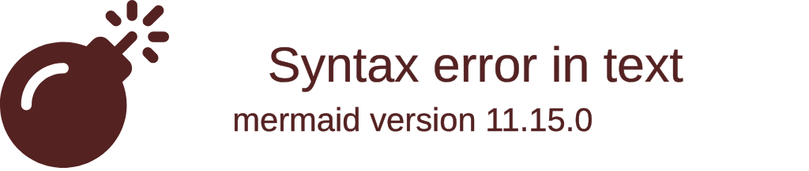

import { ConceptTemplate } from '@/features/kb/components/templates/ConceptTemplate'
import { Callout } from '@/features/kb/components/mdx/Callout'

export default function Layout({ children }) {
  return (
    <ConceptTemplate title="FreeBSD">
      {children}
    </ConceptTemplate>
  )
}

**FreeBSD** is a free, open-source Operating System. 

It is crucially important to understand one mathematical fact: **FreeBSD is NOT Linux.** 

Linux is just a Kernel. When you download Ubuntu, you are downloading the Linux Kernel, glued together with GNU utilities (from the Free Software Foundation), a display server (from X.org), and a desktop (from GNOME). Ubuntu is a Frankenstein monster of 10,000 independent projects.

FreeBSD is a complete, unified Operating System. The Kernel, the drivers, the C library, and all the user-space utilities (like `ls` and `cat`) are architected, written, and mathematically maintained by the exact same core team in a single, massive Git repository. It is a direct, mathematical descendant of the original Unix built at Bell Labs and UC Berkeley in the 1970s.

## 1. Deep Dive & Mechanics

Because FreeBSD is developed as a monolithic entity, its architecture achieves a level of mathematical cohesion that Linux can only dream of. 

If a FreeBSD Kernel developer changes how the network stack works, they can simultaneously update the user-space `ifconfig` command in the exact same Git commit. In Linux, the Kernel team has to email the completely independent `net-tools` team and hope they update their code in a few months.

FreeBSD is famous for three massive architectural innovations:
1. **ZFS (Zettabyte File System):** Originally developed by Sun Microsystems, ZFS was adopted heavily by FreeBSD. It mathematically combines the Volume Manager (RAID) and the Filesystem into one entity, providing perfect cryptographic data integrity and instant copy-on-write snapshots.
2. **Jails (Containers before Docker):** Invented in 1999 (14 years before Docker), Jails mathematically partition the OS into isolated Virtual Environments with their own IP addresses and root users, running on a single Kernel with zero virtualization overhead.
3. **The BSD License:** Unlike Linux's GPL license (which forces you to share your source code), the BSD license mathematically allows a corporation to take the FreeBSD code, modify it, keep it secret, and sell it for billions of dollars.

## 2. Mathematical / Theoretical Foundation

The most defining architectural feature of FreeBSD network engineering is `kqueue` and the Network Stack.

In Linux, when a web server (like Nginx) needs to handle 10,000 simultaneous connections, it uses a system call called `epoll`. 
In FreeBSD, the equivalent is **`kqueue`**. Mathematically, `kqueue` is arguably superior to `epoll`. 

`kqueue` is a generic event notification system. While Linux `epoll` only monitors File Descriptors (network sockets), `kqueue` can mathematically monitor *everything*: network sockets, files being modified on the hard drive, processes crashing, and signals. It allows a C++ application to run a single, hyper-optimized mathematical loop that instantly reacts to any event in the entire Operating System without wasting CPU cycles polling.

## 3. Real-World Implementation

Here is an architectural look at how FreeBSD fundamentally differs from Linux in managing software: **The Ports Tree**.

Instead of downloading pre-compiled `.deb` binaries via `apt-get`, traditional FreeBSD users use Ports (though binary `pkg` is now popular). The Ports Tree is a mathematical blueprint for compiling software.

```bash
# 1. Update the Ports Tree
# This downloads a massive directory structure containing Makefiles for 30,000 apps.
portsnap fetch update

# 2. Navigate to the software you want
cd /usr/ports/www/nginx

# 3. Compile and Install
# This command mathematically executes a C-compiler.
# But before it compiles, it pops up a blue Terminal UI (dialog).
# You can mathematically toggle specific C-compiler flags ON or OFF.
# Want Nginx without IPv6 support to save 5 KB of RAM? Uncheck it.
# Want Nginx with custom Mail Proxy support? Check it.
make install clean

# 4. The Output
# The system mathematically downloads the raw Nginx source code, applies 
# FreeBSD-specific patches, compiles it with your exact chosen flags, 
# and installs it cleanly into the unified OS structure.
```

## 4. Visualizations



## 5. Interview Prep

**Q: Is macOS based on FreeBSD?**
**A:** Partially, yes. When Apple bought NeXT (Steve Jobs' company) to create Mac OS X, they took the Mach microkernel and mathematically fused it with massive amounts of User-Space code and networking stacks directly from **FreeBSD**. When you open the Terminal on a modern MacBook and run `ls` or `netstat`, you are physically executing mathematical descendants of FreeBSD C code, *not* Linux GNU code. 

**Q: Why don't more companies use FreeBSD on the Desktop?**
**A:** Hardware Drivers. Because Linux is backed by massive corporations (IBM, Intel, Google), hardware vendors write Linux drivers for Wi-Fi cards and GPUs. FreeBSD relies entirely on volunteers to mathematically reverse-engineer those drivers. Consequently, if you buy a brand new Nvidia graphics card or a modern Intel Wi-Fi chip, it mathematically might not work on FreeBSD for 2 years.

**Q: How do Jails differ from Docker Containers?**
**A:** Docker (Linux Namespaces) was mathematically designed to package *applications* (e.g., "Run this Node.js script in an isolated box"). A Jail is mathematically designed to isolate an *entire Operating System*. When you start a Jail, it runs its own Init system, cron jobs, and syslog. It looks and acts exactly like a Virtual Machine, but shares the host Kernel. Docker is ephemeral; Jails are persistent, heavily secured mini-servers.

## 6. Production Use Cases

Because of the permissive BSD license and the legendary stability of its networking stack, FreeBSD powers massive, invisible infrastructure:
- **Sony PlayStation (PS4 / PS5):** The Operating System running on the PlayStation 4 (Orbis OS) and PlayStation 5 is a mathematically modified fork of FreeBSD 9. Sony chose FreeBSD because the BSD license legally allowed them to take the pristine Operating System, heavily modify the graphics stack for their proprietary AMD APU, and keep the source code entirely closed to prevent hackers from reverse-engineering the DRM (which would have been illegal under Linux's GPL license).
- **Netflix Open Connect:** Netflix accounts for roughly 15% of the entire world's internet traffic. When you watch a movie, you are not streaming it from AWS. You are streaming it from a red metal box (an Open Connect Appliance) sitting inside your local ISP's data center. Those boxes run **FreeBSD**. Netflix engineers mathematically optimized the FreeBSD Kernel and `kqueue` to serve 400 Gigabits per second of TLS-encrypted video out of a *single physical server*, achieving network throughput that Linux mathematically struggles to match without custom bypasses.
- **Enterprise Storage (TrueNAS Core / pfSense):** For a decade, the absolute gold standard of enterprise firewalls (pfSense) and network-attached storage (TrueNAS Core) were built exclusively on FreeBSD. FreeBSD's native, mathematically perfect integration with the ZFS filesystem made it the only logical choice for managing Petabytes of data without corruption, and its networking stack (pf) provided military-grade packet filtering long before Linux `iptables` matured.

<Callout icon="info" title="The FreeBSD Mascot">
The FreeBSD logo is a red demon wearing sneakers, affectionately known as "Beastie" (a phonetic pronunciation of BSD). The pitchfork represents the mathematical `fork()` system call used to create processes in Unix. While cute, the demon imagery caused significant problems in the 1990s when conservative schools and businesses refused to install the Operating System, believing it was literally satanic software.
</Callout>
