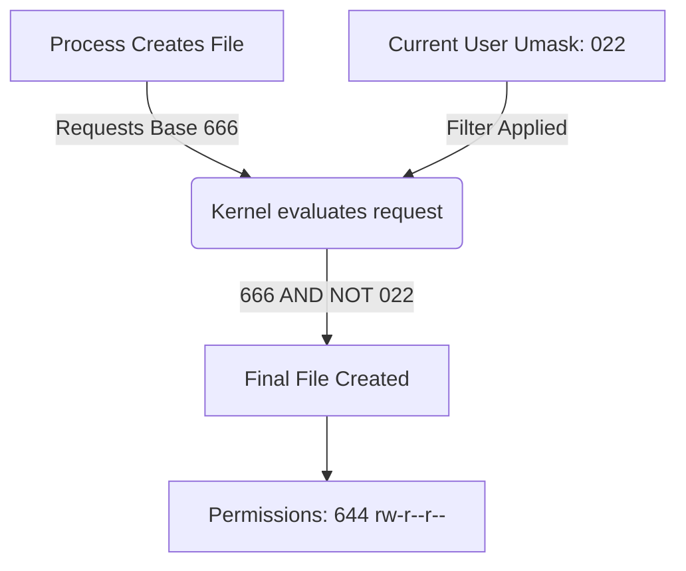

import { ConceptTemplate } from '@/features/kb/components/templates/ConceptTemplate'
import { Callout } from '@/features/kb/components/mdx/Callout'

export default function Layout({ children }) {
  return (
    <ConceptTemplate title="umask">
      {children}
    </ConceptTemplate>
  )
}

In Unix-like systems, when a process creates a new file or directory, the system needs to know what permissions to assign to it. **umask** (user mask) is the command and environmental setting that controls these default permissions.

Unlike `chmod`, which explicitly *adds* or *sets* permissions on existing files, `umask` acts as a **filter that subtracts permissions** at the exact moment a file is born. It is a critical component of system security, preventing files from being created with overly permissive access rights.

## 1. Deep Dive & Mechanics

When a program (like `touch`, `mkdir`, or a text editor) creates a file, it requests a base permission level from the kernel. 
- By default, Linux assigns a base permission of **666 (rw-rw-rw-)** for files.
- By default, Linux assigns a base permission of **777 (rwxrwxrwx)** for directories.

The kernel then applies the current shell's `umask` value to these base permissions to calculate the final permissions. The umask is typically defined in octal format, such as `022` or `027`.

The calculation is a bitwise operation. Conceptually, you can think of it as subtraction: 
**Final Permission = Base Permission - umask**

## 2. Mathematical / Theoretical Foundation

Mathematically, umask is applied via a bitwise AND operation with the bitwise NOT of the mask: 
$Final = Base \ \& \ (\sim umask)$

Let's look at the standard umask of **022**:
- Base directory permission: **777** (rwxrwxrwx)
- Umask: **022** (----w--w-)
- Calculation: $777 - 022 = 755$ (rwxr-xr-x)
- *Result: The owner has full access, but group and others can only read and execute, not write.*

Let's apply the same umask to a file:
- Base file permission: **666** (rw-rw-rw-)
- Umask: **022** (----w--w-)
- Calculation: $666 - 022 = 644$ (rw-r--r--)
- *Result: The owner can read/write, but group and others can only read.*

## 3. Real-World Implementation

You can check your current umask by simply typing the command in the terminal:
```bash
$ umask
0022
```

To change the umask for the current session, provide the new octal value:
```bash
# Set a very strict umask where only the owner has any access
$ umask 077

# Create a file and check its permissions
$ touch top_secret.txt
$ ls -l top_secret.txt
-rw------- 1 user user 0 Oct 15 10:00 top_secret.txt
```

Because running `umask` only affects the current shell session, system administrators make it permanent by adding it to the user's profile scripts:
```bash
# Append to ~/.bashrc for a specific user
echo "umask 027" >> ~/.bashrc

# Or configure it system-wide in /etc/profile or /etc/login.defs
```

## 4. Visualizations



## 5. Interview Prep

**Q: Why do new files default to a base of 666 instead of 777?**
**A:** Linux places a high priority on security. Files are never created with execution privileges (the 'x' bit, represented by 1) by default, regardless of the umask. If you want a script to be executable, you must explicitly run `chmod +x` on it after creation. Only directories receive the execute bit by default (777), because the execute bit on a directory is required to allow a user to `cd` into it.

**Q: If the base file permission is 666, and I set the umask to 033, what is the final file permission?**
**A:** This is a trick question meant to test if you understand the bitwise logic vs simple subtraction. 
Base 666 is `rw-rw-rw-`.
Umask 033 is `----wx-wx`.
Because files don't have execute permissions to begin with, subtracting the execute bit does nothing. The write bit (2) is subtracted. The final permission is `rw-r--r--` (644), exactly the same as if the umask was 022.

**Q: Where is the global default umask set in a modern Linux system?**
**A:** It is typically defined in `/etc/login.defs` for new users, or handled by PAM (Pluggable Authentication Modules) via `pam_umask.so` which reads from `/etc/profile`.

## 6. Production Use Cases

- **Shared Servers:** On corporate servers where multiple users share a machine, setting the umask to `027` ensures that newly created files can be read by the user's group, but are completely hidden (no read, write, or execute) from other unrelated users on the system.
- **Security Compliance:** Security frameworks like CIS (Center for Internet Security) or PCI-DSS mandate strict default umask settings (typically `027` or `077`) across all servers to ensure accidental data exposure does not occur when developers create log files or database dumps.

<Callout icon="shield" title="The Principle of Least Privilege">
Umask is a perfect example of the Principle of Least Privilege. By defaulting to a restrictive mask, the system ensures that users must consciously and explicitly grant access to their data via `chmod`, rather than relying on them to secure it after the fact.
</Callout>
