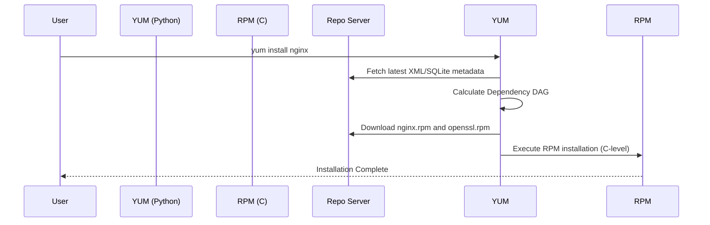

import { ConceptTemplate } from '@/features/kb/components/templates/ConceptTemplate'
import { Callout } from '@/features/kb/components/mdx/Callout'

export default function Layout({ children }) {
  return (
    <ConceptTemplate title="yum">
      {children}
    </ConceptTemplate>
  )
}

**YUM** (Yellowdog Updater, Modified) is an open-source command-line package-management utility for computers running compatible versions of Linux (primarily Red Hat Enterprise Linux, CentOS, and older versions of Fedora).

Before YUM, administrators used the raw `rpm` command to install software. The critical flaw with `rpm` was that it did not resolve dependencies. If Package A required Package B, `rpm` would simply fail and force the human administrator to hunt down Package B on the internet. YUM was introduced to automatically calculate and download these dependency chains from remote repositories.

*Note: In modern Red Hat systems (RHEL 8+), YUM has been replaced by **DNF** (Dandified YUM) under the hood, though the `yum` command is still symlinked to DNF for backwards compatibility.*

## 1. Deep Dive & Mechanics

YUM operates using **Repositories** (Repos). A repository is simply a web server hosting thousands of `.rpm` files along with a metadata directory (usually SQLite databases or XML files) describing exactly what is in the repo and how the packages relate to each other.

When you run a YUM command, it performs the following mechanical sequence:
1. It downloads the latest metadata from the URLs defined in `/etc/yum.repos.d/`.
2. It parses the metadata to locate the requested package.
3. It performs a Dependency Resolution algorithm to find all required shared libraries.
4. It downloads the RPMs to a local cache (`/var/cache/yum`).
5. It invokes the low-level `rpm` binary to securely unpack and install the files into the filesystem.

## 2. Mathematical / Theoretical Foundation

Dependency resolution is a classic computer science problem modeled using **Directed Acyclic Graphs (DAGs)**. 

Each package is a node, and each dependency is a directed edge. YUM must perform a Topological Sort of this graph to determine the exact order of installation (e.g., install glibc *before* installing python). 

The problem becomes extremely complex (theoretically NP-Complete in edge cases) when multiple versions of packages exist, and constraints conflict (e.g., Package A requires Python < 3.0, but Package B requires Python >= 3.5). Older versions of YUM's dependency resolver were notoriously slow because they were written purely in Python. This slowness directly led to the creation of DNF, which utilizes a highly optimized C++ library (`libsolv`) originally created for SUSE Linux to mathematically satisfy dependencies using a Boolean Satisfiability (SAT) solver.

## 3. Real-World Implementation

YUM requires root privileges for almost all actions.

```bash
# 1. Update the entire operating system
sudo yum update -y

# 2. Search the repositories for a package related to 'nginx'
sudo yum search nginx

# 3. Install a package and automatically answer 'yes' to prompts
sudo yum install httpd -y

# 4. Remove a package
sudo yum remove httpd

# 5. List exactly what files a package provides before installing it
sudo yum provides "*bin/top"

# 6. Clear the local cache (fixes issues where YUM gets "stuck" on old repo data)
sudo yum clean all
```

## 4. Visualizations



## 5. Interview Prep

**Q: What is the difference between `yum update` and `yum upgrade`?**
**A:** Historically, `yum update` would update packages without removing obsolete packages, while `yum upgrade` would explicitly remove obsolete packages during the process. However, in modern systems, the configuration `obsoletes=1` is set by default in `yum.conf`, making both commands effectively identical in behavior.

**Q: How do you add a third-party repository to YUM, such as the EPEL repo?**
**A:** You can manually create a `.repo` file inside `/etc/yum.repos.d/` with the URL, or you can use the `yum-config-manager` tool. For EPEL (Extra Packages for Enterprise Linux) specifically, it's so common that you can just run `yum install epel-release`.

**Q: Why was YUM replaced by DNF?**
**A:** YUM had strict architectural limitations: it was written in Python 2 (which was deprecated), it consumed massive amounts of RAM when parsing metadata, and its dependency resolution algorithm was severely slow. DNF (Dandified YUM) was built to fix this, utilizing Python 3 and a blazingly fast C++ SAT solver (`libsolv`) for dependency resolution.

## 6. Production Use Cases

- **Server Provisioning:** YUM is the backbone of configuration management tools like Ansible or Chef when running on RHEL/CentOS. An Ansible playbook simply triggers the YUM module to ensure specific software versions are locked in on production fleets.
- **Security Patching:** Running `yum --security update` allows administrators to strictly apply only CVE security patches without risking instability by updating feature versions of other software.

<Callout icon="danger" title="The Python 2 Dependency">
Because the original `yum` tool was heavily dependent on the system's Python 2 interpreter, a common fatal error occurred if a sysadmin tried to upgrade or modify the default Python installation (e.g., trying to symlink `python` to Python 3). Doing so would instantly break YUM, rendering the system unable to install software or repair itself!
</Callout>
