import { ConceptTemplate } from '@/features/kb/components/templates/ConceptTemplate'
import { Callout } from '@/features/kb/components/mdx/Callout'

export default function Layout({ children }) {
  return (
    <ConceptTemplate title="zip">
      {children}
    </ConceptTemplate>
  )
}

The **zip** format (and its associated `zip` and `unzip` command-line tools) is arguably the most ubiquitous data compression format in the world. Originally created in 1989 by Phil Katz (PKZIP) for MS-DOS, it has become the standard for compressing and exchanging files across all major operating systems.

In Linux, `zip` serves a slightly different role than `tar`. While `tar` is strictly an archiver (grouping files without compression) that preserves Unix permissions perfectly, `zip` acts as **both an archiver and a compressor simultaneously**.

## 1. Deep Dive & Mechanics

The defining characteristic of a ZIP file is that **each file is compressed individually**. 

When you use `tar.gz`, the files are glued together into one massive block, and then the entire block is compressed (known as Solid Compression). This yields a smaller overall file size. 

ZIP, on the other hand, takes file A, compresses it, and adds it. Then it takes file B, compresses it, and adds it. Because the files remain distinct inside the archive, you can extract a single 5KB file from a massive 100GB ZIP archive almost instantly. The `unzip` utility simply reads the **Central Directory** (an index located at the very end of the ZIP file), jumps to the exact byte offset of the required file, and decompresses it.

## 2. Mathematical / Theoretical Foundation

The standard compression algorithm utilized by `zip` is **DEFLATE**. 

DEFLATE is a brilliant hybrid algorithm that combines two distinct computer science theories:
1. **LZ77 (Lempel-Ziv):** A dictionary-based sliding window algorithm. It looks for repeated strings of characters in the file and replaces them with a pointer (e.g., "go back 40 bytes and copy 5 characters"). This eliminates redundancy.
2. **Huffman Coding:** An entropy encoding algorithm. It analyzes the frequency of characters. Instead of using 8 bits for every character, it assigns the most common characters (like 'e' or space) very short bit codes (like 2 bits), and rare characters longer bit codes. 

By applying LZ77 first to remove redundancy, and then Huffman coding to mathematically compress the raw symbols, DEFLATE achieves exceptional lossless compression ratios with minimal CPU overhead.

## 3. Real-World Implementation

The utilities `zip` and `unzip` are often not installed by default on minimal Linux servers, so they may need to be installed via `apt` or `yum` first.

```bash
# 1. Compress a single file
zip archive.zip document.txt

# 2. Compress a directory recursively (-r)
# This compresses the 'reports' folder and everything inside it.
zip -r backup.zip /path/to/reports/

# 3. Create a password-protected zip file (-e for encrypt)
zip -e secure.zip financials.csv

# 4. Extract an archive in the current directory
unzip archive.zip

# 5. Extract an archive to a specific directory (-d)
unzip archive.zip -d /tmp/extracted_files/

# 6. List the contents of a zip file without extracting (-l)
unzip -l archive.zip
```

## 4. Visualizations

```mermaid
architecture-beta
    group zipfile(disk)[ZIP File Structure]

    service f1(document)[Compressed File A] in zipfile
    service f2(document)[Compressed File B] in zipfile
    service f3(document)[Compressed File C] in zipfile
    service index(database)[Central Directory Index] in zipfile

    f1:R --> L:f2
    f2:R --> L:f3
    f3:R --> L:index
```


*(Because the index is at the end, the program can instantly look up File B and extract it without reading File A or C).*

## 5. Interview Prep

**Q: If you want to compress log files on a Linux server, should you use `zip` or `tar.gz`?**
**A:** You should almost always use `tar.gz`. The ZIP format was created for MS-DOS and historically struggles to perfectly preserve complex Unix file permissions, ownership (UID/GID), and symlinks. `tar` was explicitly designed for Unix systems and preserves this metadata flawlessly.

**Q: What is a "Zip Bomb"?**
**A:** A Zip Bomb (or Decompression Bomb) is a malicious archive designed to crash the system reading it. Because of how DEFLATE handles highly repetitive data (like a file containing 50 billion zeros), a tiny 42-kilobyte ZIP file can mathematically decompress into 4.5 Petabytes of data. If an antivirus scanner attempts to extract it in memory, the server will instantly run out of RAM and crash.

**Q: Why doesn't zipping a JPEG image or an MP4 video significantly reduce the file size?**
**A:** DEFLATE removes redundancy. JPEGs and MP4s are already highly compressed using complex lossy mathematical algorithms (like Discrete Cosine Transforms). The data is essentially random noise to the ZIP algorithm, so there are no repeating strings for LZ77 to pointer-reference, resulting in 0% compression.

## 6. Production Use Cases

- **Cross-Platform Delivery:** If a Linux backend needs to generate a batch of PDF invoices to send to an end-user on a Windows machine, the backend will package them using `zip`. Windows natively supports extracting ZIP files without requiring the user to install third-party software like 7-Zip (which would be required for a tarball).
- **AWS Lambda Deployments:** When deploying serverless functions to AWS Lambda or Google Cloud Functions, the deployment artifact must be a ZIP file containing the source code and `node_modules` dependencies.

<Callout icon="info" title="Hidden Zips (JARs, APKs, DOCX)">
You use ZIP files every day without realizing it. Java `.jar` files, Android `.apk` files, and modern Microsoft Office documents (`.docx`, `.xlsx`) are literally just ZIP files with different extensions. You can rename a Word Document to `document.zip` and extract it to see the raw XML files inside!
</Callout>
