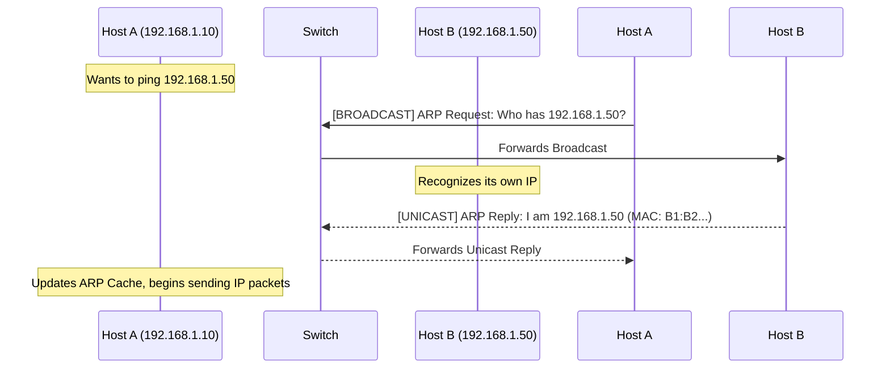

import { ConceptTemplate } from '@/features/kb/components/templates/ConceptTemplate'
import { Callout } from '@/features/kb/components/mdx/Callout'

export default function Layout({ children }) {
  return (
    <ConceptTemplate title="ARP (Address Resolution Protocol)">
      {children}
    </ConceptTemplate>
  )
}

**ARP (Address Resolution Protocol)** is the vital bridge between the Network Layer (Layer 3 - IP addresses) and the Data Link Layer (Layer 2 - MAC addresses) of the OSI model. 

When a computer wants to send data to another computer on the same local network, it knows the target's IP address (like `192.168.1.50`), but network switches don't understand IP addresses—they only understand physical hardware MAC addresses (like `00:1A:2B:3C:4D:5E`). ARP is the protocol used to ask the network: *"Who has this IP address? Please tell me your MAC address."*

## 1. Deep Dive & Mechanics

ARP operates strictly within the boundaries of a single Local Area Network (LAN). It cannot cross routers. 

When Host A wants to communicate with Host B:
1. **ARP Cache Check:** Host A first checks its local ARP cache (a temporary table in RAM mapping IP to MAC). If found, it uses it.
2. **ARP Request:** If not found, Host A broadcasts an ARP Request frame to the entire network. The destination MAC is the broadcast address (`FF:FF:FF:FF:FF:FF`). The message essentially says: *"If your IP is 192.168.1.50, reply to me."*
3. **ARP Reply:** All devices receive the broadcast, but only Host B (who owns that IP) processes it. Host B sends a **unicast** ARP Reply directly back to Host A saying: *"I am 192.168.1.50, and my MAC is 00:1A:2B..."*
4. **Caching:** Host A caches this mapping so it doesn't have to broadcast again for subsequent packets.

## 2. Mathematical / Theoretical Foundation

The ARP protocol is inherently **stateless** and **unauthenticated**. This theoretical design flaw stems from the early days of the internet when networks were small and trusted. 

Because it is stateless, a machine does not need to actually send an ARP Request to accept an ARP Reply. If a machine receives a gratuitous ARP Reply, it will simply overwrite its local ARP cache with the new data. This lack of cryptographic verification leads directly to $O(1)$ effort for an attacker to poison a target's routing path on a LAN.

## 3. Real-World Implementation

You can interact with your operating system's ARP cache via the command line.

```bash
# View the current ARP table (works on Linux, Windows, and macOS)
arp -a

# Output example:
# ? (192.168.1.1) at 00:14:22:01:23:45 on en0 ifscope [ethernet]
# ? (192.168.1.15) at a4:5e:60:dc:4f:b1 on en0 ifscope [ethernet]

# Clear the ARP cache (requires admin/root privileges)
# Useful if a device's IP changed but your PC is still trying to talk to the old MAC
sudo arp -d -a

# On modern Linux (iproute2 suite), 'ip neigh' is preferred over 'arp'
ip neigh show
```

## 4. Visualizations



## 5. Interview Prep

**Q: What is ARP Spoofing (or ARP Poisoning)?**
**A:** ARP spoofing is a Man-in-the-Middle (MitM) attack. Because ARP is stateless and unauthenticated, an attacker on the local network continuously broadcasts forged ARP Replies telling the victim's PC that the attacker's MAC address belongs to the Default Gateway (the router). The victim updates its cache and unknowingly sends all its internet traffic through the attacker's machine.

**Q: Does IPv6 use ARP?**
**A:** No. IPv6 eliminates ARP entirely. Instead, it relies on the **Neighbor Discovery Protocol (NDP)**, which operates using ICMPv6 and multicast rather than layer-2 broadcasts. NDP is more efficient and can be secured using IPSec (Secure Neighbor Discovery - SEND).

**Q: What is a Gratuitous ARP?**
**A:** A Gratuitous ARP is an ARP Request or Reply that is not prompted by a need to resolve an IP address, but is instead broadcasted by a device to announce or update its IP-to-MAC mapping to the rest of the network. This is heavily used in High Availability (HA) firewall failovers, so when the backup firewall takes over the primary's IP, it forces all switches to update their MAC tables instantly.

## 6. Production Use Cases

- **High Availability (HA) Failover:** Using VRRP (Virtual Router Redundancy Protocol). When a primary router dies, the secondary router assumes the virtual IP address and fires off a Gratuitous ARP to the switch, seamlessly redirecting traffic to itself in milliseconds.
- **Wake-on-LAN (WoL):** Network administrators often need to maintain static ARP entries in their routers so they can send magic WoL packets to computers that are powered off and thus cannot respond to dynamic ARP requests.

<Callout icon="warning" title="Broadcast Storms">
Because ARP requests use the broadcast address, they are sent to every single port on a switch. In massive, unsegmented networks (a single giant VLAN), the sheer volume of background ARP requests from thousands of devices can consume significant CPU and bandwidth, leading to degraded network performance. This is why segmenting networks into smaller subnets/VLANs is critical.
</Callout>
