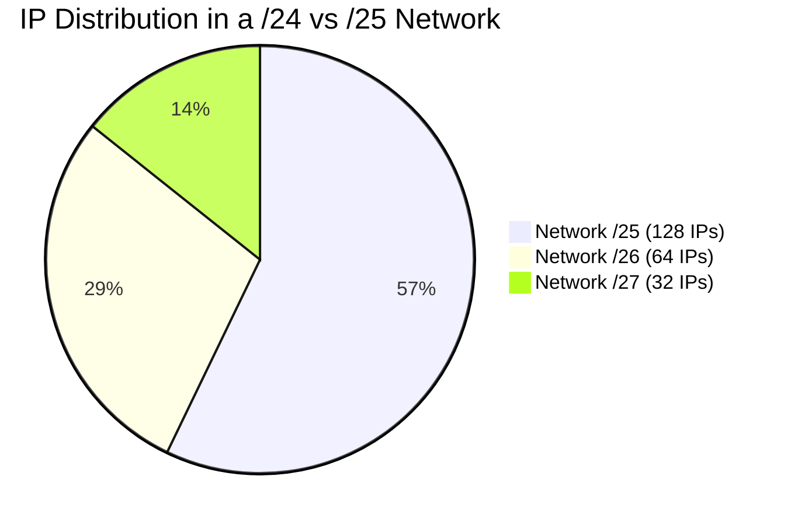

import { ConceptTemplate } from '@/features/kb/components/templates/ConceptTemplate'
import { Callout } from '@/features/kb/components/mdx/Callout'

export default function Layout({ children }) {
  return (
    <ConceptTemplate title="CIDR (Classless Inter-Domain Routing)">
      {children}
    </ConceptTemplate>
  )
}

**CIDR (Classless Inter-Domain Routing)** is the modern standard for defining and organizing IP networks. Introduced in 1993, CIDR was created to solve a massive impending crisis: the internet was running out of IP addresses due to the immense waste caused by the legacy "Classful" network system (Class A, B, and C networks).

Instead of forcing networks into rigid, pre-defined sizes, CIDR allows network administrators to create subnets of *any* arbitrary size using a flexible subnet mask.

## 1. Deep Dive & Mechanics

In the legacy Classful system, if a company needed 300 IP addresses, a Class C network (254 hosts) was too small. The registry would have to give them a Class B network (65,534 hosts), wasting over 65,000 IP addresses.

CIDR introduced **Variable-Length Subnet Masking (VLSM)**. 

A CIDR notation looks like this: `192.168.1.0/24`.
The `/24` is the **prefix length**. It mathematically dictates exactly how many bits of the 32-bit IPv4 address are locked to represent the *Network ID*, leaving the remaining bits to represent the *Host IDs*.

In a `/24` network:
- 24 bits are locked for the network.
- $32 - 24 = 8$ bits remain for the hosts.
- $2^8 = 256$ total IPs. (Minus 2 for the Network and Broadcast addresses = 254 usable IPs).

## 2. Mathematical / Theoretical Foundation

CIDR operates strictly on **Binary Boolean Logic**, specifically the Bitwise AND operation.

When a router receives a packet destined for `192.168.1.50`, it needs to determine which route to send it down. It checks its routing table, which contains CIDR blocks.

The router converts the IP and the Subnet Mask to binary and performs an AND operation:
- IP (192.168.1.50): `11000000.10101000.00000001.00110010`
- Mask (/24 or 255.255.255.0): `11111111.11111111.11111111.00000000`
- **Result (Network ID):** `11000000.10101000.00000001.00000000` (192.168.1.0)

This $O(1)$ bitwise mathematical operation allows routers to process millions of packets per second in hardware (ASICs).

## 3. Real-World Implementation

Understanding how to calculate CIDR blocks is essential for Cloud Engineering (AWS/Azure/GCP).

**Common CIDR Blocks:**
- `/32`: $2^0 = 1$ IP. Exactly one specific host. Used in firewall rules to whitelist a single IP.
- `/24`: $2^8 = 256$ IPs. The standard home network (`255.255.255.0`).
- `/16`: $2^{16} = 65,536$ IPs. A standard large corporate subnet or AWS VPC (`10.0.0.0/16`).
- `/0`: Represents the entire internet. `0.0.0.0/0` is the "Default Route"—if no other specific CIDR matches, send the packet here (usually out to the ISP).

**Route Aggregation (Supernetting):**
CIDR allows routers to combine multiple smaller networks into one larger routing table entry to save RAM.
If a router knows paths to `192.168.0.0/24` and `192.168.1.0/24`, it can aggregate them and advertise a single `192.168.0.0/23` route to the internet backbone.

## 4. Visualizations

*(A `/24` can be perfectly sliced into one `/25`, one `/26`, and two `/27` subnets without wasting a single IP address).*

## 5. Interview Prep

**Q: If you provision an AWS VPC with the CIDR `10.0.0.0/24`, how many usable IPs do you get for EC2 instances?**
**A:** Mathematically, a `/24` provides 256 total IPs. In standard networking, you subtract 2 (Network and Broadcast). However, AWS reserves an *additional* 3 IPs per subnet (for the VPC router, DNS server, and future use). Therefore, you get $256 - 5 = 251$ usable IPs.

**Q: What is the Longest Prefix Match rule in routing?**
**A:** If a router's table has overlapping CIDR entries (e.g., `10.0.0.0/8` routes to Port A, and `10.1.2.0/24` routes to Port B), and a packet arrives for `10.1.2.50`, it technically matches both. The router will *always* choose the route with the highest CIDR number (the most specific, longest prefix). It will send it out Port B.

**Q: What is the Subnet Mask equivalent of a `/22` CIDR?**
**A:** A `/24` is `255.255.255.0`. A `/22` means we borrow 2 bits *back* from the third octet. $256 - 2^2 = 256 - 4 = 252$. The mask is `255.255.252.0`. It contains 1,024 IPs.

## 6. Production Use Cases

- **Cloud VPC Design:** When building a cloud infrastructure, architects carefully carve up a `/16` VPC into smaller CIDR blocks for Public, Private, and Database subnets to ensure logical isolation and efficient IP utilization.
- **Firewall Whitelisting:** Instead of writing 256 individual firewall rules to allow a partner company's office to access an API, a security engineer simply writes one rule allowing the CIDR block `203.0.113.0/24`.

<Callout icon="info" title="IPv6 and CIDR">
CIDR is completely baked into IPv6 as well. Because IPv6 addresses are 128 bits long, you will frequently see notations like `2001:db8::/32`. A standard IPv6 subnet assigned to a single local LAN is a `/64`, which mathematically contains $18.4$ quintillion IP addresses!
</Callout>
