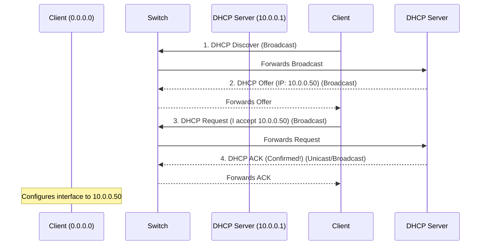

import { ConceptTemplate } from '@/features/kb/components/templates/ConceptTemplate'
import { Callout } from '@/features/kb/components/mdx/Callout'

export default function Layout({ children }) {
  return (
    <ConceptTemplate title="DHCP (Dynamic Host Configuration Protocol)">
      {children}
    </ConceptTemplate>
  )
}

**DHCP (Dynamic Host Configuration Protocol)** is the magic that makes connecting to networks effortless. When you connect your laptop to a coffee shop Wi-Fi, you don't manually type in an IP address, Subnet Mask, Gateway, and DNS server. DHCP handles all of this automatically in the background in a fraction of a second.

Operating at the Application Layer (Layer 7) but dealing strictly with Layer 3 (IP) assignments, DHCP is a client-server protocol. The DHCP Server maintains a pool of available IP addresses and "leases" them out to clients for a specific duration.

## 1. Deep Dive & Mechanics

The DHCP allocation process strictly follows a 4-step sequence known by the acronym **DORA**:
1. **Discover:** The client machine wakes up without an IP address. It broadcasts a DHCP Discover packet to the entire network (Destination IP: `255.255.255.255`, Destination Port: 67) shouting, *"Are there any DHCP servers here?"*
2. **Offer:** Any DHCP server that hears this broadcast checks its pool. It reserves an IP and broadcasts a DHCP Offer back, saying, *"Here is an IP address you can use, along with the router and DNS info."*
3. **Request:** The client receives the offer. (If there are multiple DHCP servers, it usually picks the first one it receives). It broadcasts a DHCP Request saying, *"I accept this specific offer from Server X."*
4. **Acknowledge (ACK):** The chosen DHCP server sends a DHCP ACK, confirming the lease is finalized. The client binds the IP to its network interface.

## 2. Mathematical / Theoretical Foundation

DHCP relies on the concept of **Lease Times** and **State Machines** to prevent IP exhaustion. 

If a coffee shop has a /24 subnet (254 IPs), and 300 unique people walk in and connect over the course of a day, the IPs would run out. 
DHCP solves this mathematically by leasing IPs temporarily (e.g., for 2 hours).

Clients run a state machine to manage this lease:
- At **$T_1$ (50% of lease time)**: The client attempts to renew the lease directly with the original server via Unicast.
- At **$T_2$ (87.5% of lease time)**: If the original server is dead, the client enters a Rebinding state and broadcasts to *any* DHCP server to extend the lease.
- If the timer hits 100%, the client mathematically forces a network disconnect and drops the IP, allowing the server to place it back in the available pool.

## 3. Real-World Implementation

DHCP isn't just about IP addresses; it passes **DHCP Options**.
- Option 1: Subnet Mask
- Option 3: Default Router (Gateway)
- Option 6: DNS Servers
- Option 15: Domain Name

**Example: A typical ISC DHCPd configuration file (`/etc/dhcp/dhcpd.conf`)**
```text
# Define the global DNS servers
option domain-name-servers 8.8.8.8, 1.1.1.1;

# Define the subnet and the IP pool
subnet 192.168.10.0 netmask 255.255.255.0 {
  range 192.168.10.100 192.168.10.200;
  option routers 192.168.10.1;
  default-lease-time 3600;      # 1 hour
  max-lease-time 7200;          # 2 hours
}

# Static Reservation based on MAC address (e.g., for a network printer)
host OfficePrinter {
  hardware ethernet 00:1A:2B:3C:4D:5E;
  fixed-address 192.168.10.50;
}
```

## 4. Visualizations



## 5. Interview Prep

**Q: If a client PC boots up and has an IP address of `169.254.x.x`, what happened?**
**A:** This is an APIPA (Automatic Private IP Addressing) address. It means the DORA process failed—the client sent out a DHCP Discover but never received an Offer (perhaps the DHCP server is down or the switch port is misconfigured). The OS assigns itself a `169.254` address so it can at least communicate with other broken devices on the local link.

**Q: What is a DHCP Relay (IP Helper)?**
**A:** Because DHCP Discover packets are broadcasts (`255.255.255.255`), they cannot cross routers. In an enterprise with 50 VLANs, you don't want 50 DHCP servers. You configure a "DHCP Relay" or "IP Helper" on the router. When the router hears the broadcast on VLAN 10, it converts it to a Unicast packet and forwards it directly to the centralized DHCP server on VLAN 100.

**Q: What is Rogue DHCP?**
**A:** A security threat where an attacker plugs a router or runs software on a corporate network that hands out fake DHCP Offers faster than the real server. The attacker assigns themselves as the Default Gateway, instantly achieving a Man-in-the-Middle position for all new clients. This is mitigated using "DHCP Snooping" on enterprise switches.

## 6. Production Use Cases

- **PXE Booting:** In data centers, empty servers boot up and use DHCP to request not just an IP, but also the location of a TFTP server (DHCP Option 66). They then download their operating system image directly over the network without requiring a USB drive or human interaction.
- **VoIP Phone Provisioning:** IP desk phones use DHCP to request their VLAN assignment and the IP of the PBX server so they can automatically register and download their configuration files upon being plugged in.

<Callout icon="danger" title="Pool Exhaustion">
A common Denial of Service (DoS) attack is "DHCP Starvation." An attacker uses a tool like `yersinia` to rapidly spoof thousands of random MAC addresses, sending thousands of DHCP Discover packets per second. The server hands out all available IPs in the pool, preventing any legitimate users from joining the network.
</Callout>
