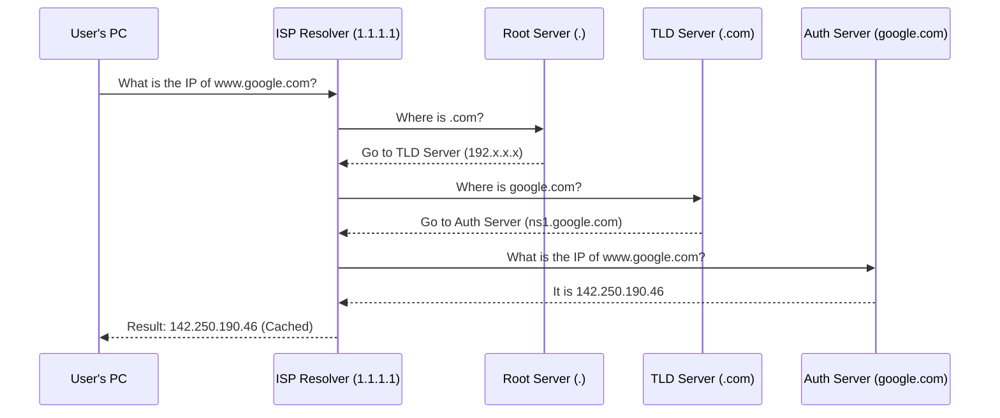

import { ConceptTemplate } from '@/features/kb/components/templates/ConceptTemplate'
import { Callout } from '@/features/kb/components/mdx/Callout'

export default function Layout({ children }) {
  return (
    <ConceptTemplate title="DNS (Domain Name System)">
      {children}
    </ConceptTemplate>
  )
}

**DNS (Domain Name System)** is often referred to as the phonebook of the internet. Humans remember words like `google.com`, but internet routers only understand IP addresses like `142.250.190.46`. DNS bridges this gap.

Without DNS, the modern internet would collapse. It is a globally distributed, hierarchical, and highly cached database. It operates primarily over **UDP Port 53**, prioritizing raw speed and low overhead over guaranteed delivery, although it falls back to TCP Port 53 for large responses (like Zone Transfers or DNSSEC).

## 1. Deep Dive & Mechanics

When you type a URL into your browser, a complex **Recursive DNS Resolution** process occurs behind the scenes:

1. **Browser/OS Cache Check:** The OS checks if it recently resolved the name.
2. **Recursive Resolver:** The OS queries its configured DNS server (usually provided by the ISP or a public resolver like Cloudflare's `1.1.1.1`). If `1.1.1.1` doesn't have the answer cached, it takes responsibility to find it.
3. **Root Servers (`.`):** The recursive resolver asks one of the 13 global Root Servers: *"Where is the `.com` Top-Level Domain (TLD) server?"*
4. **TLD Servers (`.com`):** The resolver queries the `.com` TLD server: *"Where is the authoritative server for `google.com`?"*
5. **Authoritative Servers:** The resolver asks Google's dedicated nameserver: *"What is the IP for `www.google.com`?"* The authoritative server returns the final IP.
6. **Caching:** The recursive resolver caches this answer (based on the TTL - Time to Live) and passes it back to your browser.

## 2. Mathematical / Theoretical Foundation

DNS is structured mathematically as a **Tree Graph** (Inverted Tree Data Structure).

The root is simply a dot (`.`). The branches are TLDs (`com`, `org`, `net`), and the leaves are subdomains. Because it is a tree graph, query time complexity is logarithmic $O(\log N)$, allowing the system to resolve queries against billions of domains globally in milliseconds.

The system scales via **Distributed Caching**. The Time To Live (TTL) value dictates how many seconds a node in the tree is allowed to cache the result. This massively reduces the load on the Root and Authoritative servers, allowing the internet to function without DDoS-ing its own infrastructure.

## 3. Real-World Implementation

DNS relies on different **Record Types** stored inside a DNS Zone.

- **A Record:** Maps a domain to an IPv4 address.
- **AAAA Record:** Maps a domain to an IPv6 address.
- **CNAME (Canonical Name):** Maps an alias to another domain name (e.g., `www.example.com` points to `example.com`). You cannot point a CNAME to an IP.
- **MX (Mail Exchange):** Dictates which mail servers accept email on behalf of the domain.
- **TXT (Text):** Originally for human notes, now heavily used for domain verification and email security (SPF, DKIM, DMARC).
- **NS (Name Server):** Delegates a subdomain to a different authoritative DNS server.

**Example Command-Line Interaction (using `dig`):**
```bash
# Query the A record for example.com
dig example.com A

# Query specifically against Google's 8.8.8.8 resolver
dig @8.8.8.8 example.com MX

# Trace the entire recursive path from the Root servers down
dig +trace example.com
```

## 4. Visualizations



## 5. Interview Prep

**Q: What is the difference between an Authoritative DNS server and a Recursive DNS server?**
**A:** An authoritative server actually holds the master DNS zone files and records for a specific domain; it provides the absolute truth (e.g., Amazon Route 53 hosting your company's domain). A recursive server (like Google's `8.8.8.8`) holds no domains of its own; it traverses the internet to fetch answers from authoritative servers on behalf of the client and caches the results.

**Q: Can you put a CNAME record at the "Apex" (root) of a domain?**
**A:** No, standard DNS RFCs forbid placing a CNAME at the root (apex) of a domain (e.g., `example.com`). If you do, it overrides and breaks all other records at the apex, including MX records, completely destroying email delivery. Cloud providers solve this using proprietary pseudo-records (like ALIAS in Route 53 or CNAME Flattening in Cloudflare).

**Q: Why does DNS primarily use UDP instead of TCP?**
**A:** Speed and connection overhead. TCP requires a 3-way handshake before sending data. A standard DNS request fits inside a single 512-byte UDP packet. By using UDP, the client sends the question and the server sends the answer instantly, requiring only 2 packets total. If the packet drops, the client simply times out and tries again.

## 6. Production Use Cases

- **Global Load Balancing (GeoDNS):** Authoritative DNS servers (like Cloudflare or NS1) evaluate the incoming query's origin IP. If a user in Japan queries `api.myapp.com`, DNS returns the IP of the Tokyo AWS region. If a user in New York queries it, DNS returns the IP of the us-east-1 region.
- **Failover Routing:** DNS Health Checks continuously ping a primary web server. If it goes down, the DNS server automatically updates the A record to point to a backup server's IP address.

<Callout icon="warning" title="DNS Propagation is a Myth">
People often talk about waiting 24-48 hours for "DNS Propagation." The internet doesn't actively push or propagate DNS changes. It's simply a matter of TTL (Time to Live) caching. If your A record had a TTL of 24 hours, thousands of recursive resolvers globally have cached the old IP and will stubbornly refuse to ask for the new IP until their 24-hour countdown timer expires. Always lower your TTL to 60 seconds a day before a major migration!
</Callout>
