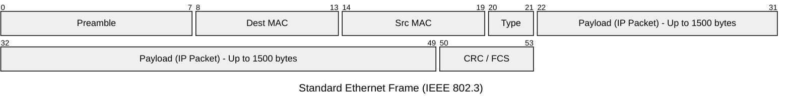

import { ConceptTemplate } from '@/features/kb/components/templates/ConceptTemplate'
import { Callout } from '@/features/kb/components/mdx/Callout'

export default function Layout({ children }) {
  return (
    <ConceptTemplate title="Ethernet">
      {children}
    </ConceptTemplate>
  )
}

**Ethernet** is the undisputed king of wired local area networking (LAN). Invented at Xerox PARC in 1973 by Bob Metcalfe, it defines the hardware and signaling standards for the Physical Layer (Layer 1) and Data Link Layer (Layer 2) of the OSI model.

Whenever you plug a copper RJ45 cable (Cat5e/Cat6) or a fiber optic transceiver into a server, switch, or router, you are utilizing Ethernet. It dictates exactly how bits are turned into electrical pulses/light, and how those bits are organized into logical **Frames** to be processed by Network Interface Cards (NICs).

## 1. Deep Dive & Mechanics

At Layer 2, Ethernet communicates using **MAC (Media Access Control) Addresses**. Every Ethernet NIC in the world is physically burned with a globally unique 48-bit MAC address by its manufacturer.

When an OS wants to transmit an IP packet, the Ethernet NIC wraps it in an **Ethernet Frame**. The frame has a strict structure:
1. **Preamble (8 bytes):** A sequence of alternating 1s and 0s to synchronize the receiver's clock.
2. **Destination MAC (6 bytes):** Where the frame is going.
3. **Source MAC (6 bytes):** Where the frame came from.
4. **EtherType (2 bytes):** Tells the receiving OS what is inside the payload (e.g., IPv4 is `0x0800`, IPv6 is `0x86DD`).
5. **Payload (46 to 1500 bytes):** The actual IP packet. (1500 bytes is the standard MTU - Maximum Transmission Unit).
6. **FCS / CRC (4 bytes):** A Frame Check Sequence math hash. If a single bit flips due to cable interference, the math fails on the receiving end, and the frame is instantly dropped as corrupt.

## 2. Mathematical / Theoretical Foundation

Early Ethernet operated over a shared coaxial cable (bus topology). This created a severe theoretical problem: if two computers transmitted electrical voltage simultaneously, a **Collision** occurred, destroying both signals. 

Ethernet solved this using the **CSMA/CD** (Carrier Sense Multiple Access with Collision Detection) algorithm.
1. **Listen:** The NIC listens to the wire. Is there voltage? If yes, wait.
2. **Transmit:** If quiet, begin transmitting bits.
3. **Detect:** While transmitting, continue listening. If a voltage spike is detected (a collision), immediately stop.
4. **Backoff Algorithm:** Both colliding NICs generate a random mathematical number (exponential backoff) and wait that many microseconds before attempting to transmit again.

*Note: Modern Ethernet uses Full-Duplex Switches, where every device has a dedicated transmit and receive wire. Collisions mathematically cannot happen, rendering CSMA/CD obsolete, though it remains in the protocol specification.*

## 3. Real-World Implementation

In the real world, manipulating Ethernet involves adjusting the **MTU (Maximum Transmission Unit)** or viewing MAC addresses on server interfaces.

```bash
# View Ethernet interfaces, MAC addresses, and MTU on Linux
ip link show

# Example Output:
# 2: eth0: <BROADCAST,MULTICAST,UP,LOWER_UP> mtu 1500 qdisc mq state UP
#    link/ether 02:42:ac:11:00:02 brd ff:ff:ff:ff:ff:ff

# Increase MTU for Jumbo Frames (Improves storage network performance)
sudo ip link set dev eth0 mtu 9000

# View detailed hardware statistics (dropped frames, CRC errors) for an Ethernet NIC
ethtool -S eth0
```

## 4. Visualizations



## 5. Interview Prep

**Q: What is a MAC Address, and can you change it?**
**A:** A MAC address is a 48-bit identifier (e.g., `00:1A:2B:3C:4D:5E`). The first 24 bits represent the OUI (Organizationally Unique Identifier - tying it to a vendor like Cisco or Apple). The last 24 bits are unique to the NIC. While it is physically burned into the hardware (ROM), the operating system's software networking stack handles the actual transmission. Therefore, you can easily "spoof" or change your MAC address in software using tools like `macchanger`.

**Q: What are Jumbo Frames?**
**A:** By default, Ethernet limits payloads to 1500 bytes (the MTU). For high-throughput scenarios (like iSCSI SAN storage or cloud interconnects), breaking a massive 10GB file into tiny 1500-byte frames requires massive CPU overhead for the constant generation of headers and interrupts. Jumbo Frames increase the MTU to 9000 bytes, dramatically reducing CPU overhead and increasing data transfer rates.

**Q: What is the difference between a Hub and a Switch?**
**A:** A Hub is a dumb Layer 1 device; any electrical signal that comes in one port is aggressively blasted out of all other ports, causing massive collisions and security risks. A Switch is a smart Layer 2 device; it looks at the Destination MAC address inside the Ethernet Frame, checks its internal MAC Address Table (CAM table), and selectively forwards the electrical signal *only* out of the specific physical port where the target device lives.

## 6. Production Use Cases

- **Data Center Interconnects:** Modern enterprise data centers use specialized Ethernet (like 100GbE or 400GbE fiber optics) to connect Top-of-Rack (ToR) switches to Spine switches.
- **VLANs (Virtual LANs - 802.1Q):** Ethernet allows administrators to insert a 4-byte tag into the frame header. This allows a single physical switch to behave like 10 isolated logical switches, keeping guest Wi-Fi traffic securely separated from corporate accounting servers on the exact same physical wires.

<Callout icon="info" title="The Promiscuous Mode">
By default, an Ethernet NIC drops any frame it receives if the Destination MAC doesn't perfectly match its own MAC. However, network engineers and hackers use tools like Wireshark to flip the NIC into "Promiscuous Mode". In this mode, the NIC bypasses the hardware filter and sends *every single frame* on the wire up to the CPU for inspection.
</Callout>
