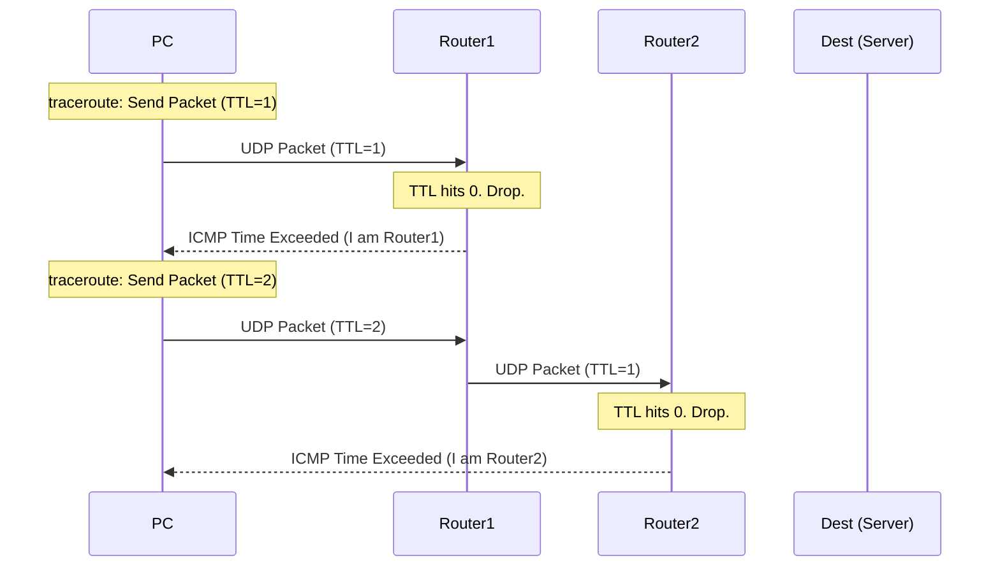

import { ConceptTemplate } from '@/features/kb/components/templates/ConceptTemplate'
import { Callout } from '@/features/kb/components/mdx/Callout'

export default function Layout({ children }) {
  return (
    <ConceptTemplate title="ICMP (Internet Control Message Protocol)">
      {children}
    </ConceptTemplate>
  )
}

**ICMP (Internet Control Message Protocol)** is the diagnostic heartbeat of the internet. While protocols like TCP and UDP are designed to carry actual application data (like web pages or video streams), ICMP is designed purely for control and error-reporting.

It operates at the Network Layer (Layer 3) alongside IP. In fact, ICMP messages are always encapsulated directly inside standard IP packets. If a router drops a packet because a network is unreachable, or if a packet's Time-to-Live (TTL) expires, the router uses ICMP to send an error message back to the original sender.

## 1. Deep Dive & Mechanics

ICMP has no concept of ports (unlike TCP/UDP). Instead, it relies on a **Type** and a **Code** field in its header to convey meaning.

Some of the most critical ICMP Types include:
- **Type 0:** Echo Reply (Used by `ping`)
- **Type 8:** Echo Request (Used by `ping`)
- **Type 3:** Destination Unreachable (A router couldn't find the target. The *Code* field specifies why: e.g., Code 1 = Host Unreachable, Code 3 = Port Unreachable).
- **Type 11:** Time Exceeded (A packet's TTL hit zero, causing it to be dropped. This is the mechanism `traceroute` exploits to map network paths).

## 2. Mathematical / Theoretical Foundation

The diagnostic tool `traceroute` relies on a brilliant theoretical hack involving ICMP and the IPv4 header's **Time to Live (TTL)** field.

The TTL field is a single byte (0-255). Its mathematical purpose is to prevent routing loops. Every time a packet passes through a router (a "hop"), the router decrements the TTL by $1$. If TTL $= 0$, the router drops the packet and sends an **ICMP Type 11 (Time Exceeded)** message back to the sender.

`traceroute` artificially exploits this:
1. It sends a packet to the destination with TTL $= 1$. The very first router decrements it to 0, drops it, and replies with ICMP Type 11. Now we know the IP of the 1st router!
2. It sends a packet with TTL $= 2$. The 1st router decrements it to 1 and passes it. The 2nd router decrements it to 0, drops it, and replies. Now we know the IP of the 2nd router!
3. This loop continues, mapping the exact network topology hop-by-hop until the final destination is reached.

## 3. Real-World Implementation

The two most famous commands in networking rely entirely on ICMP.

```bash
# 1. Ping: Tests basic connectivity and latency (Uses ICMP Type 8 and 0)
ping google.com

# 2. Traceroute: Maps the network path hop-by-hop
# (On Windows, this is 'tracert', which uses ICMP Echo Requests)
# (On Linux, 'traceroute' traditionally uses UDP packets, but relies on ICMP Type 11 for the replies)
traceroute google.com

# 3. MTR (My Traceroute): A powerful diagnostic tool combining ping and traceroute in real-time
mtr 8.8.8.8
```

## 4. Visualizations



## 5. Interview Prep

**Q: If I `ping` a server and it times out, does that definitively mean the server is offline?**
**A:** No. Many system administrators and firewalls intentionally drop or block ICMP Type 8 (Echo Requests) to prevent their servers from being discovered by basic network scanners or hit by Ping Floods. A server could be perfectly online and serving web traffic on TCP Port 443, while simultaneously dropping all ICMP ping requests.

**Q: What is a "Smurf Attack"?**
**A:** A Smurf Attack is a classic DDoS attack. An attacker sends an ICMP Echo Request (Ping) to a network's broadcast address (e.g., `192.168.1.255`). Crucially, the attacker *spoofs* the Source IP to be the victim's IP. All 254 computers on that network receive the ping and simultaneously send ICMP Echo Replies to the victim, overwhelming their bandwidth. Modern routers block directed broadcasts to prevent this.

**Q: How does Path MTU Discovery work?**
**A:** When a sender transmits a packet with the "Don't Fragment" (DF) bit set in the IP header, and it hits a router where the next link has a smaller MTU (Maximum Transmission Unit), the router drops the packet. It then sends an **ICMP Type 3, Code 4 (Fragmentation Needed and DF Set)** message back to the sender, telling it exactly what the smaller MTU size is so the sender can adjust its packet size dynamically.

## 6. Production Use Cases

- **Network Monitoring (Nagios/Zabbix):** Enterprise monitoring tools constantly send ICMP pings to thousands of switches, routers, and servers to generate real-time uptime dashboards and alert administrators if hardware goes offline.
- **Blackhole Routing (Null Routing):** When a network is under DDoS attack, ISPs will often route the malicious traffic to a "Null0" interface. This interface drops the traffic and explicitly suppresses ICMP "Destination Unreachable" responses to save CPU overhead.

<Callout icon="danger" title="Ping of Death">
In the 1990s, a vulnerability known as the "Ping of Death" existed in many operating systems (including Windows 95). The maximum legal size of an IPv4 packet is 65,535 bytes. Hackers would craft a fragmented ICMP packet that, when reassembled by the target, exceeded 65,535 bytes, causing an immediate buffer overflow and a Blue Screen of Death.
</Callout>
