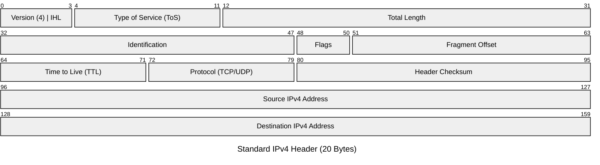

import { ConceptTemplate } from '@/features/kb/components/templates/ConceptTemplate'
import { Callout } from '@/features/kb/components/mdx/Callout'

export default function Layout({ children }) {
  return (
    <ConceptTemplate title="IPv4 (Internet Protocol version 4)">
      {children}
    </ConceptTemplate>
  )
}

**IPv4** is the technology that made the modern internet possible. Deployed in 1983 for the ARPANET, it defines IP addresses as 32-bit numerical labels written in dotted-decimal notation (e.g., `192.0.2.146`).

Because it uses exactly 32 bits, the absolute maximum number of possible IPv4 addresses is $2^{32}$, or approximately **4.3 billion**. In the early 1980s, dedicating a unique IP address to 4.3 billion computers seemed like an impossible milestone. However, with the explosion of smartphones, IoT devices, and cloud computing, the pool of unallocated IPv4 addresses officially ran out (IPv4 Exhaustion) around 2011.

## 1. Deep Dive & Mechanics

An IPv4 address is divided into a **Network Portion** and a **Host Portion**. The boundary between these two is defined by the Subnet Mask (using CIDR notation).

To keep the internet functioning despite exhaustion, IPv4 heavily relies on **NAT (Network Address Translation)** and RFC 1918 Private Address Spaces. 

RFC 1918 defines three blocks of IP addresses that are "unroutable" on the public internet:
- **10.0.0.0/8** (Massive corporate networks / AWS VPCs)
- **172.16.0.0/12** (Docker containers, medium networks)
- **192.168.0.0/16** (Home routers)

When your laptop (`192.168.1.5`) connects to Google, your home router intercepts the packet, mathematically rewrites the Source IP to your ISP-provided Public IP, and forwards it to the internet. When Google replies, your router rewrites the Destination IP back to your private address.

## 2. Mathematical / Theoretical Foundation

The structure of an IPv4 Header is highly optimized for 32-bit CPU architectures. The standard header is exactly 20 bytes long.

One critical mathematical component of the header is the **Header Checksum**. 
Because packets travel across noisy copper wires, bit corruption happens. The sender calculates a mathematical hash of the header (using one's complement arithmetic) and places it in the Checksum field. When a router receives the packet, it performs the exact same math. If the computed hash doesn't perfectly match the Checksum field, the router assumes the destination IP is corrupted and instantly drops the packet to prevent misrouting.

*(Notably, because every router must decrement the TTL field by 1, the header data changes at every hop, forcing every router to mathematically recompute the Header Checksum before forwarding it—a massive source of CPU overhead that IPv6 later eliminated).*

## 3. Real-World Implementation

Interacting with IPv4 usually involves subnetting, pinging, or configuring static IPs.

```bash
# On Linux, view your IPv4 addresses and subnet masks
ip -4 addr show

# Ping a public IPv4 address
ping 1.1.1.1

# Use netcat to listen on a specific IPv4 interface on port 8080
nc -l -p 8080 -s 192.168.1.50
```

## 4. Visualizations



## 5. Interview Prep

**Q: What is a Loopback Address?**
**A:** In IPv4, the entire `127.0.0.0/8` block is reserved for loopback. The most famous address is `127.0.0.1` (localhost). Any packet sent to this address never touches a physical Network Interface Card (NIC); the OS kernel instantly loops it back to the local machine. It is used extensively for testing local web servers and inter-process communication.

**Q: Why do we use `0.0.0.0` in configurations?**
**A:** Depending on the context, `0.0.0.0` has two meanings. In a routing table (`0.0.0.0/0`), it is the "Default Route"—meaning "match any IP address." In server configuration (like configuring an Express.js or Nginx server to listen on `0.0.0.0`), it means "bind to all available IPv4 interfaces on this machine," rather than binding to just localhost or a single specific ethernet port.

**Q: What is IP Spoofing?**
**A:** IP spoofing is the creation of IP packets with a forged source IP address. Because routers traditionally only care about the *Destination* IP to make routing decisions, an attacker can easily craft a packet that says it came from a trusted internal IP. Modern networks prevent this using BCP38 (Network Ingress Filtering), where edge routers drop packets if the source IP doesn't match the expected subnet of the interface it arrived on.

## 6. Production Use Cases

- **AWS Elastic IPs:** Because public IPv4 addresses are exhausted, they are now a commodity. Cloud providers own massive blocks of public IPv4 addresses and lease them to customers as "Elastic IPs" to attach to EC2 instances.
- **Docker Bridge Networks:** By default, the Docker daemon creates a private bridge network (often `172.17.0.0/16`) for containers. It relies entirely on Linux `iptables` to perform NAT, allowing containers with private IPv4 addresses to access the public internet.

<Callout icon="info" title="The Subnet Math Shortcut">
Network engineers use a quick mental shortcut for IPv4 subnetting. Because every bit borrowed halves the network, you can start at a `/24` (256 IPs). A `/25` is 128 IPs. A `/26` is 64 IPs. A `/27` is 32. This simple division is why CIDR notation is vastly preferred over writing out `255.255.255.224`.
</Callout>
