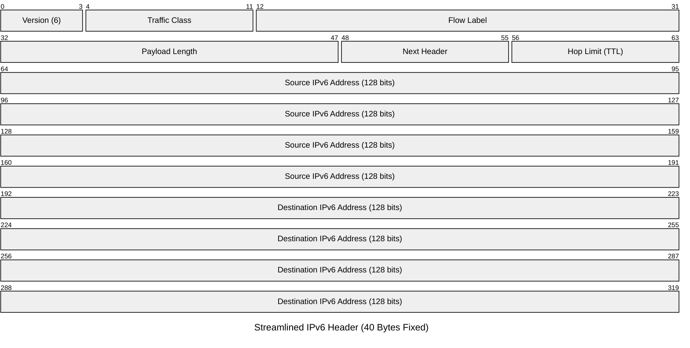

import { ConceptTemplate } from '@/features/kb/components/templates/ConceptTemplate'
import { Callout } from '@/features/kb/components/mdx/Callout'

export default function Layout({ children }) {
  return (
    <ConceptTemplate title="IPv6 (Internet Protocol version 6)">
      {children}
    </ConceptTemplate>
  )
}

**IPv6** is the successor to IPv4. Drafted by the IETF in 1998, its primary mandate was to solve the impending exhaustion of the 32-bit IPv4 address space.

While IPv4 offers 4.3 billion addresses, IPv6 utilizes a **128-bit address space**. This mathematically provides $2^{128}$ addresses, which is roughly 340 undecillion ($3.4 \times 10^{38}$) unique IP addresses. To visualize this scale, we could assign an IPv6 address to every single atom on the surface of the Earth, and we still wouldn't run out.

IPv6 addresses are represented as eight groups of four hexadecimal digits, separated by colons (e.g., `2001:0db8:85a3:0000:0000:8a2e:0370:7334`).

## 1. Deep Dive & Mechanics

Because the address space is virtually infinite, IPv6 completely eliminates the need for **NAT (Network Address Translation)**. Every smartphone, smart lightbulb, and laptop on the planet can theoretically have a globally unique, publicly routable IP address, restoring the internet to its original true end-to-end architecture.

IPv6 also introduces **SLAAC (Stateless Address Autoconfiguration)**. In IPv4, clients rely on a DHCP server to hand them an IP. In IPv6, a router periodically broadcasts Router Advertisement (RA) messages. A client PC receives the network prefix (e.g., the first 64 bits) from the router, and then mathematically derives the last 64 bits (the Interface ID) by itself, usually by hashing its own MAC address (using the EUI-64 format) or generating random privacy extensions. The client configures its own IP address instantly without a central server.

## 2. Mathematical / Theoretical Foundation

The engineers who designed IPv6 took the opportunity to aggressively optimize the packet header to reduce CPU overhead on internet backbone routers.

In IPv4, the header is variable length and contains a Checksum. As mentioned, because the TTL decreases at every hop, every router must mathematically recalculate the IPv4 checksum.
**IPv6 entirely removes the header checksum.** Modern data-link layers (like Ethernet FCS) and transport layers (like TCP checksums) already perform error checking. By eliminating this redundant math, IPv6 hardware routing is theoretically much faster and requires less ASIC complexity.

Furthermore, IPv6 eliminates **Router Fragmentation**. In IPv4, if a packet is too big, the router slices it into pieces. In IPv6, routers simply drop oversized packets and send an ICMPv6 "Packet Too Big" message to the sender, forcing the sender's CPU to handle the fragmentation, drastically speeding up router throughput.

## 3. Real-World Implementation

IPv6 formatting has rules for abbreviation to make it human-readable:
1. You can omit leading zeros in a group (e.g., `0db8` becomes `db8`).
2. You can replace a single contiguous block of multiple `0000` groups with a double colon `::` (but only once per address).

Example: `2001:0db8:0000:0000:0000:0000:0000:0001` condenses to just `2001:db8::1`.

```bash
# Ping a public IPv6 address (like Google's DNS)
ping6 2001:4860:4860::8888

# View your machine's IPv6 configuration (look for 'inet6')
ip -6 addr show

# An IPv6 URL in a web browser requires brackets because colons denote ports!
# http://[2001:db8::1]:8080/
```

## 4. Visualizations



## 5. Interview Prep

**Q: What is the equivalent of the IPv4 localhost (`127.0.0.1`) in IPv6?**
**A:** The IPv6 loopback address is `::1` (all zeros, ending in a one).

**Q: Does IPv6 use Broadcasts or ARP?**
**A:** No. IPv6 completely eliminates broadcasts (which were notoriously noisy in IPv4). Instead, it relies heavily on **Multicast** (sending packets only to subscribed groups of devices). The IPv4 ARP protocol is replaced by the **Neighbor Discovery Protocol (NDP)**, which uses ICMPv6 multicast to resolve MAC addresses much more efficiently.

**Q: What is a Link-Local Address?**
**A:** Every single IPv6 interface automatically generates a Link-Local Address starting with `fe80::`. This address is only valid on the immediate local network segment and is not routable across the internet. It is used for devices to communicate with each other (and find the default router) before they even get a public IP address.

## 6. Production Use Cases

- **Mobile Carrier Networks:** 4G LTE and 5G networks are almost exclusively built on IPv6. Mobile carriers ran out of IPv4 addresses years ago. Your smartphone primarily uses IPv6 to access the internet, utilizing Carrier-Grade NAT (CGNAT) or DNS64/NAT64 to access legacy IPv4-only websites.
- **IoT Smart Home Frameworks:** Protocols like Thread (used in the Matter smart home standard) are built directly on IPv6 (specifically 6LoWPAN). Every smart light switch and thermostat is assigned a routable IPv6 address, eliminating complex NAT port-forwarding issues.

<Callout icon="warning" title="Security Implications of No NAT">
Because IPv4 required NAT to share a single public IP, NAT accidentally acted as a rudimentary inbound firewall (blocking unsolicited traffic from reaching your internal PC). With IPv6, every device has a publicly routable IP. If a company enables IPv6 on their network without properly configuring stateful firewall rules on their edge router, every printer and workstation is instantly exposed to the entire public internet.
</Callout>
