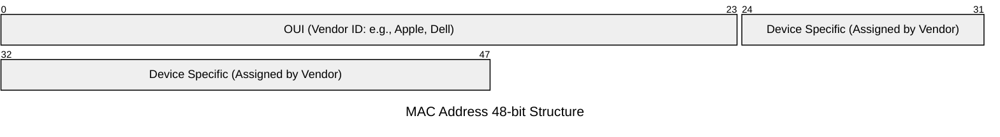

import { ConceptTemplate } from '@/features/kb/components/templates/ConceptTemplate'
import { Callout } from '@/features/kb/components/mdx/Callout'

export default function Layout({ children }) {
  return (
    <ConceptTemplate title="MAC Addresses (Media Access Control)">
      {children}
    </ConceptTemplate>
  )
}

A **MAC Address** (Media Access Control Address) is the fundamental hardware identifier in networking. While IP addresses (Layer 3) are logical and change depending on which coffee shop you sit in, MAC addresses (Layer 2) are traditionally "burned-in" to the hardware (ROM) of your Network Interface Card (NIC) at the factory. 

If IP addresses are the mailing addresses (City and Zip Code) that get a packet to your neighborhood, the MAC address is your actual physical name that gets the packet handed directly to you by the mail carrier. Switches use MAC addresses to forward Ethernet frames to the correct physical port on a local network.

## 1. Deep Dive & Mechanics

A standard MAC address is 48 bits long (6 bytes) and is typically displayed as six groups of two hexadecimal digits (e.g., `00:1A:2B:3C:4D:5E`).

It is strictly split into two halves:
1. **The first 24 bits (OUI - Organizationally Unique Identifier):** This is assigned by the IEEE to the manufacturer. If you look up `00:1A:2B` in a database, it will mathematically prove that the NIC was manufactured by a specific vendor, like Cisco, Apple, or Intel.
2. **The last 24 bits (NIC Specific):** This is assigned sequentially by the manufacturer, ensuring that no two cards from the same vendor ever share the same identifier.

When a network switch receives an Ethernet frame, it reads the Source MAC address and records it in its **MAC Address Table (CAM Table)** alongside the physical port it arrived on. This allows the switch to rapidly learn exactly which port every device is connected to.

## 2. Mathematical / Theoretical Foundation

The very first byte of a MAC address contains two theoretically critical boolean flags (bits 0 and 1):

1. **The U/L Bit (Universally/Locally Administered):** If this bit is `0`, the MAC address is globally unique (factory burned). If this bit is flipped to `1`, it indicates the MAC address was manually changed or randomly generated by software (Local Administration).
2. **The I/G Bit (Individual/Group):** If this bit is `0`, the frame is a Unicast frame (destined for a single specific NIC). If this bit is `1`, the frame is a Multicast or Broadcast frame.

For example, the broadcast MAC address `FF:FF:FF:FF:FF:FF` is mathematically all binary 1s, meaning the I/G bit is 1, instructing every NIC on the network to process the frame.

## 3. Real-World Implementation

You interact with MAC addresses constantly in systems administration, often for Wake-on-LAN, DHCP reservations, or network troubleshooting.

```bash
# View the MAC address (link/ether) of your interfaces on Linux
ip link show

# Change/Spoof a MAC address temporarily (interface must be down first)
sudo ip link set dev eth0 down
sudo ip link set dev eth0 address 02:11:22:33:44:55
sudo ip link set dev eth0 up

# View the ARP table (the mapping of IPs to MAC addresses on your LAN)
ip neigh show
```

## 4. Visualizations


*(The first 24 bits are publicly trackable to the manufacturer, the last 24 are a unique serial number).*

## 5. Interview Prep

**Q: Can two devices have the same MAC address on the internet? What about the local network?**
**A:** On the global internet, MAC addresses are irrelevant; routers strip Layer 2 frames off and only route via Layer 3 IPs. However, if two devices have the identical MAC address on the *same local network* (LAN), it creates chaos. The switch will constantly update its CAM table, flapping the port assignment back and forth. Packets will be delivered to the wrong machine, effectively breaking connectivity for both devices.

**Q: What is MAC Address Spoofing?**
**A:** While the default MAC is physically burned into ROM, the operating system driver reads it into RAM on boot and uses that RAM value for transmission. MAC Spoofing is simply telling the OS driver to use a custom 48-bit value instead. This is often used to bypass captive portals in hotels (by cloning a MAC address that has already paid for Wi-Fi) or to evade MAC-filtering firewalls.

**Q: Why do modern iOS and Android devices generate random MAC addresses?**
**A:** Privacy tracking. In the past, as you walked through a mall, every Wi-Fi router recorded your phone's Wi-Fi probe requests. Because your MAC address was globally unique and static, retail tracking companies could track your physical movements across the city. Modern OSes use **MAC Randomization** (setting the U/L bit to 1) to generate a fake, temporary MAC address for every different Wi-Fi network they scan, completely destroying this tracking mechanism.

## 6. Production Use Cases

- **DHCP Reservations:** Network administrators configure the DHCP server to always assign the IP `192.168.1.100` to the office printer's specific MAC address. Even if the printer reboots or is offline for weeks, no other device can steal that IP.
- **Port Security (802.1X):** In enterprise environments, switches are configured with MAC filtering. If an employee unplugs their corporate desktop and plugs a rogue personal laptop into the Ethernet wall jack, the switch detects an unauthorized MAC address and instantly shuts down the physical port to prevent intrusion.

<Callout icon="warning" title="CAM Table Flooding">
A devastating Layer 2 attack is CAM Table Flooding (using tools like `macof`). The attacker generates hundreds of thousands of fake MAC addresses per second. The network switch attempts to learn all of them, exhausting its finite CAM Table memory. Once the memory is full, the switch fails open, defaulting to behaving like a dumb Hub—broadcasting all traffic (including passwords) to all ports, allowing the attacker to easily sniff the network.
</Callout>
