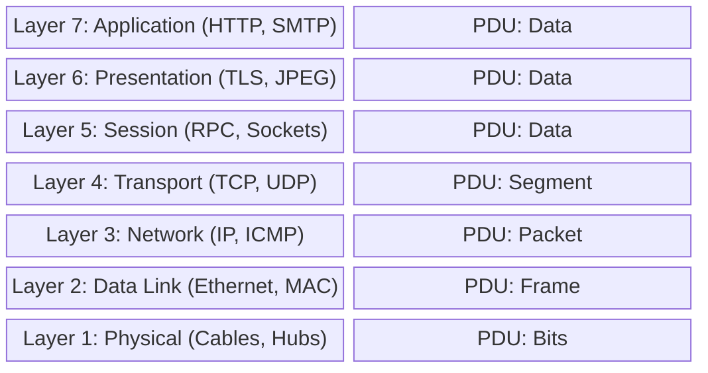

import { ConceptTemplate } from '@/features/kb/components/templates/ConceptTemplate'
import { Callout } from '@/features/kb/components/mdx/Callout'

export default function Layout({ children }) {
  return (
    <ConceptTemplate title="OSI Model (Open Systems Interconnection)">
      {children}
    </ConceptTemplate>
  )
}

The **OSI Model** (Open Systems Interconnection) is the universal language of computer networking. Developed in 1984 by the ISO, it divides the incredibly complex process of network communication into seven manageable, isolated layers.

While the modern internet technically runs on the simpler 4-layer TCP/IP model, the 7-layer OSI model remains the gold standard for network design, troubleshooting, and communication among engineers. When an engineer says, "We have a Layer 3 issue," every other engineer instantly knows they are talking about IP routing, not physical cables.

## 1. Deep Dive & Mechanics

The seven layers operate on the principle of **Encapsulation**. When you send an email, the data starts at Layer 7 and travels down. Each layer wraps the data in its own specific header (like putting an envelope inside a larger envelope), creating a **Protocol Data Unit (PDU)**. 

1. **Layer 7 - Application:** The software interface (HTTP, SMTP). PDU: *Data*
2. **Layer 6 - Presentation:** Data formatting, encryption, compression (TLS/SSL, JPEG). PDU: *Data*
3. **Layer 5 - Session:** Establishing and managing persistent connections. PDU: *Data*
4. **Layer 4 - Transport:** End-to-end reliability, sequencing, and ports (TCP, UDP). PDU: *Segment*
5. **Layer 3 - Network:** Logical addressing and routing across multiple networks (IP, ICMP). PDU: *Packet*
6. **Layer 2 - Data Link:** Node-to-node delivery on the same local network using MAC addresses (Ethernet, Wi-Fi). PDU: *Frame*
7. **Layer 1 - Physical:** The actual transmission of raw bits over a physical medium (Cables, Radio waves, Hubs). PDU: *Bits*

When the data reaches the destination, it travels *up* the stack, with each layer stripping off (decapsulating) its specific header.

## 2. Mathematical / Theoretical Foundation

The OSI model is heavily influenced by the software engineering principle of **Separation of Concerns** and **Abstraction Interfaces**.

By isolating functions into layers, mathematical optimization can occur independently. An engineer designing a complex error-correction math algorithm for a fiber-optic cable at Layer 1 does not need to care or know how a Layer 7 HTTP request is formatted. Because the interfaces between layers are strictly standardized, you can completely rip out a copper cable (Layer 1) and replace it with Wi-Fi (Layer 1/2), and Layer 3 (IP) and Layer 4 (TCP) will continue functioning with zero mathematical awareness that the physical medium changed.

## 3. Real-World Implementation

Troubleshooting networks should almost always follow the OSI model, starting from Layer 1 and working up (the Bottom-Up approach).

```bash
# Troubleshooting workflow:

# 1. Layer 1 (Physical): Is the cable plugged in? Does the NIC have link lights?
ethtool eth0 | grep "Link detected"

# 2. Layer 2 (Data Link): Can we see local MAC addresses? (Is the switch working?)
ip neigh show

# 3. Layer 3 (Network): Can we route to the outside world? (IP/ICMP)
ping 8.8.8.8

# 4. Layer 4 (Transport): Is the specific TCP/UDP port open on the server?
telnet 8.8.8.8 443

# 7. Layer 7 (Application): Is the web server actually returning a valid HTTP response?
curl -I https://google.com
```

## 4. Visualizations



## 5. Interview Prep

**Q: At which OSI layer does a Router operate? What about a Switch?**
**A:** A Router operates at Layer 3 (Network) because it inspects IP addresses to make routing decisions. A standard Switch operates at Layer 2 (Data Link) because it inspects MAC addresses to switch frames on a local network. A Hub operates at Layer 1 (Physical) because it blindly repeats electrical signals without inspecting any data.

**Q: What is a "Layer 7 Load Balancer" vs a "Layer 4 Load Balancer"?**
**A:** A Layer 4 Load Balancer (like AWS Network Load Balancer) only looks at the IP address and TCP/UDP port to forward traffic. It is extremely fast but blind to the actual content. A Layer 7 Load Balancer (like AWS Application Load Balancer or Nginx) actually terminates the HTTP connection, inspects the URL path (e.g., `/images` vs `/api`), and routes traffic intelligently based on the application data.

**Q: Why do many network engineers joke about "Layer 8"?**
**A:** "Layer 8" is an IT joke referring to the User. If a network issue cannot be explained by Layers 1-7, it is often a "Layer 8 issue" (human error, like someone unplugging their own computer).

## 6. Production Use Cases

- **Firewall Rule Definition:** Next-Generation Firewalls (NGFWs) like Palo Alto allow administrators to write rules across multiple OSI layers. You can write a Layer 3/4 rule (Block IP 1.2.3.4 on Port 80) or a Layer 7 rule (Block HTTP requests attempting to download `.exe` files, regardless of the port).
- **Network Architecture:** When designing a microservices architecture in Kubernetes, engineers must understand how the Calico CNI operates at Layer 3 (IP routing via BGP) while the Istio Service Mesh operates heavily at Layer 7 (managing mTLS and HTTP request tracing).

<Callout icon="info" title="Mnemonics for Memorization">
The most common way to memorize the 7 layers from bottom to top (Physical to Application) is:
**P**lease **D**o **N**ot **T**hrow **S**ausage **P**izza **A**way.
From top to bottom:
**A**ll **P**eople **S**eem **T**o **N**eed **D**ata **P**rocessing.
</Callout>
