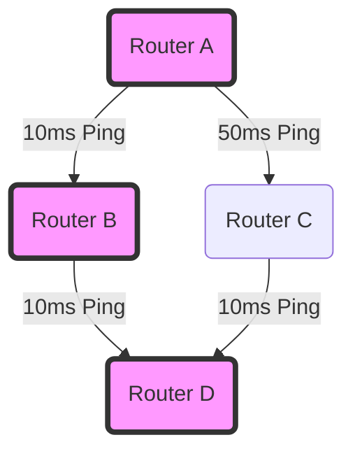

import { ConceptTemplate } from '@/features/kb/components/templates/ConceptTemplate'
import { Callout } from '@/features/kb/components/mdx/Callout'

export default function Layout({ children }) {
  return (
    <ConceptTemplate title="Routing (Static & Dynamic)">
      {children}
    </ConceptTemplate>
  )
}

**Routing** is the central intelligence of the internet. When an IP packet arrives at a router, the router must inspect the Destination IP address and decide which physical interface (port) to send it out of. To make this decision, it consults its **Routing Table**. 

The fundamental problem of network engineering is how to populate and maintain this Routing Table. There are two primary methods: **Static Routing** (a human types the routes manually) and **Dynamic Routing** (routers use complex algorithms to talk to each other and learn the routes automatically).

## 1. Deep Dive & Mechanics

**Static Routing:**
A network administrator logs into the router and explicitly types: *"To reach network 10.5.0.0/16, send the packet out Port 2."*
- **Pros:** Zero CPU overhead (no algorithms running), completely predictable, highly secure (no routing protocols to hack).
- **Cons:** Does not scale. If Port 2's cable gets cut by a backhoe, the router will stubbornly keep sending packets into the void. A human must manually log in and change the route to a backup path.

**Dynamic Routing:**
Administrators enable a Routing Protocol (like OSPF or BGP). Routers constantly send "Hello" packets to each other, exchanging information about which networks they can see and how fast their links are.
- **Pros:** Highly scalable. If a cable is cut, the algorithm instantly recalculates the topology and updates the routing table to use a backup path in milliseconds (Convergence).
- **Cons:** Requires CPU/RAM to maintain the database of routes. Misconfigurations can cause massive network outages (e.g., routing loops).

## 2. Mathematical / Theoretical Foundation

Dynamic routing protocols rely heavily on **Graph Theory** algorithms to calculate the shortest path.

1. **Distance-Vector Protocols (e.g., RIP, EIGRP):** Based on the **Bellman-Ford algorithm**. Routers do not know the full map of the network; they only know what their direct neighbors tell them (Routing by rumor). They calculate the "Distance" (e.g., hop count) and the "Vector" (which port to send it out).
2. **Link-State Protocols (e.g., OSPF, IS-IS):** Based on **Dijkstra's Shortest Path First (SPF) algorithm**. Every router floods information about its links to *all* other routers. Every router mathematically builds a complete, identical $O(N)$ topological map of the entire network in RAM, and then runs Dijkstra's algorithm to calculate the absolute fastest path to every destination.

## 3. Real-World Implementation

In Linux, you can manage the routing table using the `iproute2` suite.

```bash
# View the current routing table
ip route show

# STATIC ROUTING EXAMPLES:
# Add a static route for a specific subnet
sudo ip route add 192.168.100.0/24 via 10.0.0.1 dev eth0

# Add a Default Route (0.0.0.0/0). "If you don't know where it goes, send it to 192.168.1.1"
sudo ip route add default via 192.168.1.1

# DYNAMIC ROUTING:
# In Linux, dynamic routing is usually handled by a software daemon like FRRouting (FRR) or Quagga.
# Example FRR vtysh command to enable OSPF:
# router ospf
#  network 192.168.0.0/16 area 0
```

## 4. Visualizations


*(In a Dynamic Link-State protocol like OSPF, Router A knows the path A->C->D takes 60ms, while A->B->D takes 20ms. It automatically populates the routing table to route through B. If B dies, it instantly recalculates and routes through C).*

## 5. Interview Prep

**Q: What is Administrative Distance (AD)?**
**A:** If a router learns about the *exact same* destination network from two different sources (e.g., a human typed a Static Route, but OSPF also dynamically found a path), which one does it trust? Administrative Distance is a trustworthiness score. A Static Route has an AD of 1 (highly trusted). OSPF has an AD of 110. The router will always install the Static Route into the table because it has the lower AD.

**Q: What is the difference between IGP and EGP?**
**A:** **IGP (Interior Gateway Protocol)** includes OSPF and EIGRP. These are used *inside* a single organization (an Autonomous System) to route traffic between office buildings. **EGP (Exterior Gateway Protocol)** refers to BGP. It is used on the public internet to route traffic *between* different organizations and ISPs.

**Q: What is a Routing Loop, and how does IP prevent it?**
**A:** A routing loop occurs when Router A thinks the path to a destination is through Router B, and Router B thinks the path is through Router A. The packet bounces back and forth infinitely, consuming bandwidth. IP prevents this at Layer 3 using the **TTL (Time to Live)** field. Every bounce decrements the TTL by 1. When it hits 0, the packet is dropped.

## 6. Production Use Cases

- **Site-to-Site VPNs:** Often utilize Static Routing. If a company has a branch office with subnet `10.1.0.0/16`, the HQ firewall simply has a static route instructing it to send all traffic for that subnet into the IPSec VPN tunnel interface.
- **Internet Backbone (BGP):** The global internet relies on BGP (Border Gateway Protocol). When an ISP in London connects to an ISP in New York, they don't type static routes for the billions of IPs on the internet. Their routers establish a dynamic BGP session and exchange millions of routing prefixes dynamically, automatically routing around transatlantic cable failures.

<Callout icon="danger" title="BGP Route Leaks">
Because BGP operates on blind trust between organizations, a misconfiguration by a junior engineer at a small ISP can accidentally advertise that they have the "fastest route" to Google's servers. The dynamic algorithm accepts this, and suddenly half the world's internet traffic is routed to a tiny router in Kansas, instantly causing a global internet outage.
</Callout>
