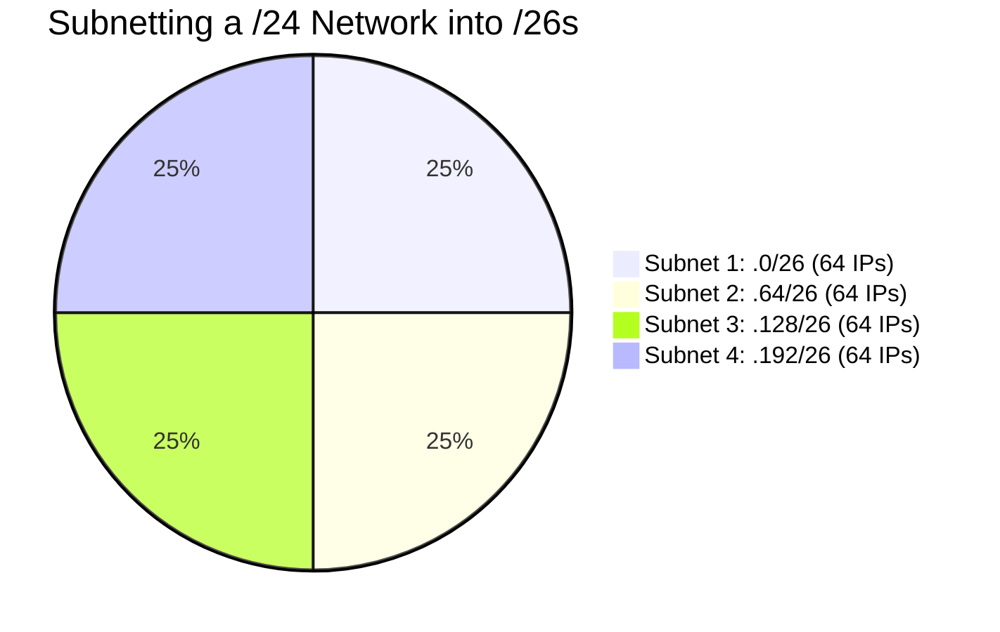

import { ConceptTemplate } from '@/features/kb/components/templates/ConceptTemplate'
import { Callout } from '@/features/kb/components/mdx/Callout'

export default function Layout({ children }) {
  return (
    <ConceptTemplate title="Subnetting">
      {children}
    </ConceptTemplate>
  )
}

**Subnetting** is arguably the most critical and mathematically intensive skill in foundational networking. It is the process of taking a large block of IP addresses provided by an ISP or cloud provider and slicing it into smaller, manageable chunks (subnets).

Why subnet? 
1. **Security:** You isolate networks. Your database servers go in one subnet, and public web servers go in another, separated by a firewall.
2. **Performance:** If you put 5,000 computers on a single network, the Layer 2 ARP broadcast traffic would cripple the network switches. Subnetting limits the scope of broadcasts.

## 1. Deep Dive & Mechanics

An IPv4 address (32 bits) is split into a **Network ID** and a **Host ID**. 

When you subnet, you perform **bit borrowing**. You "borrow" bits from the Host portion of the address and reassign them to the Network portion. By doing this, you increase the number of available subnets, but mathematically decrease the number of host IP addresses available inside each of those subnets.

The boundary is controlled by the **Subnet Mask**, typically written in CIDR notation (e.g., `/24`).

## 2. Mathematical / Theoretical Foundation

Subnetting relies entirely on base-2 (Binary) mathematics. 

**Key Formulas:**
1. **Number of Subnets created:** $2^s$ (where $s$ is the number of bits borrowed).
2. **Number of Usable Hosts per subnet:** $2^h - 2$ (where $h$ is the number of host bits remaining). We subtract 2 because the all-zeros address is reserved for the Network ID, and the all-ones address is reserved for the Broadcast Address.

**Example Scenario:**
You are given `192.168.1.0 /24` (256 total IPs). You need to split this into 4 smaller networks.
- To get 4 subnets, you need to borrow 2 bits ($2^2 = 4$).
- The new prefix is `/24 + 2 = /26`.
- You have $32 - 26 = 6$ host bits remaining.
- Hosts per subnet: $2^6 - 2 = 64 - 2 = 62$ usable hosts.

Your 4 new subnets are:
1. `192.168.1.0 /26` (IPs: 1-62)
2. `192.168.1.64 /26` (IPs: 65-126)
3. `192.168.1.128 /26` (IPs: 129-190)
4. `192.168.1.192 /26` (IPs: 193-254)

## 3. Real-World Implementation

In cloud architecture (like AWS or Terraform), you configure subnets using CIDR strings. You do not manually type out binary.

```bash
# Example Terraform configuration for an AWS VPC Subnet
resource "aws_subnet" "database_subnet" {
  vpc_id     = aws_vpc.main.id
  
  # The VPC is 10.0.0.0/16 (65,536 IPs). 
  # We carve out a /24 subnet (256 IPs) specifically for databases.
  cidr_block = "10.0.1.0/24"
  
  availability_zone = "us-east-1a"
  tags = {
    Name = "Private-DB-Subnet"
  }
}
```

## 4. Visualizations



## 5. Interview Prep

**Q: You are given a `/29` subnet. How many usable IP addresses does it contain?**
**A:** A `/29` means 29 bits are used for the network, leaving 3 bits for the host. $2^3 = 8$ total IPs. Subtract 2 for the Network and Broadcast addresses, leaving exactly **6 usable IP addresses**. `/29`s are frequently used for Point-to-Point router links or small public IP blocks given by an ISP.

**Q: What is a `/31` subnet used for?**
**A:** Mathematically, $32 - 31 = 1$ host bit. $2^1 = 2$ IPs. If you subtract 2, you get 0 usable IPs. However, RFC 3021 created a special exception for Point-to-Point links between two routers. Because there are only two devices on the wire, there is no need for a Broadcast address. A `/31` allows exactly 2 usable IPs, saving address space.

**Q: In AWS, if you create a `10.0.1.0/24` subnet, how many IPs are actually usable by EC2 instances?**
**A:** Standard math dictates $256 - 2 = 254$. However, AWS reserves the first 4 IPs and the last IP (Network, VPC Router, Amazon DNS, Future Use, and Broadcast). Therefore, you have $256 - 5 = 251$ usable IPs.

## 6. Production Use Cases

- **VPC Design:** A standard Cloud Architecture best practice is to deploy a `/16` VPC, and then subnet it across 3 Availability Zones. Each zone gets a `/24` Public Subnet (for Load Balancers), a `/24` Private Subnet (for App Servers), and a `/24` Database Subnet. Subnetting allows strict Security Group and Network ACL rules to govern traffic between these layers.
- **Data Center Segmentation:** A hospital might subnet their internal network to place all medical imaging machines (MRIs, X-Rays) in a `10.50.x.x` subnet, physically isolated from the guest Wi-Fi subnet `192.168.x.x` to comply with HIPAA regulations.

<Callout icon="info" title="The Subnet Cheat Code">
Network Engineers rarely do the binary math by hand in production. They use the "Magic Number" trick. Subtract the interesting octet of the subnet mask from 256. If your mask is `255.255.255.224`, the magic number is $256 - 224 = 32$. This instantly tells you that your subnets increment by 32 (e.g., .0, .32, .64, .96).
</Callout>
