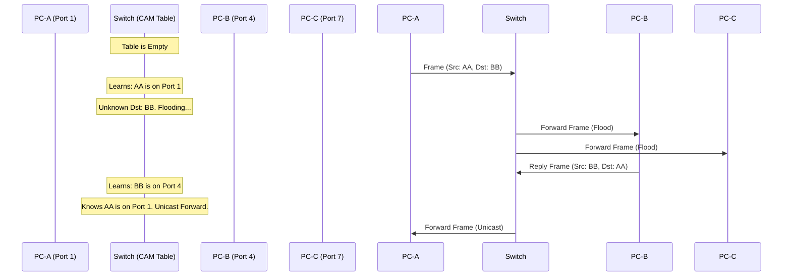

import { ConceptTemplate } from '@/features/kb/components/templates/ConceptTemplate'
import { Callout } from '@/features/kb/components/mdx/Callout'

export default function Layout({ children }) {
  return (
    <ConceptTemplate title="Switching">
      {children}
    </ConceptTemplate>
  )
}

**Switching** is the core mechanism that makes local area networks (LANs) highly efficient. While routers connect *different* networks together (using Layer 3 IP addresses), switches connect devices *within the same* network (using Layer 2 MAC addresses).

Before switches, networks used **Hubs**. A hub is mathematically dumb; if a signal comes in on Port 1, the hub blindly amplifies the electrical signal and blasts it out of Ports 2, 3, 4, and 5. This causes massive collisions and severe security vulnerabilities. A **Switch** is intelligent; it reads the data frame, identifies the exact recipient, and builds a dedicated electrical circuit strictly between the sender and the receiver.

## 1. Deep Dive & Mechanics

A switch maintains an internal database called the **MAC Address Table** (or CAM Table - Content Addressable Memory). 

When a switch is first turned on, its MAC table is completely empty. It populates this table dynamically through **Learning**:
1. PC-A (MAC: `AA:AA`) sends a frame to PC-B (MAC: `BB:BB`) on Port 1.
2. The switch reads the Source MAC (`AA:AA`) and instantly records in its table: *"MAC AA:AA lives on Port 1."*
3. Because the switch doesn't know where `BB:BB` lives yet, it performs a **Flood**. It sends the frame out of every single port *except* Port 1.
4. PC-B receives the frame and replies. PC-B's reply enters Port 4.
5. The switch reads PC-B's Source MAC and records: *"MAC BB:BB lives on Port 4."*
6. From now on, when PC-A talks to PC-B, the switch selectively **Forwards** the frame directly from Port 1 to Port 4. No other ports see the traffic.

## 2. Mathematical / Theoretical Foundation

The mathematical magic of a switch lies in its **CAM (Content Addressable Memory)**.

Standard computer RAM is addressed by location: you give the CPU an address (`0x4FA2`), and the RAM returns the data stored there. 
CAM is the mathematical inverse. You give the hardware the *data* (a 48-bit MAC address), and the hardware returns the *address* (the physical switch port number). 

Because CAM is implemented physically in silicon ASICs (Application-Specific Integrated Circuits), this lookup occurs in exactly $O(1)$ time, usually within a few nanoseconds. This is why a 48-port enterprise switch can forward millions of frames per second simultaneously without any CPU bottleneck.

## 3. Real-World Implementation

Network engineers interact with switching primarily through enterprise switch CLIs (like Cisco IOS or Juniper Junos).

```bash
# In Cisco IOS, view the dynamic MAC Address Table
show mac address-table

# Example Output:
# Vlan    Mac Address       Type        Ports
# ----    -----------       --------    -----
#    1    0014.2201.2345    DYNAMIC     Gi0/1
#    1    a45e.60dc.4fb1    DYNAMIC     Gi0/4

# Clear the MAC address table manually (forces the switch to re-learn everything)
clear mac address-table dynamic
```

## 4. Visualizations



## 5. Interview Prep

**Q: What is a Layer 3 Switch?**
**A:** A traditional Layer 2 switch only looks at MAC addresses. A Layer 3 switch (also called a Multilayer Switch) has the silicon capability to also look at Layer 3 IP addresses. It essentially combines the high-speed ASICs of a switch with the routing capabilities of a router. This is critical in enterprise networks to route traffic between different VLANs at wire-speed without bottlenecking a traditional external router (Router-on-a-Stick).

**Q: What happens if you plug a cable from Port 1 on a switch directly into Port 2 on the same switch?**
**A:** You create a Layer 2 Switching Loop. Broadcast frames will enter Port 1, get flooded out Port 2, immediately re-enter Port 1, and get flooded again, infinitely multiplying. Because Ethernet frames have no TTL (Time-to-Live) field like IP packets do, the frames never die. Within seconds, a **Broadcast Storm** will consume 100% of the switch's CPU and bandwidth, completely crashing the network. 

**Q: How do switches prevent Broadcast Storms?**
**A:** They use the **Spanning Tree Protocol (STP)**. STP allows switches to mathematically map the physical network topology. If it detects a physical loop (redundant cables), it logically blocks one of the ports in software, breaking the loop while maintaining it as a standby backup link in case the primary cable fails.

## 6. Production Use Cases

- **Microsegmentation:** In data centers, switches are used to implement port-level security. A switch can be configured (via 802.1X) to physically shut down a port if it detects an unauthorized MAC address attempting to connect.
- **Top of Rack (ToR) Switching:** In AWS/Azure data centers, every server rack has a massive switch at the top. All 40 servers in the rack connect to the ToR switch at 100Gbps, allowing blistering fast Layer 2 communication between servers running microservices in the same rack before the traffic ever needs to hit a Layer 3 router.

<Callout icon="danger" title="MAC Flooding Attacks">
A hacker can exploit the limited size of a switch's CAM table using a tool like `macof`. The tool bombards the switch with 100,000 fake MAC addresses per second. The CAM table fills up and crashes. When a switch's memory is full, its default fallback behavior is to act like a dumb Hub—it starts flooding *all* traffic to *all* ports. The hacker can now open Wireshark and passively sniff all sensitive traffic on the network.
</Callout>
