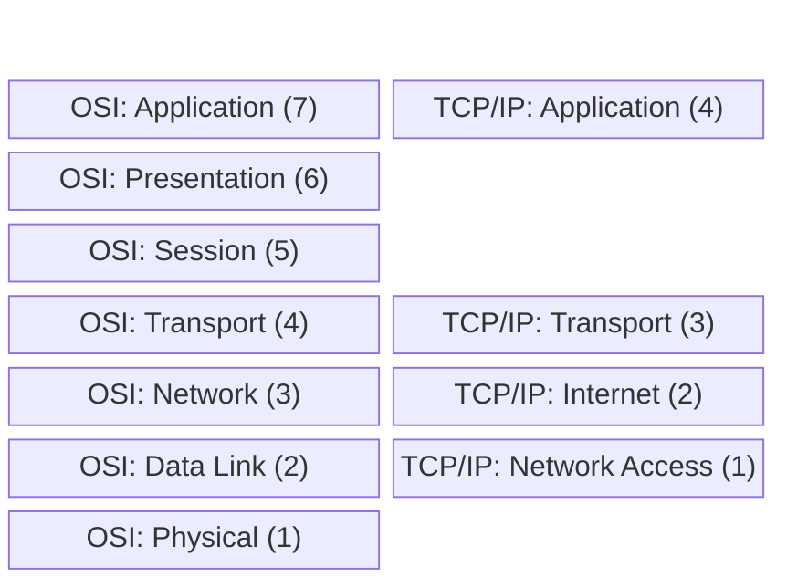

import { ConceptTemplate } from '@/features/kb/components/templates/ConceptTemplate'
import { Callout } from '@/features/kb/components/mdx/Callout'

export default function Layout({ children }) {
  return (
    <ConceptTemplate title="TCP/IP Model">
      {children}
    </ConceptTemplate>
  )
}

While the OSI Model is the theoretical 7-layer standard used for teaching and design, the **TCP/IP Model** (also known as the Internet Protocol Suite or DoD Model) is the actual, practical architecture that the modern internet is built upon.

Developed by the US Department of Defense (DARPA) in the 1970s (predating the OSI model), it is more concise, condensing the complex 7 layers of OSI into just 4 highly functional layers. 

## 1. Deep Dive & Mechanics

The TCP/IP model focuses heavily on pragmatism over theoretical purity. The four layers are:

1. **Application Layer (Layer 4):** Combines OSI's Application, Presentation, and Session layers. This layer handles high-level protocols, data representation, and dialogue control. (e.g., HTTP, HTTPS, SSH, DNS, SMTP, FTP).
2. **Transport Layer (Layer 3):** Maps directly to OSI's Transport layer. It provides end-to-end communication services for applications, handling multiplexing via ports and offering either reliable (TCP) or unreliable (UDP) delivery.
3. **Internet Layer (Layer 2):** Maps to OSI's Network layer. This is the realm of the IP protocol. It handles the logical addressing and routing of packets across multiple distinct networks (e.g., IPv4, IPv6, ICMP).
4. **Network Access Layer (Layer 1):** Combines OSI's Data Link and Physical layers. Also called the Link Layer, it defines the hardware addressing and physical transmission of bits over the medium (e.g., Ethernet, Wi-Fi 802.11, MAC addresses).

## 2. Mathematical / Theoretical Foundation

The defining theoretical philosophy of the TCP/IP model is the **End-to-End Principle**. 

The architects (Vint Cerf and Bob Kahn) mathematically assumed that the network infrastructure (the routers and cables in the Internet Layer and Network Access Layer) would be inherently unreliable and chaotic. Therefore, they pushed all the complex mathematical state-tracking, error-checking, and flow control out to the absolute edges of the network—into the Transport Layer (TCP) running on the end user's PC.

Because the core routers only have to do one simple $O(1)$ task—look at the IP address and forward the packet—the internet can scale to billions of nodes with immense speed. If a packet is dropped, the network doesn't care; it is the mathematical responsibility of the user's PC (TCP stack) to detect the missing sequence number and request a retransmission.

## 3. Real-World Implementation

Because TCP/IP is the foundational stack of modern Operating Systems, you interact with it constantly via socket programming.

```python
# A simple Python representation of the TCP/IP stack in action
import socket

# We interact at the Application Layer, but ask the OS to give us a Transport (TCP) socket
# AF_INET = Internet Layer (IPv4)
# SOCK_STREAM = Transport Layer (TCP)
s = socket.socket(socket.AF_INET, socket.SOCK_STREAM)

# The OS handles the Network and Link layers automatically
# resolving 'google.com' via DNS, finding the IP, and generating Ethernet frames
s.connect(("google.com", 80))

# We send Application Layer data (HTTP)
s.sendall(b"GET / HTTP/1.1\r\nHost: google.com\r\n\r\n")
print(s.recv(1024).decode())
```

## 4. Visualizations


*(The TCP/IP model condenses the top three OSI layers into one, and the bottom two OSI layers into one).*

## 5. Interview Prep

**Q: Why did the TCP/IP model "win" against the OSI model in the real world?**
**A:** Pragmatism and timing. The OSI model was developed by massive international committees and took years to finalize. It was highly prescriptive and theoretically pure but complex to implement in software. TCP/IP was funded by the US military, developed rapidly by engineers actually building the ARPANET, and the protocol suite was baked directly into BSD Unix for free. By the time OSI was finalized, TCP/IP was already running the burgeoning internet.

**Q: At which TCP/IP layer does a firewall primarily operate?**
**A:** Traditional stateful firewalls (like iptables) operate simultaneously at the Internet Layer (blocking specific IP addresses) and the Transport Layer (blocking specific TCP/UDP ports). Modern Next-Generation Firewalls (NGFW) or Web Application Firewalls (WAF) operate all the way up at the Application Layer (inspecting HTTP headers or blocking SQL injection payloads).

**Q: How does the concept of Encapsulation map to the TCP/IP layers?**
**A:** 
- The Application Layer creates raw **Data**.
- The Transport Layer encapsulates it into a **Segment** (adds TCP/UDP header).
- The Internet Layer encapsulates it into a **Packet** (adds IP header).
- The Network Access Layer encapsulates it into a **Frame** (adds Ethernet header) and converts it to **Bits** for physical transmission.

## 6. Production Use Cases

- **Software Defined Networking (SDN):** Cloud providers heavily utilize the TCP/IP model to virtualize infrastructure. In AWS VPCs, the physical Network Access Layer is abstracted away. Engineers only interact with the Internet Layer (defining CIDR subnets and Route Tables) and the Transport Layer (defining Security Group rules for TCP/UDP ports).
- **Socket Programming:** Every time a backend developer writes a Node.js Express server or a Go web server, they are interfacing directly with the OS's TCP/IP stack, instructing the kernel to bind a process to a specific Transport Layer port (e.g., 8080) and listen for incoming Internet Layer IP packets.

<Callout icon="info" title="The 5-Layer Hybrid Model">
In modern computer science textbooks (like Kurose and Ross), academics often use a 5-layer hybrid model that combines the best of both worlds. It takes the top 3 layers of TCP/IP (Application, Transport, Network/Internet) but splits the bottom layer back into OSI's Data Link and Physical layers, as the distinction between a MAC address (Data Link) and a radio wave (Physical) is too important to ignore in modern engineering.
</Callout>
