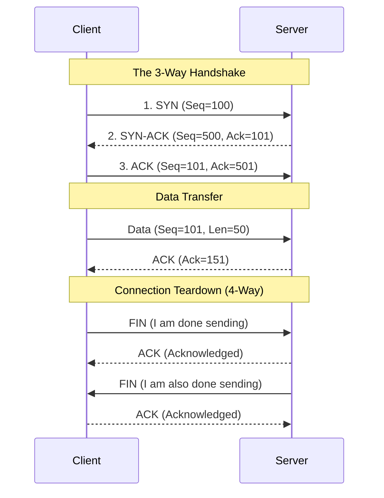

import { ConceptTemplate } from '@/features/kb/components/templates/ConceptTemplate'
import { Callout } from '@/features/kb/components/mdx/Callout'

export default function Layout({ children }) {
  return (
    <ConceptTemplate title="TCP (Transmission Control Protocol)">
      {children}
    </ConceptTemplate>
  )
}

**TCP (Transmission Control Protocol)** is the workhorse of the internet. If you are reading a webpage, sending an email, or downloading a file, you are relying on TCP.

It resides at the Transport Layer (Layer 4) of the OSI model. While the underlying IP protocol (Layer 3) is chaotic, unreliable, and prone to dropping or reordering packets, TCP sits on top of IP and acts as an uncompromising micromanager. It mathematically guarantees that every single byte of data sent by an application will be delivered to the destination exactly as it was sent, in the exact correct order, without duplication or corruption.

## 1. Deep Dive & Mechanics

TCP establishes a **Stateful Connection** between two computers before any data is sent. This is accomplished via the famous **3-Way Handshake**:
1. **SYN:** The Client sends a synchronization packet with a random mathematical Sequence Number (e.g., $1000$).
2. **SYN-ACK:** The Server acknowledges the client's sequence ($1001$) and sends its own random Sequence Number (e.g., $5000$).
3. **ACK:** The Client acknowledges the server's sequence ($5001$). The connection is now established.

During data transmission, TCP relies on **Sequence Numbers** and **Acknowledgments (ACKs)**. If the client sends 500 bytes of data (Seq: 1001), the server must reply with an ACK of 1501 (meaning "I received everything up to 1500, please send the next byte starting at 1501"). If the client doesn't receive that ACK within a specific timeout window, it assumes the packet was dropped by a router and mathematically forces a retransmission.

## 2. Mathematical / Theoretical Foundation

TCP's most complex mathematical algorithms involve **Flow Control** and **Congestion Control**.

- **Flow Control (The Sliding Window):** Prevents the sender from overwhelming the receiver's memory buffer. The receiver mathematically calculates how much free RAM it has left in its TCP buffer and advertises this "Window Size" in every ACK packet. If the Window Size hits 0, the sender pauses transmission until the receiver's application (like a slow web browser) processes the data and frees up RAM.
- **Congestion Control (AIMD - Additive Increase, Multiplicative Decrease):** Prevents the sender from overwhelming the internet routers. The sender starts by sending data slowly (Slow Start). It exponentially increases the send rate until a packet drops (which it assumes is due to router congestion). It then *multiplicatively decreases* the send rate (halving it) to relieve the internet, and then *additively increases* it slowly again. This creates the classic "sawtooth" graph of TCP throughput.

## 3. Real-World Implementation

Developers rarely write raw TCP packets; they interact with them via OS Socket APIs.

```bash
# View all active TCP connections and their current state on a server
netstat -tnp
# or on modern Linux:
ss -tnp

# Output example:
# State      Recv-Q Send-Q  Local Address:Port   Peer Address:Port
# ESTAB      0      0       192.168.1.10:22      203.0.113.5:54321
# TIME-WAIT  0      0       192.168.1.10:80      10.0.0.5:12345

# Manually initiate a TCP connection to test if a port is open
telnet google.com 443
# or
nc -vz google.com 443
```

## 4. Visualizations



## 5. Interview Prep

**Q: What is the difference between TCP and UDP?**
**A:** TCP is connection-oriented, reliable, orders packets, and performs error checking and flow control, but has high latency overhead (used for HTTP, SSH, FTP). UDP is connectionless, unreliable, does not order packets, and has zero flow control, but is blazingly fast with minimal overhead (used for Video Streaming, VoIP, DNS, Gaming).

**Q: What is a SYN Flood Attack?**
**A:** A DDoS attack where the attacker sends thousands of TCP SYN packets to a server but intentionally never replies with the final ACK. The server allocates RAM for each half-open connection, waiting for the handshake to finish. Eventually, the server's TCP backlog queue fills up, and it drops all legitimate new connections. It is mitigated using SYN Cookies.

**Q: Why does TCP use a 4-Way Teardown to close a connection?**
**A:** TCP is a full-duplex protocol; data can flow in both directions independently. When the Client sends a FIN packet, it means "I have no more data to send," but it *can still receive data*. The Server ACKs this, but may continue sending its own data for several more seconds before finally sending its own FIN packet to permanently close its half of the connection.

## 6. Production Use Cases

- **Web Browsing & APIs (HTTP/HTTPS):** When you download a 5GB file via HTTP, it rides on TCP. If even a single byte was dropped out of order and not retransmitted, the entire ZIP file or executable binary would be hopelessly corrupted.
- **Relational Databases:** Protocols for PostgreSQL and MySQL operate strictly over TCP. If a backend server sends a complex SQL `UPDATE` query to the database, TCP guarantees the query arrives perfectly intact.

<Callout icon="info" title="The BBR Congestion Algorithm">
For decades, TCP congestion control (like CUBIC) relied strictly on packet loss to detect network congestion. In 2016, Google engineers introduced **TCP BBR (Bottleneck Bandwidth and Round-trip propagation time)**. Instead of waiting for packets to drop, BBR continuously calculates the mathematical physics of the network tube (Bandwidth × Latency) to determine the exact maximum speed data can be sent without causing a traffic jam. Enabling TCP BBR on a Linux server can instantly double web application throughput on high-latency links!
</Callout>
