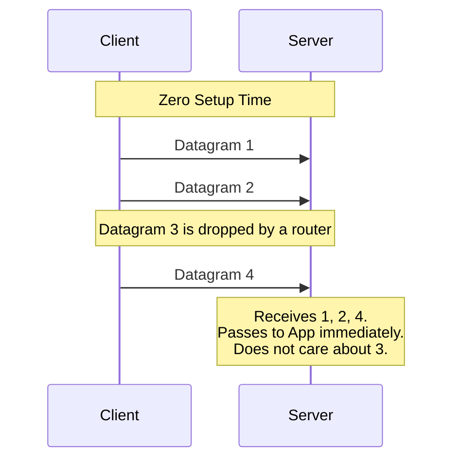

import { ConceptTemplate } from '@/features/kb/components/templates/ConceptTemplate'
import { Callout } from '@/features/kb/components/mdx/Callout'

export default function Layout({ children }) {
  return (
    <ConceptTemplate title="UDP (User Datagram Protocol)">
      {children}
    </ConceptTemplate>
  )
}

**UDP (User Datagram Protocol)** is the rebellious, fast-moving counterpart to TCP at the Transport Layer (Layer 4). While TCP is the meticulous accountant ensuring every byte is tracked and accounted for, UDP is the reckless courier who throws the package at the door and drives away without waiting for a signature.

UDP is a **connectionless** protocol. It performs no handshakes, no acknowledgments, no packet reordering, and no flow control. If a router is congested, it drops the UDP packet, and the sender will never know it happened.

## 1. Deep Dive & Mechanics

Because UDP strips away all of the reliability mechanisms of TCP, its header is incredibly minimal—only 8 bytes long (compared to TCP's 20-60 bytes).

A UDP Header contains exactly four fields:
1. **Source Port (16 bits):** Where it came from.
2. **Destination Port (16 bits):** Where it's going.
3. **Length (16 bits):** The size of the header and payload.
4. **Checksum (16 bits):** A basic mathematical check to ensure the payload wasn't corrupted in transit.

When an application tells the OS to send data via UDP, the OS instantly wraps it in this 8-byte header and blasts it onto the network wire. There is zero delay for connection establishment.

## 2. Mathematical / Theoretical Foundation

The theoretical justification for UDP lies in the physics of **Real-Time Communications** and the concept of **Head-of-Line Blocking**.

In TCP, if packet #1, #2, and #4 arrive, but packet #3 is dropped, TCP mathematically forces the operating system to *buffer* #4 and halt the application until packet #3 is retransmitted and arrives. This is called Head-of-Line Blocking.

In a live Zoom video call or a competitive multiplayer game (like Counter-Strike), this is disastrous. If a video frame from 0.5 seconds ago is dropped, retransmitting it is pointless—by the time it arrives, it's stale data, and the stream will noticeably stutter. UDP solves this mathematically by simply passing packets #1, #2, and #4 directly to the application. The application accepts the temporary visual glitch and keeps rendering the stream with the absolute lowest possible latency.

## 3. Real-World Implementation

Interacting with UDP requires specific flags in command-line tools, as most default to TCP.

```bash
# Test if a UDP port is open (e.g., DNS port 53) using netcat (-u flag)
# Note: Because UDP is connectionless, it may not respond even if open!
nc -vzu 8.8.8.8 53

# Use iPerf3 to blast a network with UDP traffic to test maximum raw bandwidth
# Server side:
iperf3 -s
# Client side (-u for UDP, -b for target bandwidth):
iperf3 -c 192.168.1.10 -u -b 1000M

# View active UDP listening ports on a Linux server
ss -ulnp
```

## 4. Visualizations



## 5. Interview Prep

**Q: Can you achieve reliability over UDP?**
**A:** Yes, but the *application* must handle it, not the operating system kernel. A developer can build a custom protocol on top of UDP where the application itself implements sequence numbers and retransmissions. This is heavily used in modern protocols like **QUIC** (which powers HTTP/3). QUIC uses UDP to avoid TCP's slow handshakes, but implements its own high-speed reliability in user-space.

**Q: Why does DNS primarily use UDP instead of TCP?**
**A:** A standard DNS query (translating a domain to an IP) is tiny and fits entirely inside a single 512-byte UDP packet. If DNS used TCP, a client would have to send 3 packets just to establish the handshake, then send the query, wait for the response, and send 4 packets to tear down the connection. Using UDP, it's a single packet out, single packet back. If it drops, the DNS client simply times out and retries.

**Q: What is a UDP Amplification DDoS Attack?**
**A:** Because UDP is connectionless, it is trivial to spoof the Source IP address. An attacker sends a tiny 64-byte UDP request to a public NTP (Network Time Protocol) or DNS server, but fakes the Source IP to be the victim's IP. The NTP server responds to the query with a massive 3,000-byte response, sending it directly to the victim. The attacker has "amplified" their bandwidth by 50x, easily overwhelming the victim's internet connection.

## 6. Production Use Cases

- **Streaming & Telemetry:** Video/Audio streaming (WebRTC, Zoom, Twitch ingest) and IoT sensor telemetry (where a sensor blasts temperature data every second; missing one second is irrelevant).
- **Service Discovery & Broadcasting:** Protocols like DHCP (to get an IP address) and mDNS (Bonjour/Chromecast discovery) rely on UDP broadcasts. You cannot broadcast with TCP because TCP requires a 1-to-1 handshake. UDP allows a device to blast a single packet to a subnet (`255.255.255.255`) asking, "Are there any printers here?"

<Callout icon="warning" title="Firewalls and UDP">
Because UDP has no concept of a "connection state" (no SYN, ACK, FIN), stateful firewalls have a difficult time tracking it. If an internal PC sends a UDP packet out to a server, the firewall creates a temporary "pseudo-state" allowing UDP packets from that server back in. However, this state usually times out very quickly (e.g., 30 seconds of silence), which is why UDP-based applications (like SIP VoIP phones) must constantly send "Keep-Alive" ping packets to keep the firewall hole open.
</Callout>
