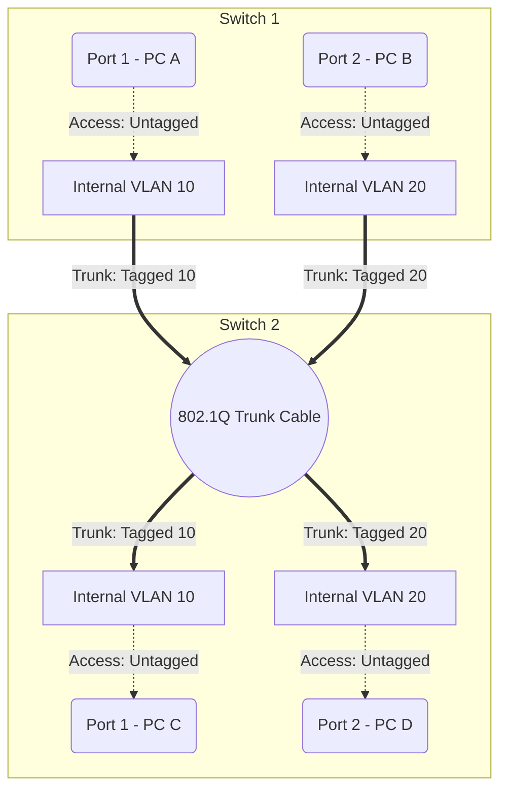

import { ConceptTemplate } from '@/features/kb/components/templates/ConceptTemplate'
import { Callout } from '@/features/kb/components/mdx/Callout'

export default function Layout({ children }) {
  return (
    <ConceptTemplate title="VLAN (Virtual Local Area Network)">
      {children}
    </ConceptTemplate>
  )
}

A **VLAN (Virtual Local Area Network)** is a software-defined layer of network isolation operating at Layer 2 (Data Link Layer). 

Historically, if an enterprise wanted to completely separate their Accounting department's network from the Guest Wi-Fi network for security reasons, they had to buy two entirely separate physical switches and run separate physical cables. VLANs solve this by logically slicing a single physical 48-port switch into multiple independent "virtual switches." 

Ports 1-10 can be assigned to VLAN 10 (Accounting), and Ports 11-20 to VLAN 20 (Guest). Even though they share the same physical silicon, a computer on Port 1 mathematically cannot send a Layer 2 Ethernet frame to a computer on Port 11.

## 1. Deep Dive & Mechanics

VLANs are standardized under the **IEEE 802.1Q** protocol.

When a standard Ethernet frame enters a switch port that is configured as a specific VLAN (an **Access Port**), the switch's internal ASICs mathematically inject a 4-byte **VLAN Tag** directly into the Ethernet header. 

This tag contains a 12-bit VLAN Identifier (VID). As the frame moves through the internal backplane of the switch, the hardware enforces strict isolation: this frame is only allowed to exit out of other ports that share the same 12-bit VID. Before the frame is pushed out of the destination Access Port to the final PC, the switch strips the tag off. The PCs are completely unaware that VLANs even exist.

## 2. Mathematical / Theoretical Foundation

The 12-bit VLAN Identifier (VID) dictates the theoretical limits of network segmentation.

Because $2^{12} = 4096$, a single Ethernet network can mathematically support a maximum of **4,096 distinct VLANs** (with VLAN 0 and 4095 being reserved, leaving 4,094 usable). 

In traditional corporate environments, 4,000 subnets are more than enough. However, in massive modern cloud data centers (like AWS or Azure) hosting tens of thousands of different tenants, this 12-bit mathematical limit was a severe architectural bottleneck. This directly led to the invention of **VXLAN (Virtual Extensible LAN)**, which encapsulates Layer 2 frames inside Layer 4 UDP packets and uses a 24-bit identifier, expanding the limit to 16 million virtual networks.

## 3. Real-World Implementation

Configuring VLANs requires managing two types of switch ports: **Access Ports** and **Trunk Ports**.

- **Access Port:** Connects to an end device (PC, printer). The switch adds the tag when data enters, and removes it when data exits.
- **Trunk Port:** Connects to another switch or a router. The switch *leaves the 802.1Q tags intact* when sending data out this port, allowing traffic for dozens of different VLANs to traverse a single physical cable.

```bash
# Example configuration on a Cisco IOS Switch

# 1. Create a VLAN
Switch(config)# vlan 20
Switch(config-vlan)# name GUEST_WIFI

# 2. Assign a port to the VLAN (Access Port)
Switch(config)# interface GigabitEthernet0/1
Switch(config-if)# switchport mode access
Switch(config-if)# switchport access vlan 20

# 3. Configure a port connecting to another switch (Trunk Port)
Switch(config)# interface GigabitEthernet0/48
Switch(config-if)# switchport mode trunk
Switch(config-if)# switchport trunk allowed vlan 10,20,30
```

## 4. Visualizations



## 5. Interview Prep

**Q: Can a device in VLAN 10 communicate with a device in VLAN 20?**
**A:** Not directly at Layer 2. By definition, VLANs represent separate broadcast domains. To communicate between them, you must use a Layer 3 device (a Router or a Multilayer Switch). The process is called **Inter-VLAN Routing**. The traffic must leave VLAN 10, hit the router, the router inspects the IP address, makes a routing decision, and pushes it back down into VLAN 20.

**Q: What is a "Native VLAN"?**
**A:** On an 802.1Q Trunk port, multiple tagged VLANs travel across the wire. The Native VLAN (usually VLAN 1 by default) is the one exception: traffic belonging to the Native VLAN is sent across the trunk *without* a tag. This was historically necessary for backward compatibility with legacy hubs that didn't understand 802.1Q headers. Security best practices dictate changing the Native VLAN to an unused ID to prevent VLAN Hopping attacks.

**Q: What is "Router on a Stick"?**
**A:** A network design pattern where a single physical router is connected to a switch via a single physical Trunk Cable. The router's physical interface is mathematically split into multiple "Sub-interfaces" (e.g., `eth0.10` and `eth0.20`), each acting as the default gateway for a different VLAN, handling all the Inter-VLAN routing through one cable.

## 6. Production Use Cases

- **VoIP Isolation:** In corporate offices, desk phones and PCs often share the same ethernet cable (the PC plugs into the phone, the phone plugs into the wall). Switches use a feature called Voice VLAN to logically separate the traffic. The phone tags its audio traffic (VLAN 50), while the PC sends untagged data traffic (VLAN 10). The switch prioritizes the Voice VLAN to prevent choppy phone calls while someone is downloading a large file.
- **Hypervisor Networking:** In VMware ESXi or Proxmox, virtual machines are connected to a Virtual Switch inside the server. The physical NIC on the server is configured as an 802.1Q Trunk to the physical Top-of-Rack switch. This allows the virtualization admin to instantly place VM-A in the Database VLAN and VM-B in the Web VLAN purely through software.

<Callout icon="danger" title="VLAN Hopping (Double Tagging)">
A classic Layer 2 security vulnerability. If an attacker's PC is connected to an access port that happens to belong to the Native VLAN, they can mathematically craft a malicious Ethernet frame with *two* 802.1Q tags. The first switch strips the outer Native tag and forwards it down the trunk. The second switch receives the frame, reads the inner (forged) tag, and blindly forwards the attacker's traffic into a highly secure VLAN that they shouldn't have access to.
</Callout>
