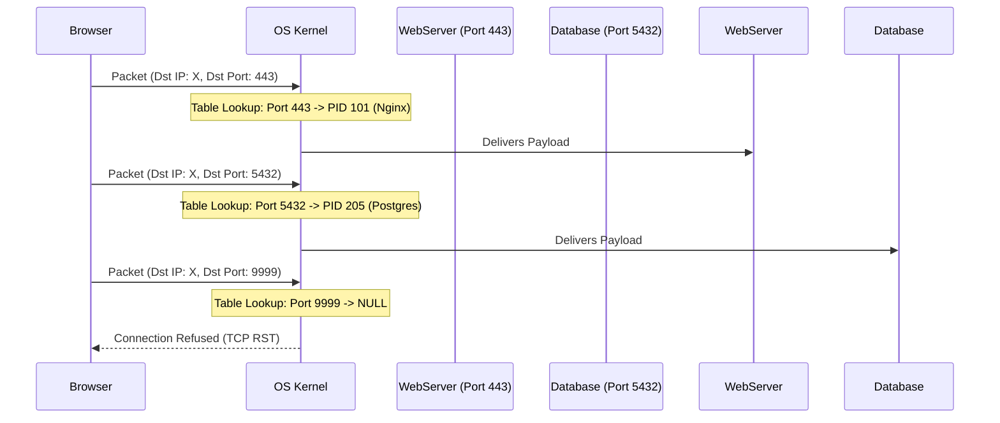

import { ConceptTemplate } from '@/features/kb/components/templates/ConceptTemplate'
import { Callout } from '@/features/kb/components/mdx/Callout'

export default function Layout({ children }) {
  return (
    <ConceptTemplate title="Ports (Network Ports)">
      {children}
    </ConceptTemplate>
  )
}

In computer networking, if an IP address (Layer 3) is a skyscraper's street address, a **Port** (Layer 4) is the specific apartment number inside that building. 

When a server receives a stream of network packets, it needs a way to know where to send them. Should it hand the data to the Nginx web server, the SSH daemon, or the PostgreSQL database? It determines this by looking at the **Destination Port** inside the TCP or UDP header. This concept allows a single computer to host hundreds of different network services simultaneously—a process known as multiplexing.

## 1. Deep Dive & Mechanics

A port is a 16-bit unsigned integer, meaning there are exactly **65,536** possible ports (from 0 to 65,535). 

The Internet Assigned Numbers Authority (IANA) divides these into three strict categories:
1. **Well-Known Ports (0 - 1023):** Reserved for core system services (e.g., 80 for HTTP, 443 for HTTPS, 22 for SSH). On Unix-like systems, you mathematically cannot bind a process to these ports unless you have root (administrator) privileges. This was originally designed as a security measure so clients could trust that a service running on port 22 was actually controlled by the server admin, not a rogue user.
2. **Registered Ports (1024 - 49151):** Assigned by IANA for specific vendor applications (e.g., 3306 for MySQL, 5432 for PostgreSQL). Any user process can bind to these without root privileges.
3. **Dynamic / Ephemeral Ports (49152 - 65535):** Used temporarily by client applications. When your web browser opens a connection to Google, it automatically assigns itself a random ephemeral source port (like 53421) so it can receive the returning traffic.

## 2. Mathematical / Theoretical Foundation

At the Transport Layer (TCP and UDP), a port is fundamentally just a 16-bit number mathematically encoded in the packet header. 

The operating system kernel maps these 16-bit numbers to specific application processes (PIDs) using a Hash Table or Tree data structure in RAM. When a packet arrives, the kernel strips the Layer 3 IP header, inspects the Layer 4 header to extract the Destination Port, performs an $O(1)$ lookup in the port table, finds the corresponding process's memory buffer, and dumps the payload into it.

If a packet arrives for a port where no process is currently listening, the kernel mathematically rejects it. For TCP, it replies with a **RST (Reset)** packet. For UDP, it replies with an **ICMP Destination Port Unreachable** packet.

## 3. Real-World Implementation

Network administrators and backend engineers interact with ports constantly when configuring firewalls and debugging servers.

```bash
# View all currently listening ports on a Linux server and the Process IDs attached to them
sudo netstat -tlnp
# Or using the modern equivalent 'ss':
sudo ss -tlnp

# Example Output:
# State    Recv-Q    Send-Q        Local Address:Port        Peer Address:Port    Process
# LISTEN   0         128                 0.0.0.0:22               0.0.0.0:*        users:(("sshd",pid=1234,fd=3))
# LISTEN   0         511                 0.0.0.0:80               0.0.0.0:*        users:(("nginx",pid=5678,fd=4))

# Scan a remote server to see what ports are open (using Nmap)
nmap -p 1-1024 example.com

# Open a specific port (e.g., 8080) on a Linux firewall using UFW
sudo ufw allow 8080/tcp
```

## 4. Visualizations



## 5. Interview Prep

**Q: Can two different applications listen on the same port at the same time?**
**A:** Generally, no. If Nginx is listening on Port 80, and you try to start Apache on Port 80, the OS will throw an `EADDRINUSE` (Address already in use) error. However, there are exceptions. Using the `SO_REUSEPORT` socket option in Linux allows multiple processes to bind to the same port. The kernel will automatically load-balance incoming connections across those processes, which is heavily used by modern web servers (like Nginx workers) to scale across multiple CPU cores.

**Q: If a firewall blocks all inbound ports except Port 443, how can a client web browser receive the response from the server?**
**A:** This is due to **Stateful Firewalls**. The firewall blocks *unsolicited inbound* traffic on all ports. However, when the client *initiates* the outbound connection to Port 443, it uses a random ephemeral source port (e.g., 50123). The stateful firewall records this connection in its state table. When the server replies (Destination Port 50123), the firewall mathematically matches it to the existing state table entry and dynamically allows the packet back in.

**Q: Why do some ports like 80 and 443 use TCP, while port 53 uses UDP?**
**A:** HTTP/HTTPS requires guaranteed data delivery, which TCP provides. DNS (Port 53) requires extremely low latency for tiny requests (fitting in a single 512-byte packet). The overhead of setting up a TCP handshake just to ask for an IP address is mathematically inefficient, so DNS primarily uses connectionless UDP.

## 6. Production Use Cases

- **Port Forwarding (DNAT):** In Docker, when you run `docker run -p 8080:80 nginx`, you are mapping Port 8080 on the host machine to Port 80 inside the container. The Docker daemon manipulates `iptables` to automatically rewrite the destination port of incoming packets.
- **Microservices Architecture:** In Kubernetes, thousands of microservices run on random ephemeral ports. A Service Mesh (like Istio) manages complex port mapping, allowing Service A to talk to Service B on Port 80, while under the hood it is seamlessly routed to Port 31456 on a random Node.

<Callout icon="danger" title="Port Scanning and Security">
Port scanning is the first step in almost every cyberattack. Hackers use tools like Nmap to systematically ping all 65,535 ports on a public IP address to find out what software is running. If they find Port 3389 open, they know Remote Desktop Protocol (RDP) is exposed and will immediately launch brute-force password attacks against it. Best practice dictates implementing "Default Deny" firewall rules, only explicitly opening the ports strictly required for the business.
</Callout>
