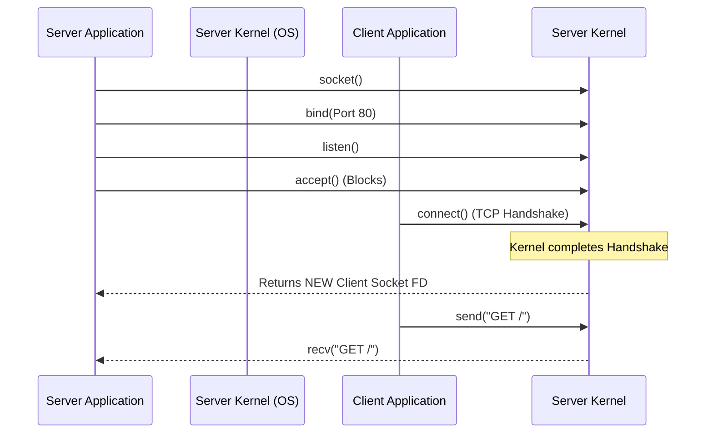

import { ConceptTemplate } from '@/features/kb/components/templates/ConceptTemplate'
import { Callout } from '@/features/kb/components/mdx/Callout'

export default function Layout({ children }) {
  return (
    <ConceptTemplate title="Sockets (Network Sockets)">
      {children}
    </ConceptTemplate>
  )
}

A **Network Socket** is the fundamental software abstraction that allows two programs to talk to each other over a network. If IP addresses and Ports are the theoretical addresses in the TCP/IP model, a Socket is the actual object instantiated in the Operating System's memory that performs the work.

Introduced as the Berkeley Sockets API in 1983, the socket API became the universal standard. When a programmer wants to build a web server, they don't write complex code to generate Ethernet frames or calculate TCP checksums. They simply ask the OS to give them a "Socket," bind it to a port, and write data to it exactly as if they were writing to a file on a hard drive.

## 1. Deep Dive & Mechanics

In Unix-like systems, everything is a file, and a Socket is no exception. It is represented by a **File Descriptor** (an integer pointer).

To establish a TCP server connection, a program performs a strict sequence of system calls:
1. **`socket()`**: Asks the kernel to create an endpoint for communication. The kernel allocates a memory buffer and returns a file descriptor.
2. **`bind()`**: Associates the socket with a specific IP Address and Port (e.g., `0.0.0.0:80`).
3. **`listen()`**: Marks the socket as a "Passive Socket," telling the kernel it is ready to accept incoming connections.
4. **`accept()`**: A blocking call. When a client performs a TCP handshake, `accept()` mathematically duplicates the listening socket and returns a *brand new* "Active Socket" connected specifically to that client. The original socket goes back to listening.
5. **`read()` / `write()`**: The server and client push and pull bytes into their respective socket buffers.

## 2. Mathematical / Theoretical Foundation

A network socket is uniquely identified by a mathematical **5-Tuple**:
1. Protocol (TCP or UDP)
2. Source IP Address
3. Source Port
4. Destination IP Address
5. Destination Port

This 5-Tuple is critically important. A web server only has one listening socket on Port 80. How can it serve 10,000 concurrent clients if it only has one port?
Because the kernel uses the 5-Tuple as a hash key. When a packet arrives, the kernel checks the Source IP and Source Port of the client. Since every client has a different Source IP or Source Port, every connection results in a mathematically unique 5-Tuple. The kernel can effortlessly demultiplex the traffic and hand it to the correct active socket file descriptor.

## 3. Real-World Implementation

Here is how sockets look in raw Python (which wraps the C Berkeley Sockets API very cleanly).

```python
import socket

# 1. Create a TCP/IP socket (AF_INET = IPv4, SOCK_STREAM = TCP)
server_socket = socket.socket(socket.AF_INET, socket.SOCK_STREAM)

# Allow the port to be reused immediately after the server stops
server_socket.setsockopt(socket.SOL_SOCKET, socket.SO_REUSEADDR, 1)

# 2. Bind the socket to all interfaces on port 8080
server_socket.bind(('0.0.0.0', 8080))

# 3. Listen for incoming connections (Queue size of 5)
server_socket.listen(5)
print("Listening on port 8080...")

while True:
    # 4. Accept a connection (This blocks until a client connects)
    client_socket, client_address = server_socket.accept()
    print(f"Connection established with {client_address}")
    
    # 5. Read data and send a response
    request = client_socket.recv(1024)
    client_socket.sendall(b"HTTP/1.1 200 OK\r\n\r\nHello from the socket!")
    
    # 6. Close the active client socket
    client_socket.close()
```

## 4. Visualizations



## 5. Interview Prep

**Q: What is a Datagram Socket (`SOCK_DGRAM`)?**
**A:** While a Stream Socket (`SOCK_STREAM`) represents a reliable TCP connection, a Datagram Socket represents UDP. Because UDP is connectionless, you don't call `listen()` or `accept()`. You simply call `bind()` to a port, and then use `recvfrom()` to pull whatever chaotic packets happen to land on that port, dealing with them one by one.

**Q: What is a Unix Domain Socket (IPC)?**
**A:** A Unix Domain Socket (`AF_UNIX`) is a socket used for Inter-Process Communication (IPC) *on the same physical machine*. Instead of binding to an IP address and port, it binds to a file path on the hard drive (e.g., `/var/run/docker.sock`). Because the data never touches the TCP/IP network stack (no IP headers, no checksum calculations), Unix sockets are mathematically magnitudes faster than using localhost (`127.0.0.1`) for local communication.

**Q: What is the C10k Problem?**
**A:** In the 1990s, web servers handled concurrent connections by spawning a new OS thread or process for every active socket (like Apache). Creating 10,000 threads to handle 10,000 sockets (the C10k problem) would exhaust the server's RAM and crash the kernel due to context-switching overhead. Modern servers (like Nginx or Node.js) solve this using **Asynchronous, Non-Blocking Sockets** combined with event loops (`epoll` or `kqueue`). One thread can efficiently monitor 10,000 non-blocking sockets simultaneously.

## 6. Production Use Cases

- **WebSockets:** While regular HTTP sockets close immediately after a request finishes, WebSockets (used in chat apps or live trading dashboards) upgrade the HTTP connection and intentionally keep the underlying TCP socket open permanently, allowing bidirectional real-time data flow.
- **Docker Daemon:** When you run the `docker` command in your terminal, it actually connects to a Unix Domain Socket (`/var/run/docker.sock`) to send HTTP REST commands directly to the Docker background daemon process running on the same machine.

<Callout icon="warning" title="File Descriptor Exhaustion">
In Linux, everything is a file, including sockets. The OS imposes a hard limit on how many File Descriptors a process can open (usually 1,024 by default). If a Node.js web server receives a massive traffic spike and tries to `accept()` its 1025th client socket, the OS will mathematically block it, throwing a `Too many open files` (EMFILE) error, crashing the server. Systems Administrators must manually increase this limit (using `ulimit -n`) in production environments.
</Callout>
