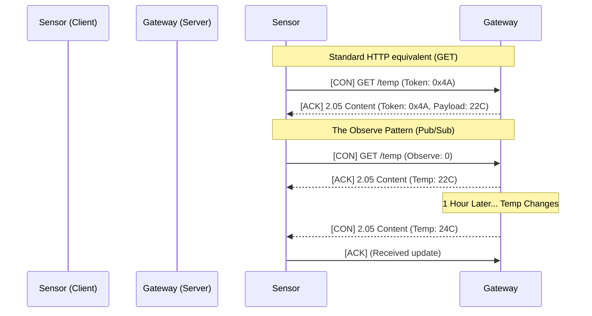

import { ConceptTemplate } from '@/features/kb/components/templates/ConceptTemplate'
import { Callout } from '@/features/kb/components/mdx/Callout'

export default function Layout({ children }) {
  return (
    <ConceptTemplate title="CoAP (Constrained Application Protocol)">
      {children}
    </ConceptTemplate>
  )
}

The **Constrained Application Protocol (CoAP)** is essentially HTTP rewritten for the Internet of Things (IoT). 

While HTTP is incredibly powerful, it is also bloated. HTTP relies on heavy TCP connections, massive text-based headers, and complex TLS handshakes. If you are manufacturing a smart temperature sensor running on an 8-bit microcontroller powered by a coin-cell battery that must last for 5 years, the CPU and radio power required to transmit standard HTTP/TCP traffic will kill the battery in weeks.

CoAP (RFC 7252) was designed to solve this. It provides the exact same RESTful paradigm as HTTP (GET, POST, PUT, DELETE), but it operates over lightweight **UDP** and encodes its headers in a highly compressed binary format.

## 1. Deep Dive & Mechanics

Because CoAP uses UDP, it inherently lacks the reliability of TCP. To compensate, CoAP implements its own minimal reliability layer directly in the application payload.

CoAP defines four message types:
1. **Confirmable (CON):** The message requires an Acknowledgment. If the sender doesn't receive an ACK, it will mathematically calculate an exponential backoff timer and retransmit the UDP packet.
2. **Non-confirmable (NON):** Fire-and-forget. Used for frequent telemetry (e.g., sending a temperature reading every second). If it drops, it doesn't matter.
3. **Acknowledgment (ACK):** Acknowledges a CON message.
4. **Reset (RST):** Indicates a message was received but could not be processed (e.g., missing context).

Furthermore, CoAP implements a feature HTTP lacks natively: **Observe**. A client can send a single GET request with the "Observe" flag. The server will then push state changes to the client automatically over time without the client needing to poll.

## 2. Mathematical / Theoretical Foundation

The mathematical brilliance of CoAP is its **Binary Header Compression**.

An HTTP request might have 300-500 bytes of ASCII string headers (`Accept-Language: en-US`, `User-Agent: Mozilla...`). 
CoAP theoretically compresses all metadata into a fixed 4-byte base header, followed by mathematically delta-encoded binary options.

For example, instead of sending the string `Content-Format: application/json`, CoAP mathematically maps the URI and Content-Format to integers. `application/json` is simply represented by the integer `50`. This allows an entire CoAP request, including payload, to frequently fit inside a single 127-byte IEEE 802.15.4 radio frame (preventing fragmentation and saving massive amounts of radio battery power).

## 3. Real-World Implementation

Interacting with CoAP requires specialized libraries, as standard web browsers do not natively support `coap://` URIs.

```javascript
// A simple Node.js CoAP Client using the 'coap' npm package
const coap = require('coap');

// We create a GET request to a CoAP endpoint
const req = coap.request('coap://localhost/temperature');

req.on('response', (res) => {
  // CoAP response codes map directly to HTTP (e.g., 2.05 = HTTP 200 OK)
  console.log(`Response Code: ${res.code}`); 
  
  res.pipe(process.stdout);
});

req.end();
```

## 4. Visualizations



## 5. Interview Prep

**Q: How does CoAP handle security without TLS (which requires TCP)?**
**A:** CoAP secures data using **DTLS (Datagram Transport Layer Security)**. DTLS is essentially TLS mathematically adapted to work over unreliable UDP. It provides the same cryptographic guarantees (AES encryption, Certificates, Pre-Shared Keys) but is designed to handle out-of-order and dropped packets.

**Q: If CoAP uses UDP, how does it handle large payloads (like downloading a firmware update)?**
**A:** CoAP handles this using **Block-Wise Transfers**. Instead of relying on TCP fragmentation, the CoAP application layer mathematically requests the file in small chunks (e.g., 64-byte blocks). The client requests Block 1, the server sends Block 1. The client then explicitly requests Block 2. This keeps RAM requirements on the tiny IoT device extremely low.

**Q: CoAP vs MQTT: Which should you use for IoT?**
**A:** MQTT is a Publish/Subscribe protocol running over TCP. It requires a central Broker (server) and maintains an always-on TCP connection, making it excellent for high-reliability message routing but heavier on battery. CoAP is a Request/Response (RESTful) protocol running over UDP. It is decentralized (device-to-device) and vastly superior for ultra-low power devices that want to wake up, blast a UDP packet, and immediately go back to sleep.

## 6. Production Use Cases

- **Smart City Infrastructure:** Networked streetlights and parking meters often use CoAP over NB-IoT (Narrowband IoT) cellular networks. The tiny packet size of CoAP minimizes expensive cellular data costs while preserving the 10-year battery life of the parking meter.
- **Home Automation (Matter/Thread):** CoAP is heavily utilized in local mesh networks like Thread (used by Apple, Google, and Amazon smart home devices). A smartphone app can use a CoAP GET request to directly query the state of a smart lock without needing a complex central server.

<Callout icon="info" title="Cross-Protocol Proxies">
Because CoAP was explicitly designed to map exactly to HTTP semantics (GET, PUT, 404 Not Found, 500 Internal Error), it is trivial to build a stateless proxy. An HTTP client (like a standard React web app) can send a standard HTTP GET to an Edge Gateway. The Gateway instantly translates the HTTP header into a binary CoAP UDP packet, sends it to the smart bulb, receives the CoAP reply, translates it back to HTTP, and sends it to the web browser.
</Callout>
