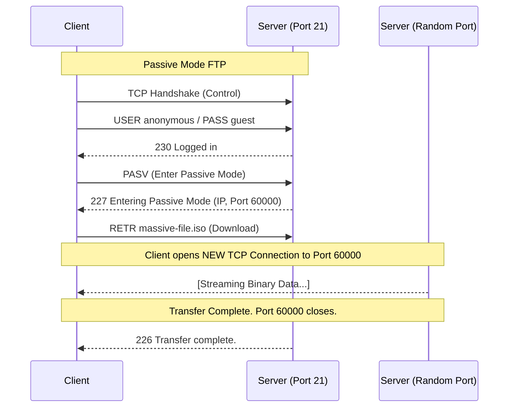

import { ConceptTemplate } from '@/features/kb/components/templates/ConceptTemplate'
import { Callout } from '@/features/kb/components/mdx/Callout'

export default function Layout({ children }) {
  return (
    <ConceptTemplate title="FTP (File Transfer Protocol)">
      {children}
    </ConceptTemplate>
  )
}

The **File Transfer Protocol (FTP)** is one of the oldest protocols still in use on the internet, predating TCP/IP itself (first proposed in 1971 as RFC 114 for the ARPANET). 

Before the World Wide Web and HTTP existed, if you wanted to download software or share documents across the country, you used FTP. While HTTP is optimized for fetching hundreds of tiny assets (HTML, CSS, images) rapidly, FTP was mathematically optimized for one thing: holding open a robust, long-term connection to transfer massive, gigabyte-sized files.

## 1. Deep Dive & Mechanics

Unlike almost every other modern protocol (which uses a single connection), FTP requires **two separate TCP connections** to function:

1. **The Control Connection (Port 21):** The client connects to the server on Port 21. This connection stays open the entire time. It is used strictly for sending text-based commands (like `USER`, `PASS`, `CWD` to change directories, and `RETR` to retrieve a file). *No actual file data is ever sent over this port.*
2. **The Data Connection (Port 20 or random):** When the client asks to download a file, an entirely separate TCP connection is created specifically to stream the binary bytes of that file. Once the file finishes, the data connection closes, but the Control connection on Port 21 remains open for the next command.

## 2. Mathematical / Theoretical Foundation

The complexity of FTP arises from how the Data Connection is mathematically established. There are two modes: **Active Mode** and **Passive Mode**.

- **Active Mode (Server connects to Client):** The client opens a random local port (e.g., 50000). It sends a `PORT` command over Port 21 telling the server, *"I am listening on IP X, Port 50000."* The **server** then initiates a new TCP connection from its Port 20 to the Client's Port 50000.
- **Passive Mode (Client connects to Server):** Because modern NAT and client firewalls block inbound connections, Active Mode almost never works today. In Passive Mode (`PASV`), the client says, *"I cannot accept inbound connections."* The server opens a random ephemeral port (e.g., 60000) and replies, *"Okay, you connect to me on IP Y, Port 60000."* The client then initiates the data connection.

## 3. Real-World Implementation

Interacting with FTP via the command line reveals its plain-text nature.

```bash
# Connecting to an FTP server via CLI
ftp ftp.example.com

# The interactive prompt begins:
# Connected to ftp.example.com.
# 220 (vsFTPd 3.0.3)
# Name: anonymous
# 331 Please specify the password.
# Password: (enter email)
# 230 Login successful.

# Basic Commands:
ftp> ls          # Lists directory contents
ftp> cd pub      # Changes directory
ftp> binary      # Switches transfer mode from ASCII to Binary (critical for zip/exe files!)
ftp> get file.zip # Downloads the file
ftp> put mydata.tar # Uploads a file
```

## 4. Visualizations



## 5. Interview Prep

**Q: Is FTP secure?**
**A:** Absolutely not. Standard FTP transmits everything—including your username and password—in **plain text**. Anyone sniffing the Wi-Fi network with Wireshark can read your credentials instantly. Today, standard FTP is only used for public, anonymous downloads (like downloading Linux ISOs).

**Q: What is the difference between FTPS and SFTP?**
**A:** They are completely different protocols. 
- **FTPS (FTP over SSL):** This is the exact same traditional FTP protocol, but wrapped in a TLS encryption tunnel (similar to HTTPS). It still uses the complex two-connection (Port 21/Data Port) architecture.
- **SFTP (SSH File Transfer Protocol):** This has absolutely nothing to do with FTP. It is a subsystem of SSH (Secure Shell). It operates entirely over a single TCP connection (Port 22), is fully encrypted, and avoids all the NAT/Firewall nightmares of Passive/Active mode. **SFTP is the modern industry standard.**

**Q: Why do you have to type `binary` before downloading an image or executable in CLI FTP?**
**A:** Because FTP was invented when mainframes used different text encodings (like EBCDIC vs ASCII), its default mode is **ASCII mode**. If you download a `.zip` file in ASCII mode, the FTP client will mathematically search the binary file for line-ending characters (like `\n`) and translate them to match your local OS (e.g., `\r\n`). This alters the bytes and completely corrupts the ZIP file. Setting `binary` mode (Image mode) forces FTP to transfer the raw bytes untouched.

## 6. Production Use Cases

- **Legacy Mainframe Integration:** Massive banking and logistics mainframes built in the 1980s still rely heavily on batch processing via FTP. Every night at midnight, systems generate massive CSV flat-files and push them to partner networks using automated FTP scripts.
- **Media and Broadcasting:** High-end video production houses often still use FTP (specifically accelerated variants) to upload massive 500GB raw 8K video files to centralized NAS servers, as HTTP upload protocols often struggle with files of that sheer magnitude.

<Callout icon="danger" title="FTP and Firewalls">
FTP is a nightmare for network engineers. Because the server tells the client which random Port (e.g., Port 64321) to connect to *inside the plain-text payload of Port 21*, a standard firewall blocking all inbound ports will block the file transfer. Firewalls had to implement a hack called **FTP ALG (Application Layer Gateway)**. The firewall literally spies on the plain-text Port 21 traffic, parses the `227 Entering Passive Mode` message, extracts the port number, and dynamically opens a temporary hole in the firewall for that specific port. Because FTPS encrypts the payload, the firewall cannot read the port number, completely breaking FTPS behind strict firewalls!
</Callout>
