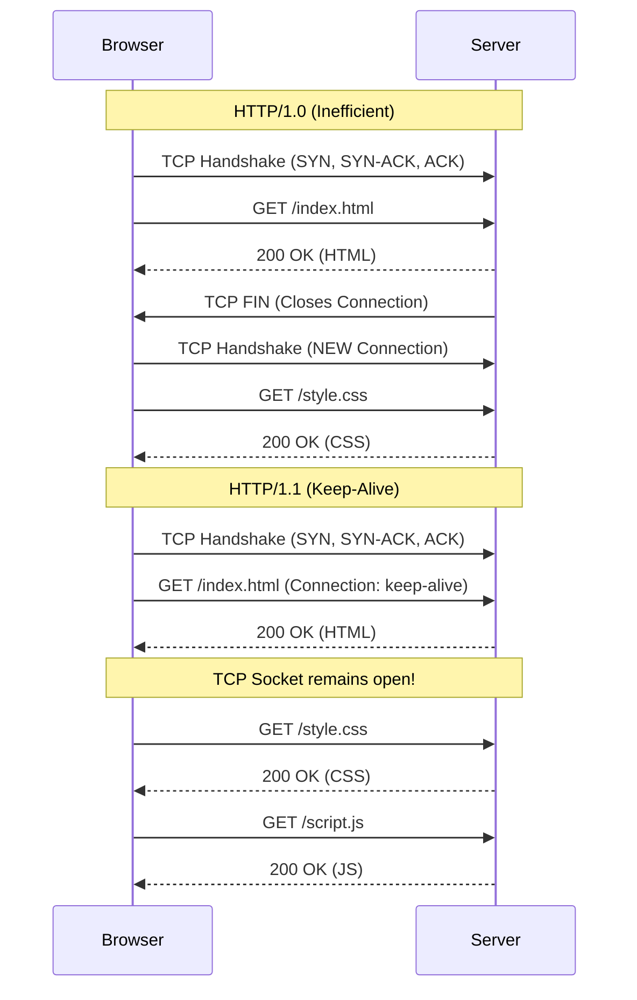

import { ConceptTemplate } from '@/features/kb/components/templates/ConceptTemplate'
import { Callout } from '@/features/kb/components/mdx/Callout'

export default function Layout({ children }) {
  return (
    <ConceptTemplate title="HTTP/1.1">
      {children}
    </ConceptTemplate>
  )
}

**HTTP/1.1** (Hypertext Transfer Protocol), standardized in 1997 (RFC 2068), is the undisputed language of the World Wide Web. While HTTP/1.0 created the web, it was highly inefficient. HTTP/1.1 introduced critical mathematical and architectural improvements that allowed the web to scale to its current massive, dynamic state.

It is a stateless, text-based, Request-Response protocol operating over TCP (usually Port 80, or 443 for HTTPS). A client (browser) sends a plaintext request, and a server returns a plaintext response containing headers and a payload (like HTML or JSON).

## 1. Deep Dive & Mechanics

The most critical upgrade in HTTP/1.1 was the introduction of **Persistent Connections (Keep-Alive)**.

In HTTP/1.0, if a webpage had 10 images, the browser had to perform a full TCP 3-Way Handshake, request Image 1, receive Image 1, and close the TCP connection. Then it had to perform *another* 3-Way Handshake for Image 2. This added massive mathematical latency overhead.

HTTP/1.1 defaults to `Connection: keep-alive`. The browser opens a single TCP connection, requests the HTML, keeps the TCP socket open, and reuses that exact same socket to sequentially request the CSS, JS, and all 10 images. 

Additionally, HTTP/1.1 introduced **Host Headers**. In 1.0, the server didn't know which domain you were requesting, meaning one IP address could only host one website. 1.1 requires the `Host: example.com` header, allowing a single IP address to host thousands of different websites (Virtual Hosting).

## 2. Mathematical / Theoretical Foundation

A major challenge in streaming data over TCP is knowing when the payload ends. 
If a server is generating a massive database report dynamically, it doesn't know the `Content-Length` ahead of time. In 1.0, the only way to signal the end of a file was to physically close the TCP connection, which breaks Keep-Alive.

HTTP/1.1 solved this mathematically with **Chunked Transfer Encoding**. 
Instead of sending one massive payload, the server sends the data in chunks. Before each chunk, it sends the exact hexadecimal size of that chunk. 

```text
HTTP/1.1 200 OK
Transfer-Encoding: chunked

4
        (Hex for 4 bytes)
Wiki

5
        (Hex for 5 bytes)
pedia

0
        (Hex 0 means "I am finished!")


```
This allows the TCP socket to stay open, while mathematically guaranteeing the client knows exactly when the dynamic stream has concluded.

## 3. Real-World Implementation

Because HTTP/1.1 is plain text, you can literally speak it to a server using a raw TCP socket.

```bash
# Connect to a web server manually
telnet example.com 80

# Type the following HTTP/1.1 request (pressing Enter twice at the end):
GET / HTTP/1.1
Host: example.com
Accept: text/html

# The server will reply in plain text:
HTTP/1.1 200 OK
Content-Type: text/html
Content-Length: 1256
Connection: keep-alive

<!doctype html>
<html>...</html>
```

## 4. Visualizations



## 5. Interview Prep

**Q: What is Head-of-Line (HoL) Blocking in HTTP/1.1?**
**A:** Even though HTTP/1.1 reuses the TCP connection, it is strictly synchronous. The browser requests Asset 1. It *must* wait for Asset 1 to completely finish downloading before it can request Asset 2 on that same socket. If Asset 1 is a massive 50MB video file, Asset 2 (a tiny CSS file) is stuck waiting in line. This is Head-of-Line Blocking. Browsers hack around this by opening up to 6 parallel TCP connections to the same server.

**Q: What is HTTP Pipelining?**
**A:** Pipelining was an attempt to fix HoL blocking in HTTP/1.1. It allowed the browser to send the requests for Asset 1, 2, and 3 simultaneously without waiting for the response. However, the server was mathematically forced to return the responses in the exact same order (1, 2, 3). If Asset 1 took a long time to generate, 2 and 3 were still blocked on the server side. Pipelining was notoriously buggy in intermediary proxies and was largely abandoned by modern browsers in favor of HTTP/2.

**Q: What is a 304 Not Modified response?**
**A:** A caching mechanism. The browser sends a GET request with a header `If-Modified-Since: Wed, 21 Oct 2025`. The server checks the file. If the file hasn't changed since that date, it replies with `304 Not Modified` and an empty body. This mathematically saves immense bandwidth, telling the browser to just use the copy in its local hard drive cache.

## 6. Production Use Cases

- **RESTful APIs:** Almost all standard web APIs (JSON over HTTP) communicate using HTTP/1.1 semantics, utilizing verbs (GET, POST, PUT, DELETE, PATCH) to map directly to CRUD operations on database resources.
- **Reverse Proxies:** Tools like Nginx and HAProxy are masters of HTTP/1.1. They parse the `Host` header of incoming traffic on Port 80/443 and dynamically route it to different backend microservices based on the URL path.

<Callout icon="warning" title="The Overhead of Text">
HTTP/1.1 is incredibly verbose. Every single request sends hundreds of bytes of plain-text headers (User-Agent, Cookies, Accept-Encoding). If a web page makes 100 requests for tiny icons, the browser transmits the exact same 1KB of cookie/header data 100 times over the wire, wasting 100KB of upload bandwidth. This mathematical inefficiency was a primary driver for the binary compression introduced in HTTP/2.
</Callout>
