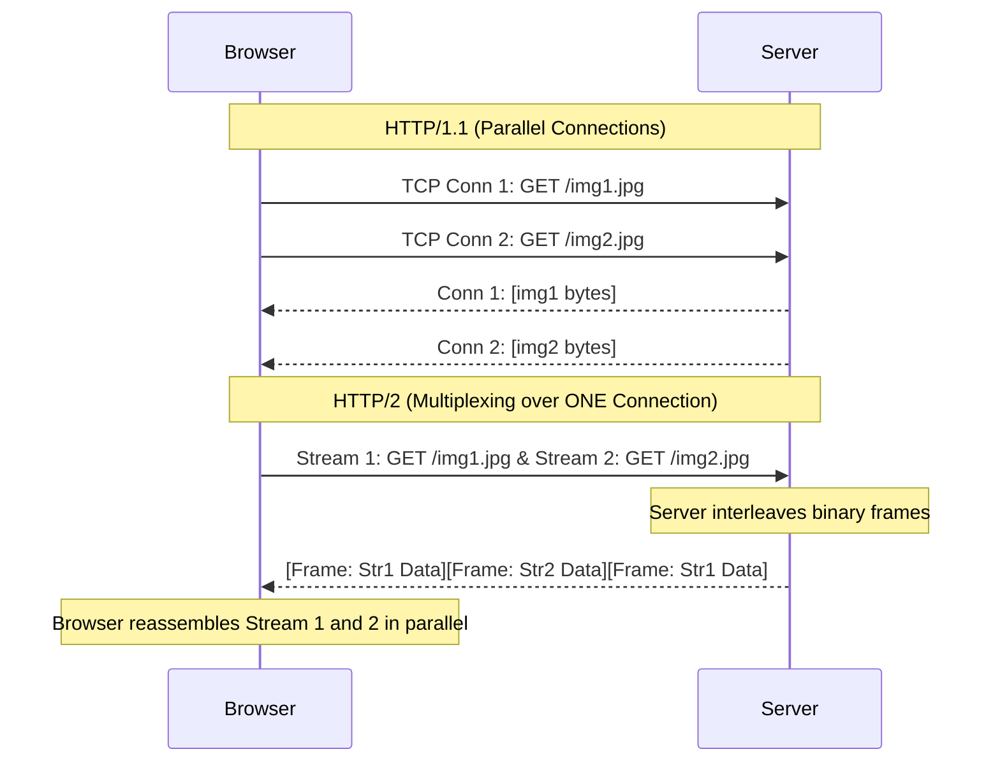

import { ConceptTemplate } from '@/features/kb/components/templates/ConceptTemplate'
import { Callout } from '@/features/kb/components/mdx/Callout'

export default function Layout({ children }) {
  return (
    <ConceptTemplate title="HTTP/2">
      {children}
    </ConceptTemplate>
  )
}

**HTTP/2** (published as RFC 7540 in 2015) was the first major upgrade to the web's core protocol in 18 years. It was heavily derived from Google's experimental **SPDY** protocol.

While HTTP/1.1 fundamentally shaped the early dynamic web, it was incredibly inefficient for modern, asset-heavy websites. HTTP/1.1 suffered from **Head-of-Line (HoL) Blocking** at the application layer, requiring browsers to open multiple parallel TCP connections (which wastes memory and defeats TCP congestion control) just to download a CSS file and a JavaScript file simultaneously. HTTP/2 was engineered specifically to decrease latency and fix these structural bottlenecks without changing the high-level semantics (methods, status codes, URIs) of HTTP.

## 1. Deep Dive & Mechanics

HTTP/2 abandons the plain-text, human-readable format of HTTP/1.1 entirely. It is a strictly **Binary Protocol**. 

It introduces the concept of **Streams, Messages, and Frames**:
- **Frame:** The smallest unit of communication (e.g., a HEADERS frame, a DATA frame).
- **Message:** A complete HTTP request or response (e.g., a GET request), consisting of one or more frames.
- **Stream:** A bidirectional flow of bytes established within the TCP connection.

Because data is chopped into tiny binary frames, HTTP/2 achieves true **Multiplexing**. A browser can open a single TCP connection to a server and request 50 images simultaneously. The server chops all 50 images into frames, tags each frame with a Stream ID, and interleaves them together over the single TCP connection. The browser reads the Stream IDs and mathematically reassembles the 50 images in parallel. Head-of-Line Blocking at the application layer is completely eliminated.

## 2. Mathematical / Theoretical Foundation

HTTP/2 introduces **HPACK Header Compression**.

In HTTP/1.1, if a browser makes 100 requests to the same server, it mathematically transmits the exact same 1KB of cookie and User-Agent headers 100 times, wasting 100KB of bandwidth.

HPACK solves this using a stateful mathematical **Compression Table**.
Both the client and the server maintain a synchronized, indexed table of headers in RAM. 
1. Request 1: The client sends `User-Agent: Mozilla...` and `Cookie: session=123` in plain text. The server stores these at Index 62 and 63 in its table.
2. Request 2: The client simply sends the binary integers `[62, 63]`.
The server performs an $O(1)$ lookup, reconstructing the massive strings from the indices. This reduces header overhead bandwidth by up to 90%.

## 3. Real-World Implementation

Because HTTP/2 is binary and almost exclusively requires TLS (HTTPS) in practice via the ALPN (Application-Layer Protocol Negotiation) extension, you can no longer use `telnet` to type raw requests. You must use modern tools.

```bash
# Test if a server supports HTTP/2 using curl
# The -I fetches only the headers. --http2 forces HTTP/2.
curl -I --http2 https://www.google.com

# Output snippet:
# HTTP/2 200 
# content-type: text/html; charset=ISO-8859-1
# ...
```

*Note: In Node.js, you interact with HTTP/2 via the `node:http2` module, which exposes specific API methods to handle streams and push events, rather than the standard `node:http` module.*

## 4. Visualizations



## 5. Interview Prep

**Q: What is HTTP/2 Server Push?**
**A:** Server Push was a feature where a server could preemptively send resources to the client before the client asked for them. For example, if the client requested `index.html`, the server knows the client will eventually need `style.css`. The server pushes `style.css` into the browser's cache instantly. *Note: Server Push proved mathematically difficult to optimize in the real world (often pushing assets the browser already had cached, wasting bandwidth) and has been deprecated in modern browsers like Chrome.*

**Q: Does HTTP/2 solve Head-of-Line Blocking completely?**
**A:** No! It solves HoL blocking at the **Application Layer (HTTP)** via multiplexing. However, it still runs on top of TCP. If a single packet drops, the **TCP Layer** will halt the entire socket, blocking *all* multiplexed streams until the packet is retransmitted. This is called *TCP Head-of-Line Blocking*, and it is the exact reason HTTP/3 was created.

**Q: Why do we still use tools like Webpack to bundle 50 JavaScript files into 1 massive file if HTTP/2 can multiplex 50 files efficiently?**
**A:** When HTTP/2 was released, many developers stopped bundling. However, they discovered that parsing and executing 50 separate JS modules in the V8 engine has significant CPU overhead compared to parsing 1 bundled file. Additionally, optimal compression (like Gzip/Brotli) achieves much higher mathematical compression ratios on one massive text file than on 50 tiny text files. Bundling remains a best practice.

## 6. Production Use Cases

- **gRPC (Google Remote Procedure Call):** The incredibly popular gRPC framework for microservice communication is built entirely on top of HTTP/2. It uses HTTP/2's binary framing and multiplexing to stream Protocol Buffer (protobuf) messages between servers at blistering speeds.
- **High-Traffic Media Sites:** Sites that load hundreds of small thumbnails (like Pinterest or Netflix) saw massive, immediate page load speed improvements by simply upgrading their reverse proxies (Nginx/Envoy) to support HTTP/2, as the browser no longer had to wait for available TCP connection slots to fetch the images.

<Callout icon="warning" title="The ALPN Requirement">
While the HTTP/2 specification technically allows for unencrypted HTTP/2 over plain TCP (known as h2c), every major browser vendor (Chrome, Firefox, Safari) strictly refused to implement it for security reasons. Therefore, to use HTTP/2 in a web browser, the server *must* support HTTPS (TLS 1.2+). The TLS handshake uses the ALPN extension to mathematically negotiate the upgrade to HTTP/2 before any HTTP data is sent.
</Callout>
