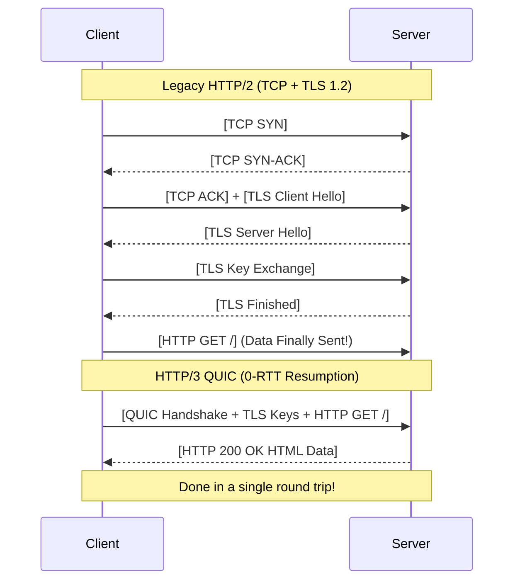

import { ConceptTemplate } from '@/features/kb/components/templates/ConceptTemplate'
import { Callout } from '@/features/kb/components/mdx/Callout'

export default function Layout({ children }) {
  return (
    <ConceptTemplate title="HTTP/3 (QUIC)">
      {children}
    </ConceptTemplate>
  )
}

**HTTP/3** represents the most radical paradigm shift in the history of web protocols. Since 1989, the World Wide Web has relied exclusively on TCP as its underlying transport layer. HTTP/3 rips TCP out of the stack entirely and replaces it with a new protocol called **QUIC** (Quick UDP Internet Connections), which runs on top of **UDP**.

Standardized in 2022 (RFC 9114), HTTP/3 was created to solve the fundamental physics problem that HTTP/2 exposed: **TCP Head-of-Line (HoL) Blocking**.

## 1. Deep Dive & Mechanics

In HTTP/2, you multiplex 50 streams (images, CSS, JS) over a single TCP connection. If a mobile phone drives into a tunnel and a single packet containing a piece of Image 1 drops, TCP will halt the entire socket. The browser cannot render Image 2, 3, or 4 (even if their packets arrived perfectly) until Image 1's packet is retransmitted.

QUIC solves this by moving reliability out of the OS Kernel (TCP) and into the User Space.
Because QUIC runs on UDP, it implements its own mathematical packet reordering and retransmission algorithms. If Stream 1 drops a packet, QUIC halts Stream 1. However, because QUIC understands that Stream 2 and Stream 3 are logically independent, it continues to pass their UDP packets to the browser. Only the specific stream that lost data is delayed.

## 2. Mathematical / Theoretical Foundation

The mathematical latency of establishing a secure web connection is a massive bottleneck.
In HTTP/2 over TLS 1.2, establishing a connection requires:
1. TCP Handshake (1 RTT - Round Trip Time)
2. TLS Handshake (2 RTT)
Total: **3 RTTs** before a single byte of HTTP data is sent. If the user is in Australia and the server is in New York (200ms ping), that's 600ms of dead silence.

QUIC integrates TLS 1.3 directly into its transport layer. 
- **Standard QUIC Connection:** Because cryptographic keys are negotiated during the initial connection setup, it takes only **1 RTT** to establish a secure connection.
- **0-RTT Resumption:** If the client has spoken to the server before, it remembers the cryptographic mathematical parameters. The client can send an HTTP GET request in the very first UDP packet it sends, achieving **0 RTT** latency.

## 3. Real-World Implementation

Implementing HTTP/3 requires specialized server configurations, as many legacy firewalls blindly block UDP traffic on port 443.

```bash
# Testing HTTP/3 requires a modern build of curl with the --http3 flag compiled in
curl -I --http3 https://cloudflare.com

# Example Nginx configuration to enable HTTP/3 (QUIC)
server {
    # Listen on TCP for HTTP/1.1 and HTTP/2
    listen 443 ssl http2;
    
    # Listen on UDP for HTTP/3 (QUIC)
    listen 443 quic reuseport;
    
    # Advertise to the client that HTTP/3 is available
    add_header Alt-Svc 'h3=":443"; ma=86400';
    
    ssl_certificate /path/to/cert.pem;
    ssl_certificate_key /path/to/key.pem;
}
```

## 4. Visualizations



## 5. Interview Prep

**Q: If QUIC is built on UDP, isn't it insecure and unreliable?**
**A:** No. QUIC uses UDP simply as a dumb, fast pipe to bypass the rigid TCP logic built into OS kernels. The QUIC protocol itself (implemented in user-space libraries like Google's `quiche` or Cloudflare's `quiche`) mathematically implements all the reliability, sequence numbering, and flow control that TCP has, plus mandatory end-to-end TLS 1.3 encryption.

**Q: How does a web browser know a server supports HTTP/3 if it connects using TCP first?**
**A:** Through the **Alt-Svc (Alternative Service)** HTTP header. The browser makes its first connection using standard HTTP/2 over TCP. The server responds with the HTML and includes `Alt-Svc: h3=":443"`. The browser mathematically records this in its cache. The next time the user visits the site, the browser completely skips TCP and immediately fires a UDP QUIC packet at port 443.

**Q: What is Connection Migration in QUIC?**
**A:** In TCP, a connection is mathematically bound by the 4-tuple (Client IP, Client Port, Server IP, Server Port). If you are watching a video on Wi-Fi and walk out of your house, your phone switches to 5G. Your Client IP changes. The TCP connection breaks, and the video buffers. In QUIC, connections are identified by a 64-bit **Connection ID** embedded in the packet, independent of the IP. When you switch to 5G, the phone keeps sending the same Connection ID, and the server seamlessly continues streaming the video without dropping the connection.

## 6. Production Use Cases

- **Mobile Applications:** Apps like Uber and YouTube use QUIC extensively because mobile network physics (cell tower handoffs, high latency, frequent packet drops) are exactly the environments where QUIC mathematically destroys TCP in performance.
- **Content Delivery Networks (CDNs):** Cloudflare, Fastly, and Google Edge extensively support HTTP/3. Because the protocol is highly optimized for fast connection setup (0-RTT), edge nodes can deliver cached assets to end-users globally with perceptually instant load times.

<Callout icon="danger" title="The CPU Overhead of QUIC">
Because TCP is heavily optimized by the OS Kernel and hardware network cards (NICs can perform TCP Checksum Offloading and Segmentation in hardware ASICs), it is incredibly CPU efficient. Because QUIC runs in user-space over UDP, all cryptographic encryption and packet sequencing must be done mathematically by the main CPU. When Cloudflare first deployed HTTP/3, they noted that it required roughly 2x to 3x more CPU power to serve the same amount of traffic compared to TCP.
</Callout>
