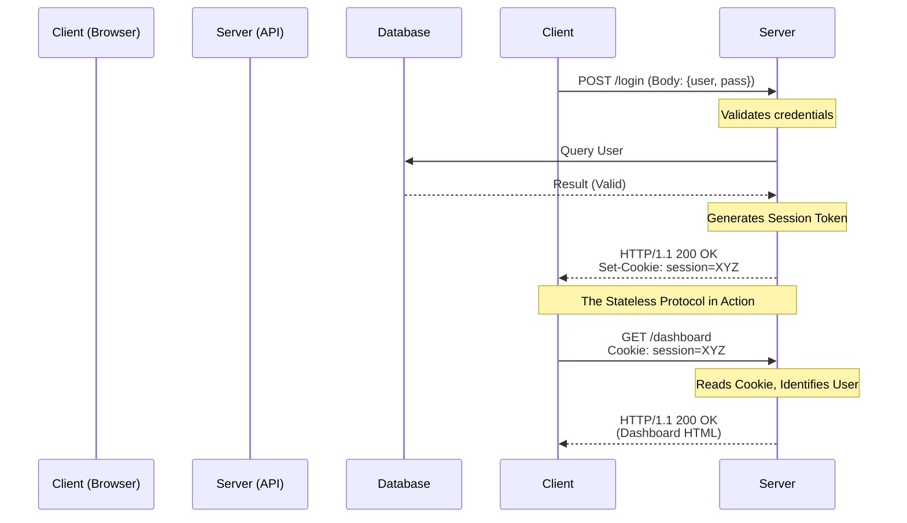

import { ConceptTemplate } from '@/features/kb/components/templates/ConceptTemplate'
import { Callout } from '@/features/kb/components/mdx/Callout'

export default function Layout({ children }) {
  return (
    <ConceptTemplate title="HTTP (Hypertext Transfer Protocol)">
      {children}
    </ConceptTemplate>
  )
}

**HTTP (Hypertext Transfer Protocol)** is the primary language of the World Wide Web. Invented by Tim Berners-Lee at CERN in 1989, it was initially designed for the simple task of fetching HTML documents from a server. Today, it is the backbone of almost all internet communication, powering web browsers, mobile apps, and machine-to-machine REST APIs.

HTTP is an Application Layer (Layer 7) protocol. It sits on top of a reliable transport protocol (traditionally TCP/IP). It is a **Client-Server** protocol, meaning a client (like a web browser) initiates a request, and a server mathematically processes it and returns a response.

## 1. Deep Dive & Mechanics

The most defining characteristic of HTTP is that it is fundamentally **Stateless**. 

When a client sends Request A, and then sends Request B one second later, the HTTP protocol itself has absolutely no mathematical concept that both requests came from the same person. The server treats every single request as a completely isolated event. 

To build modern, stateful applications (like a shopping cart or a logged-in user session), developers must implement state tracking *on top* of HTTP. This is universally achieved using **Cookies** or **Tokens** (like JWT). The server gives the client a mathematically unique string (a Cookie) in the first response. The client attaches this string in the HTTP Headers of every subsequent request, allowing the server to manually reconstruct the state.

## 2. Mathematical / Theoretical Foundation

Every HTTP communication consists of two distinct data structures: the **Request** and the **Response**.

**The HTTP Request contains:**
1. A Request Line: `[Method] [URI] [HTTP Version]` (e.g., `GET /index.html HTTP/1.1`)
2. HTTP Headers: Key-value pairs providing metadata (e.g., `Host: google.com`)
3. An optional Body: Raw data being sent to the server (e.g., a JSON payload in a POST request).

**The HTTP Response contains:**
1. A Status Line: `[HTTP Version] [Status Code] [Reason Phrase]` (e.g., `HTTP/1.1 200 OK`)
2. HTTP Headers: Key-value pairs (e.g., `Content-Type: application/json`)
3. An optional Body: The actual data requested.

The Status Codes are mathematically grouped:
- **1xx (Informational):** The request was received, continuing process.
- **2xx (Successful):** The action was successfully received, understood, and accepted. (e.g., 200 OK, 201 Created).
- **3xx (Redirection):** Further action must be taken to complete the request (e.g., 301 Moved Permanently, 302 Found).
- **4xx (Client Error):** The request contains bad syntax or cannot be fulfilled. (e.g., 400 Bad Request, 401 Unauthorized, 404 Not Found).
- **5xx (Server Error):** The server failed to fulfill an apparently valid request. (e.g., 500 Internal Server Error, 502 Bad Gateway).

## 3. Real-World Implementation

While browsers abstract HTTP entirely, backend developers interact with it constantly using tools like `curl` or Postman.

```bash
# Perform a simple GET request
curl http://example.com/api/users

# Perform a POST request with JSON data and custom headers
curl -X POST http://example.com/api/users \
     -H "Content-Type: application/json" \
     -H "Authorization: Bearer my_jwt_token" \
     -d '{"name": "Alice", "role": "admin"}'

# View the raw HTTP Request and Response Headers (-v for verbose)
curl -v http://example.com
```

## 4. Visualizations



## 5. Interview Prep

**Q: What is the difference between idempotent and safe HTTP methods?**
**A:** 
- A **Safe** method (GET, HEAD, OPTIONS) mathematically guarantees it will not modify resources on the server. It is strictly read-only.
- An **Idempotent** method (PUT, DELETE) can modify the server, but making the exact same request 1 time has the exact same mathematical effect as making it 10,000 times. For example, `DELETE /user/5`. If you run it once, the user is gone. If you run it 10 more times, the end state of the database is exactly the same (the user is still gone).
- POST is neither safe nor idempotent. Submitting a POST request 10 times usually creates 10 duplicate records.

**Q: What is CORS (Cross-Origin Resource Sharing)?**
**A:** It is a security mechanism enforced by web browsers. If a script on `https://mywebsite.com` tries to make an HTTP request to an API at `https://api.otherdomain.com`, the browser mathematically blocks it (Same-Origin Policy). To allow it, the API server must explicitly include the `Access-Control-Allow-Origin: https://mywebsite.com` header in its HTTP responses.

**Q: What is the purpose of the HTTP OPTIONS method?**
**A:** It is primarily used for **Preflight Requests** in CORS. Before a browser sends a complex POST request with custom headers to a different domain, it sends a lightweight `OPTIONS` request first to ask the server, *"Are you willing to accept a POST request with these headers from my domain?"* The server replies with the allowed methods and origins.

## 6. Production Use Cases

- **RESTful APIs:** Representational State Transfer (REST) is an architectural style that strictly leverages HTTP semantics. It maps CRUD operations to HTTP methods (Create = POST, Read = GET, Update = PUT/PATCH, Delete = DELETE) and uses standard HTTP Status Codes to communicate success or failure.
- **Webhooks:** A server-to-server communication pattern heavily reliant on HTTP. When an event occurs on Stripe (e.g., a customer payment succeeds), Stripe acts as an HTTP client and fires an HTTP POST request containing the payment data to a specific URL on your backend server.

<Callout icon="info" title="The Power of Headers">
HTTP Headers are incredibly extensible. Because the protocol dictates that unknown headers should simply be ignored, developers and organizations can invent custom headers on the fly. For example, AWS heavily utilizes custom headers like `x-amz-request-id` for tracing. You can inject `X-My-Custom-Correlation-Id` into your microservices to easily track a single request as it bounces across 20 different internal servers in Datadog.
</Callout>
