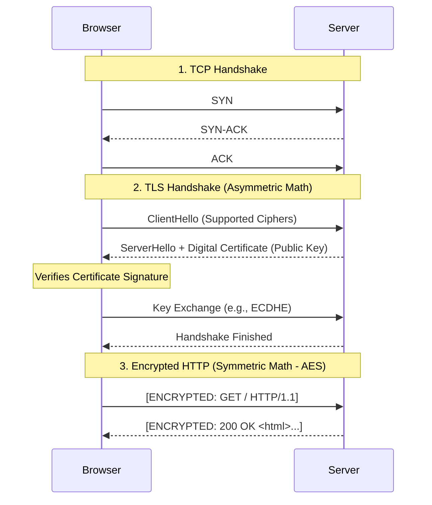

import { ConceptTemplate } from '@/features/kb/components/templates/ConceptTemplate'
import { Callout } from '@/features/kb/components/mdx/Callout'

export default function Layout({ children }) {
  return (
    <ConceptTemplate title="HTTPS (HTTP Secure)">
      {children}
    </ConceptTemplate>
  )
}

**HTTPS (Hypertext Transfer Protocol Secure)** is mathematically identical to HTTP, with one critical difference: all HTTP data (headers, URLs, payloads) is routed through a cryptographic tunnel known as **TLS (Transport Layer Security)**, historically called SSL, before being transmitted over TCP.

In standard HTTP (Port 80), all traffic is transmitted in plain text. Any router or ISP along the path can read passwords, session cookies, and private messages (Packet Sniffing). HTTPS (Port 443) ensures **Confidentiality** (encryption), **Integrity** (data wasn't tampered with), and **Authentication** (you are talking to the real server, not an imposter).

## 1. Deep Dive & Mechanics

The magic of HTTPS relies on a mathematically complex process called the **TLS Handshake**, which establishes the secure tunnel.

1. **Client Hello:** The browser sends supported cipher suites and a random byte string.
2. **Server Hello & Certificate:** The server replies with its chosen cipher, its own random string, and its **Digital Certificate** (which contains its Public Key and is mathematically signed by a trusted Certificate Authority like Let's Encrypt).
3. **Authentication:** The browser's OS verifies the Certificate Authority's mathematical signature against its local Root Trust Store. If valid, the browser knows the server is authentic.
4. **Key Exchange (Asymmetric):** The client and server use the Public Key and complex algorithms (like Diffie-Hellman or RSA) to securely mathematically derive a shared **Symmetric Session Key** without ever transmitting the actual key across the wire.
5. **Secure Channel (Symmetric):** The handshake is over. Both sides now use the lightning-fast Symmetric Session Key (e.g., AES-GCM) to encrypt and decrypt all actual HTTP traffic.

## 2. Mathematical / Theoretical Foundation

HTTPS is built upon the dual mathematical pillars of Modern Cryptography:

1. **Asymmetric Cryptography (Public Key / Private Key):** Based on the mathematical difficulty of factoring massively large prime numbers (RSA) or calculating discrete logarithms on elliptic curves (ECC). It allows two parties to securely exchange secrets over an observed network. However, asymmetric math requires intense CPU calculations, making it too slow to encrypt gigabytes of video data.
2. **Symmetric Cryptography (Shared Key):** Based on bitwise operations (like XOR) and substitution-permutation networks (like AES). It is mathematically blazingly fast (often hardware-accelerated in the CPU). 

HTTPS combines them beautifully: Asymmetric math is used *only* during the first 50 milliseconds to securely exchange a key, and then Symmetric math takes over to encrypt the actual massive web payloads.

## 3. Real-World Implementation

Configuring HTTPS requires obtaining a cryptographic certificate and binding it to a web server (like Nginx).

```bash
# Using Let's Encrypt (Certbot) to automatically fetch a free TLS certificate
# and configure Nginx to serve HTTPS traffic.
sudo certbot --nginx -d example.com -d www.example.com

# Example Nginx Block for HTTPS
# server {
#     listen 443 ssl http2;
#     server_name example.com;
#     
#     ssl_certificate /etc/letsencrypt/live/example.com/fullchain.pem;
#     ssl_certificate_key /etc/letsencrypt/live/example.com/privkey.pem;
#     
#     # Disable mathematically weak/broken legacy protocols
#     ssl_protocols TLSv1.2 TLSv1.3;
#     
#     location / {
#         proxy_pass http://localhost:3000;
#     }
# }
```

## 4. Visualizations



## 5. Interview Prep

**Q: What is a Man-in-the-Middle (MitM) attack, and how does HTTPS prevent it?**
**A:** In a MitM attack, a hacker intercepts the connection and acts as a proxy (the client talks to the hacker, the hacker talks to the server). HTTPS prevents this via **Digital Certificates**. The hacker can intercept the traffic, but to read it, they must present a valid TLS certificate for `google.com`. Because they do not possess Google's Private Key, and no trusted Certificate Authority will mathematically sign a fake certificate for them, the browser will throw a massive red "Your Connection is Not Private" warning and halt the connection.

**Q: What is HSTS (HTTP Strict Transport Security)?**
**A:** It is a security header (`Strict-Transport-Security: max-age=31536000`) sent by the server over HTTPS. It tells the browser, *"For the next year, never mathematically attempt to connect to this domain using unencrypted HTTP (Port 80) ever again."* This prevents SSL Stripping attacks where a hacker intercepts the initial plain-text `http://` redirect and prevents the user from upgrading to HTTPS.

**Q: What is SNI (Server Name Indication)?**
**A:** In the early days, you needed a unique IP address for every single HTTPS website because the TLS handshake happened *before* the HTTP `Host` header was sent; the server didn't know which certificate to present. SNI is an extension to TLS. In the initial `ClientHello` packet, the browser includes the domain name (e.g., `example.com`) in plain text. This allows a single IP address (like an AWS Load Balancer) to host thousands of different HTTPS certificates and serve the correct one instantly.

## 6. Production Use Cases

- **E-Commerce and Compliance:** PCI-DSS (Payment Card Industry) and HIPAA regulations mathematically and legally mandate that all transmission of credit card data and patient records occur over strongly encrypted TLS channels (HTTPS).
- **Service-to-Service Encryption (mTLS):** In modern Zero Trust microservice architectures (like Kubernetes with Istio), HTTPS isn't just for external users. Microservice A communicates with Microservice B using **Mutual TLS (mTLS)**, where *both* the client and the server present cryptographic certificates to authenticate each other, completely encrypting all internal data center traffic.

<Callout icon="danger" title="TLS Termination">
In large architectures, web servers (like Node.js or Tomcat) rarely handle HTTPS themselves. The cryptographic math requires significant CPU overhead. Architects use a **TLS Termination Proxy** (like AWS ALB, Nginx, or HAProxy) at the edge of the network. The proxy handles the complex TLS handshake and decrypts the traffic. It then forwards the plain-text HTTP traffic over the secure, private backend network to the internal application servers, saving massive amounts of CPU cycles.
</Callout>
