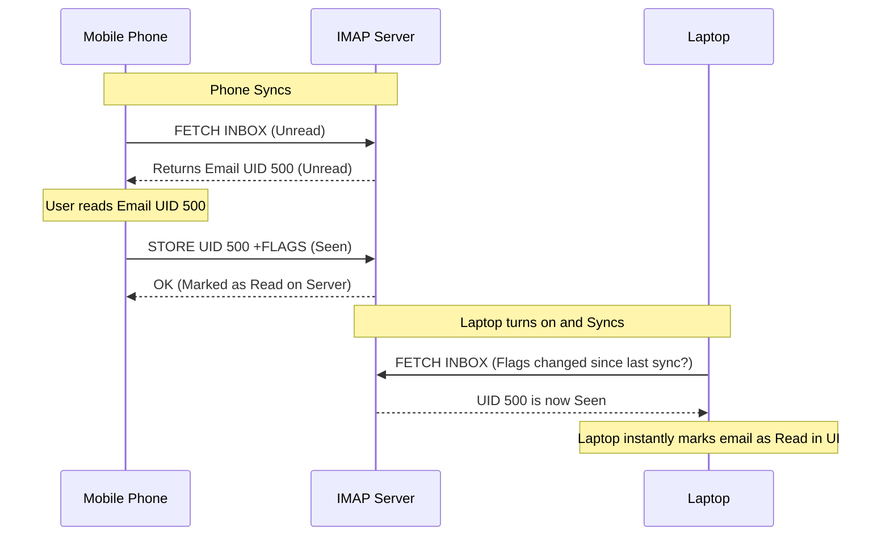

import { ConceptTemplate } from '@/features/kb/components/templates/ConceptTemplate'
import { Callout } from '@/features/kb/components/mdx/Callout'

export default function Layout({ children }) {
  return (
    <ConceptTemplate title="IMAP (Internet Message Access Protocol)">
      {children}
    </ConceptTemplate>
  )
}

**IMAP (Internet Message Access Protocol)**, currently in its 4th revision (IMAP4), is the modern standard for receiving email. (Note: **SMTP** is used for *sending* email, while IMAP is used exclusively for *retrieving* it).

Before IMAP became ubiquitous, the world relied on **POP3 (Post Office Protocol)**. POP3 was designed for an era when server hard drives were tiny and expensive. In POP3, an email client connects to the server, downloads the email to the local computer, and mathematically deletes the email from the server. 

IMAP was invented because modern users have multiple devices (a phone, a laptop, a tablet). IMAP is fundamentally a **synchronization protocol**. Emails live permanently on the server. When you read an email on your phone, the phone uses IMAP to tell the server to flag it as "Read." When you open your laptop, it syncs with the server and mathematically sees the "Read" flag, keeping all devices in perfect harmony.

## 1. Deep Dive & Mechanics

IMAP operates over TCP Port 143 (or Port 993 for IMAP over TLS/SSL, known as IMAPS). 

Unlike HTTP, which is stateless, IMAP relies on a persistent, stateful TCP connection. When a client connects, it authenticates and enters an **Authenticated State**. It can then select a specific Mailbox (e.g., `INBOX` or `Archive`).

Because emails can be massive (containing 20MB PDF attachments), IMAP is highly optimized for partial mathematical retrieval. An IMAP client can request *only* the email headers (Subject, Sender, Date) to quickly populate a list UI. If the user clicks on an email with a massive attachment, the client can use IMAP to fetch *only* the text body, leaving the 20MB binary attachment on the server until the user explicitly clicks "Download."

## 2. Mathematical / Theoretical Foundation

IMAP tracks the state of emails using a mathematical tagging system called **Message Sequence Numbers** and **UIDs (Unique Identifiers)**.

Every message in a folder is assigned a sequential number (1, 2, 3). However, if message 2 is deleted, message 3 mathematically shifts down and becomes message 2. This makes caching on a mobile phone extremely difficult.

To solve this, IMAP assigns a strict, monotonically increasing 32-bit **UID** to every message, along with a **UIDVALIDITY** value for the folder. A client (like Apple Mail) caches the UIDs locally. When it connects, it says: *"I have UIDs 100 through 500. Give me anything higher than 500."* This $O(1)$ synchronization mechanism mathematically guarantees the client and server remain perfectly synced without needing to re-download the entire 10GB mailbox.

## 3. Real-World Implementation

Like HTTP and FTP, IMAP is a plain-text protocol at its core (before TLS encryption is applied). You can interact with it via telnet or OpenSSL.

```bash
# Connect to an IMAP server over TLS (Port 993)
openssl s_client -crlf -connect imap.example.com:993

# The server greets you:
* OK IMAP4rev1 Service Ready

# IMAP commands must be prefixed with a unique transaction tag (e.g., a001)
a001 LOGIN myemail@example.com mypassword
a001 OK LOGIN completed

# Select the inbox
a002 SELECT INBOX
* 15 EXISTS (15 emails total)
a002 OK [READ-WRITE] SELECT completed

# Fetch the Subject and Sender of email #1
a003 FETCH 1 (BODY[HEADER.FIELDS (SUBJECT FROM)])
* 1 FETCH (BODY[HEADER.FIELDS (Subject From)] {55}
From: boss@example.com
Subject: Urgent Meeting
)
a003 OK FETCH completed

# Log out
a004 LOGOUT
```

## 4. Visualizations



## 5. Interview Prep

**Q: What is the IMAP `IDLE` command (Push Email)?**
**A:** In standard IMAP, the client must constantly mathematically poll the server (e.g., every 5 minutes) asking, *"Are there new emails?"* This wastes battery life on mobile devices. The IMAP `IDLE` extension allows the client to open the TCP connection and simply wait. When a new email arrives on the server, the server instantly pushes a notification down the open TCP socket to the phone, triggering a notification mathematically instantly (Push Email).

**Q: If you delete an email in an IMAP client, why isn't it actually deleted on the server immediately?**
**A:** IMAP separates the act of flagging an email from the mathematical act of purging it from the hard drive. When you delete an email, IMAP simply applies the `\Deleted` flag to the message. The email still exists. The server only physically destroys the data when the client explicitly issues the `EXPUNGE` command (which most email clients do automatically when you close the app or empty the Trash folder).

**Q: Why are modern APIs (like Microsoft Graph or Gmail REST API) replacing IMAP for developers?**
**A:** IMAP is incredibly complex to parse. The responses are formatted in a highly specific, nested ASCII structure (MIME formats) that requires heavy string manipulation. Modern REST APIs use standard JSON over HTTP, making it exponentially easier for a developer to write a Python script to read an inbox compared to dealing with raw IMAP socket programming.

## 6. Production Use Cases

- **Customer Support Software:** Platforms like Zendesk or Intercom utilize IMAP libraries in the background. They connect to a company's `support@company.com` inbox, constantly read incoming emails using IMAP, and mathematically convert those raw emails into Support Tickets in their database.
- **Email Migration Tools:** When an enterprise migrates from an on-premise Exchange server to Google Workspace, migration tools use IMAP to recursively iterate through every folder, download the MIME structures, and push them up to the new provider, preserving folder hierarchies and read/unread flags perfectly.

<Callout icon="info" title="The JMAP Successor">
Because IMAP is showing its age (developed in the 1980s), the IETF recently standardized **JMAP (JSON Meta Application Protocol)** (RFC 8620). Backed by companies like Fastmail, JMAP seeks to replace IMAP entirely by providing a mathematically optimized, JSON-based, stateless API over HTTPS. It drastically reduces battery consumption on mobile devices and eliminates the need for holding open fragile, long-lived TCP connections.
</Callout>
