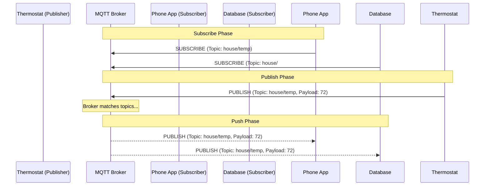

import { ConceptTemplate } from '@/features/kb/components/templates/ConceptTemplate'
import { Callout } from '@/features/kb/components/mdx/Callout'

export default function Layout({ children }) {
  return (
    <ConceptTemplate title="MQTT (Message Queuing Telemetry Transport)">
      {children}
    </ConceptTemplate>
  )
}

**MQTT (Message Queuing Telemetry Transport)** is the undisputed king of IoT (Internet of Things) messaging. Invented in 1999 by IBM to monitor oil pipelines over fragile satellite links, it was engineered with one primary goal: absolute mathematical efficiency over unreliable networks.

Unlike HTTP's heavy Request/Response model, MQTT uses a **Publish/Subscribe (Pub/Sub)** architecture. Devices do not talk directly to each other. Instead, every device holds open a tiny, persistent TCP connection to a central server called the **MQTT Broker**. 

## 1. Deep Dive & Mechanics

In MQTT, data is organized into hierarchical **Topics** (e.g., `house/livingroom/temperature`).

- **Publishers:** A smart thermostat publishes a message (`"72F"`) to the topic `house/livingroom/temperature`. The thermostat has no idea if anyone is listening; it just blindly hands the message to the Broker.
- **Subscribers:** A smartphone app connects to the Broker and subscribes to `house/livingroom/temperature`. 
- **The Broker:** When the Broker receives the "72F" message, it instantly duplicates and mathematically routes the message to every currently connected subscriber of that topic.

Because the TCP connection is kept alive via tiny, 2-byte PING packets, the Broker can *push* data to the smartphone app instantly, without the app needing to drain its battery by constantly polling the server.

## 2. Mathematical / Theoretical Foundation

The most critical mathematical feature of MQTT is its implementation of **Quality of Service (QoS)**, which guarantees message delivery over unreliable cellular or satellite networks.

- **QoS 0 (At most once):** "Fire and forget." The publisher sends the message. If the Wi-Fi drops and the packet is lost, the message is gone forever. (Lowest latency, zero overhead).
- **QoS 1 (At least once):** The publisher mathematically stores the message in RAM and sends it. It waits for a `PUBACK` (Acknowledgment) from the Broker. If it doesn't receive it, it re-sends. This guarantees delivery, but a network glitch might cause the Broker to receive the exact same message *twice*.
- **QoS 2 (Exactly once):** The highest overhead. It uses a complex 4-step mathematical handshake (`PUBLISH` -> `PUBREC` -> `PUBREL` -> `PUBCOMP`) to mathematically guarantee the message is delivered exactly one time, with no duplicates.

## 3. Real-World Implementation

Developers interact with MQTT Brokers (like Mosquitto, HiveMQ, or AWS IoT Core) using lightweight client libraries.

```javascript
// Example using the MQTT.js library in Node.js
const mqtt = require('mqtt');

// Connect to a public test broker
const client = mqtt.connect('mqtt://test.mosquitto.org');

client.on('connect', () => {
  console.log('Connected to Broker!');
  
  // Subscribe to a topic
  client.subscribe('factory/machine1/rpm', { qos: 1 });

  // Publish a message to a different topic
  client.publish('factory/machine2/status', 'ONLINE', { qos: 1, retain: true });
});

// Fired whenever a message arrives on our subscribed topic
client.on('message', (topic, message) => {
  console.log(`Received [${topic}]: ${message.toString()}`);
});
```

## 4. Visualizations



## 5. Interview Prep

**Q: What is a "Retained Message" in MQTT?**
**A:** Normally, if a subscriber is offline when a message is published, they miss it. If a publisher sets the `retain: true` flag, the Broker mathematically saves the *last known good value* for that topic in its RAM. When a new subscriber eventually connects, the Broker instantly sends them the retained message so they know the current state (e.g., the current temperature) without waiting for the next publishing cycle.

**Q: What is the "Last Will and Testament" (LWT) feature?**
**A:** When an IoT device connects to the Broker, it can register a "Will". For example: *"If my TCP connection drops unexpectedly without a clean disconnect, publish the message 'OFFLINE' to topic 'device/status'."* This allows the entire network to instantly and mathematically know when a device has lost power or crashed.

**Q: What is the difference between MQTT and HTTP?**
**A:** HTTP is document-centric, Request/Response, stateless, and has massive header overhead (hundreds of bytes). MQTT is data-centric, Pub/Sub, stateful (persistent connection), and has a tiny 2-byte header overhead. MQTT is mathematically vastly superior for real-time telemetry, while HTTP is superior for fetching large documents or images.

## 6. Production Use Cases

- **Smart Home Ecosystems:** Platforms like Home Assistant use a local Mosquitto MQTT broker as the central nervous system of the house. A smart light switch publishes `"pressed"`, and the Philips Hue integration (which is subscribed) instantly turns on the lights.
- **Enterprise Fleet Management:** Logistics companies with thousands of delivery trucks use MQTT over cellular networks. The trucks publish GPS coordinates every 5 seconds. If the truck drives through a tunnel (losing 4G), the MQTT client queues the QoS 1 messages locally and blasts them all to the broker the second the connection is restored, guaranteeing no data loss.

<Callout icon="danger" title="Security and Plain Text">
By default, MQTT operates over Port 1883 in absolute plain text with no encryption. Anyone on the network can easily subscribe to `#` (the global wildcard) and read every single message flowing through the system. In production, MQTT must ALWAYS be wrapped in TLS (operating on Port 8883) to ensure encryption, and Brokers must be configured to require strict username/password or X.509 Certificate authentication for every connecting device.
</Callout>
