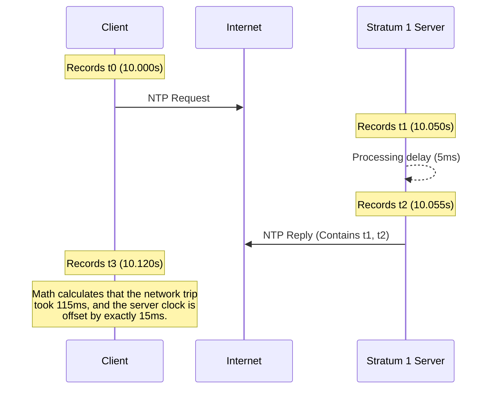

import { ConceptTemplate } from '@/features/kb/components/templates/ConceptTemplate'
import { Callout } from '@/features/kb/components/mdx/Callout'

export default function Layout({ children }) {
  return (
    <ConceptTemplate title="NTP (Network Time Protocol)">
      {children}
    </ConceptTemplate>
  )
}

The **Network Time Protocol (NTP)** (Port 123, UDP) is one of the oldest and most mathematically complex protocols on the internet, designed by David Mills in 1985. 

Time synchronization is the invisible glue of modern computer science. If the clocks on two servers drift apart by even 5 minutes, TLS certificates will mathematically fail to validate (appearing expired), Kerberos authentication will reject logins to prevent replay attacks, and distributed databases (like Cassandra or Spanner) will corrupt data because they cannot determine the correct chronological order of database writes.

## 1. Deep Dive & Mechanics

NTP does not simply ask a server, *"What time is it?"* and set the local clock. Network physics makes that impossible. 
If a server says it is exactly 12:00:00.000, and it takes the packet 50 milliseconds to travel across the internet, setting your local clock to 12:00:00.000 would mean your clock is instantly wrong by 50ms.

NTP uses a sophisticated mathematical formula involving four timestamps to completely eliminate the network latency from the equation:
1. $t_0$: Client sends the packet.
2. $t_1$: Server receives the packet.
3. $t_2$: Server sends the reply.
4. $t_3$: Client receives the reply.

The client mathematically calculates the exact network delay $\delta = (t_3 - t_0) - (t_2 - t_1)$ and the exact clock offset $\theta = \frac{(t_1 - t_0) + (t_2 - t_3)}{2}$. This algorithm allows NTP to synchronize computer clocks across the chaotic public internet to within a few milliseconds of accuracy.

## 2. Mathematical / Theoretical Foundation

NTP operates on a strict hierarchical architecture known as **Strata** (singular: Stratum).

- **Stratum 0:** These are not computers. They are high-precision timekeeping devices: Atomic Clocks, GPS satellites, or Quantum Clocks.
- **Stratum 1:** Servers directly, physically wired (via Serial or PCIe) to a Stratum 0 device. These are the most accurate computers on earth.
- **Stratum 2:** Servers that sync their time over the network from Stratum 1 servers.
- **Stratum 3:** Servers that sync from Stratum 2, and so on (up to a mathematical maximum of 15; Stratum 16 is considered "unsynchronized").

Your laptop or cloud VM is typically a Stratum 3 or Stratum 4 device, constantly running an algorithm called **Marzullo's algorithm** to query multiple different servers, discard the outliers (liars), and average the remaining responses to find the true time.

## 3. Real-World Implementation

Most Linux systems run the modern, lightweight `chrony` daemon (or legacy `ntpd`) in the background to handle NTP automatically.

```bash
# Check the current status of time synchronization on Linux
timedatectl status

# View the mathematical breakdown of the NTP servers you are currently querying
# (Shows stratum, polling interval, delay, offset, and jitter)
chronyc sources -v

# Example Output snippet:
#   .-- Source mode  '^' = server, '=' = peer, '#' = local clock.
#  / .- Source state '*' = current best, '+' = combined, '-' = not combined
# | /   Name/IP Address            NP  NR  Span  Frequency  Freq Skew  Offset  Std Dev
# ========================================================================================
# ^* time.cloudflare.com            3   3   140     +0.010      0.540  +150us   120us
```

## 4. Visualizations



## 5. Interview Prep

**Q: What is a Leap Second, and how does it break computer systems?**
**A:** The Earth's rotation is mathematically slowing down. To keep human clocks aligned with the sun, scientists occasionally add a "Leap Second" to the official atomic clocks (e.g., 23:59:59 is followed by 23:59:60). Traditional NTP propagates this 60th second. Many Linux kernels and databases panic when they see "60" in the seconds field and crash instantly (which famously took down Reddit, Mozilla, and Qantas Airlines in 2012). 

**Q: How do modern companies handle the Leap Second?**
**A:** Google invented the **Leap Smear**. Instead of inserting a sudden 60th second, Google's custom Stratum 1 NTP servers intentionally lie. For the 24 hours leading up to a leap second, they mathematically slow down their NTP clocks by 11.5 microseconds per second. By the time the leap second occurs, the computers are already perfectly aligned without ever seeing a 60 in the timestamp.

**Q: What is an NTP Amplification DDoS Attack?**
**A:** NTP uses connectionless UDP. An attacker sends a tiny 48-byte UDP query (specifically the `monlist` command) to a misconfigured public NTP server, spoofing the Source IP to be the victim's IP. The NTP server mathematically amplifies this, sending a massive list of its last 600 clients (often 3,000+ bytes) directly to the victim. This 60x amplification allows a small botnet to generate Terabytes of DDoS traffic.

## 6. Production Use Cases

- **Distributed Databases (Google Spanner):** Traditional databases use auto-incrementing integers for IDs. Distributed databases use Timestamps. If Server A is in Tokyo and Server B is in London, they must have perfectly synchronized clocks to know which transaction mathematically happened first. Google built "TrueTime", a highly advanced API that utilizes GPS antennas and Atomic Clocks wired directly into their data center racks to guarantee NTP accuracy within 1 millisecond.
- **Financial Trading Systems:** High-Frequency Trading (HFT) firms execute thousands of stock trades per second. Regulations mathematically require every trade to be timestamped with microsecond accuracy to prevent front-running. These firms often bypass internet NTP entirely, installing their own GPS-synced Stratum 1 grandmaster clocks inside the stock exchange data center using PTP (Precision Time Protocol).

<Callout icon="info" title="Slewing vs Stepping">
If an NTP client boots up and realizes its clock is wrong by 1 hour, it will **Step** the time (instantly jumping the clock forward or backward 1 hour). This is highly dangerous for running databases. However, if the clock is only wrong by a few milliseconds, NTP will **Slew** the time. It alters the mathematical frequency of the CPU's hardware clock tick, causing the clock to run 0.05% faster or slower for a few minutes until it gently drifts back into perfect synchronization without any sudden jumps.
</Callout>
