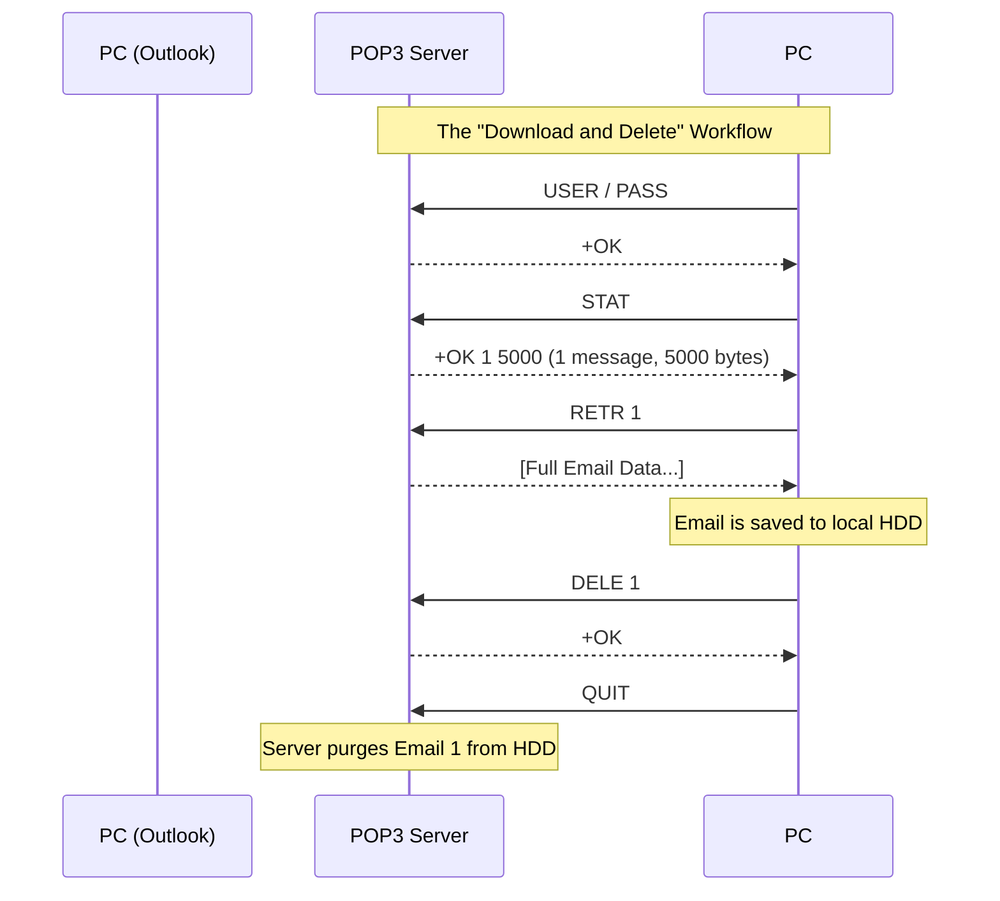

import { ConceptTemplate } from '@/features/kb/components/templates/ConceptTemplate'
import { Callout } from '@/features/kb/components/mdx/Callout'

export default function Layout({ children }) {
  return (
    <ConceptTemplate title="POP3 (Post Office Protocol version 3)">
      {children}
    </ConceptTemplate>
  )
}

The **Post Office Protocol version 3 (POP3)** is the grandfather of email retrieval. Designed in the 1980s (RFC 1939), it was built for an era when internet connections were established using screeching dial-up modems that charged by the minute, and server hard drive space was incredibly expensive.

POP3's design philosophy is exactly like a physical Post Office box. Your mail is delivered to the Post Office (the Server). You drive to the Post Office, physically take all your letters out of the box, bring them home (the Client), and the Post Office box is now completely empty.

## 1. Deep Dive & Mechanics

POP3 operates over TCP Port 110 (or Port 995 for encrypted POP3S). 

It is a mathematically simple, linear, state-machine protocol. The workflow is rigidly defined:
1. **Authorization State:** The client connects and provides credentials (`USER` and `PASS`).
2. **Transaction State:** The client asks how many emails exist (`STAT`). The client then iterates through a loop, explicitly downloading the full binary content of each email one by one (`RETR 1`, `RETR 2`). Finally, it marks them for deletion (`DELE`).
3. **Update State:** The client sends the `QUIT` command. *Only at this moment* does the server mathematically purge the downloaded emails from its hard drive.

There is no concept of "folders", "read/unread status", or "syncing" in standard POP3. It is a one-way dump of data.

## 2. Mathematical / Theoretical Foundation

The protocol uses sequential integer numbering to mathematically identify messages during a session.

If the `STAT` command reports 3 emails, they are mathematically identified as 1, 2, and 3 for the duration of that specific TCP connection. However, these numbers are not permanent. If you delete message 1 and reconnect tomorrow, the old message 2 is mathematically reassigned as the new message 1.

To solve the problem of clients crashing mid-download, POP3 introduced the **UIDL (Unique ID Listing)** command. The server generates a persistent hash string (e.g., `0853.xyz`) for every email. The client maintains a mathematical database of UIDLs on its local hard drive. Upon connecting, the client checks the server's UIDL list against its local database and only issues `RETR` commands for the hashes it doesn't already have.

## 3. Real-World Implementation

Because POP3 is a simple, line-based ASCII protocol, you can interact with it manually just like HTTP or SMTP.

```bash
# Connect to a POP3 server securely
openssl s_client -crlf -connect pop.example.com:995

# Server greeting
+OK POP3 server ready

# Authentication
USER myemail@example.com
+OK Password required
PASS mypassword
+OK Logged in.

# Ask for the status (Returns number of messages and total byte size)
STAT
+OK 2 32014

# Retrieve message #1 (Prints the full MIME source of the email)
RETR 1
+OK 1204 octets
From: boss@example.com
Subject: Meeting
... (Email Body) ...
. (A single period on a line indicates the end of the message)

# Mark message #1 for deletion
DELE 1
+OK Message 1 deleted

# Commit deletions and disconnect
QUIT
+OK Logging out.
```

## 4. Visualizations



## 5. Interview Prep

**Q: What is the primary difference between POP3 and IMAP?**
**A:** POP3 is a **download-and-delete** protocol designed for offline reading on a single device. IMAP is a **synchronization** protocol designed to keep emails permanently on the server, allowing multiple devices (phone, laptop, tablet) to view the exact same inbox, folders, and read/unread states in real-time.

**Q: Can you configure POP3 to leave messages on the server?**
**A:** Yes. Modern email clients allow you to check a box saying "Leave a copy of messages on the server." The client will use the UIDL command to download new emails, but will intentionally *skip* sending the `DELE` command. However, because POP3 has no concept of "read/unread" flags, if you read an email on your PC, it will still appear as "Unread" when you later connect via your phone.

**Q: Why is POP3 considered obsolete for consumer use?**
**A:** The multi-device explosion killed POP3. If a user sets up POP3 on their laptop without checking "Leave a copy", the laptop downloads their emails and deletes them from the server. When the user later checks their phone, the inbox is empty. Furthermore, if the laptop's hard drive crashes, the user loses their entire email history permanently because the server no longer has copies.

## 6. Production Use Cases

- **Automated Ingestion Systems:** POP3 is still heavily used by backend software scripts. For example, a company might set up `invoices@company.com`. A Python script runs a cron job every 5 minutes to connect via POP3, download the PDF attachments, parse them into a database, and mathematically delete the emails from the server to keep the inbox perfectly clean and zero out storage costs.
- **High-Security Air-Gapped Environments:** In certain military or intelligence environments, security policy dictates that emails must not reside permanently on a centralized server where they could be hacked en masse. POP3 forces the emails to be downloaded to secured, physically isolated client terminals, ensuring the central server acts only as a temporary transit relay.

<Callout icon="info" title="POP3 Status Codes">
Unlike HTTP, which has dozens of complex numeric status codes (200, 404, 500), POP3 is incredibly blunt. It only has two mathematical states for a response: `+OK` (Success) or `-ERR` (Failure). The exact reason for the failure is simply appended as human-readable text after the `-ERR` string.
</Callout>
