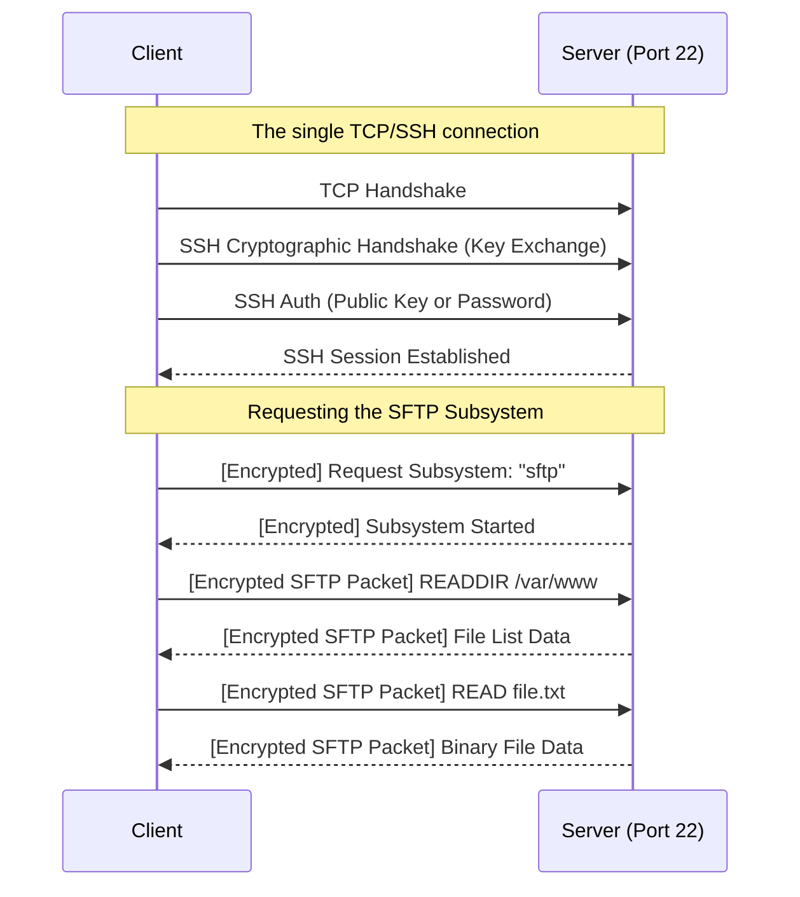

import { ConceptTemplate } from '@/features/kb/components/templates/ConceptTemplate'
import { Callout } from '@/features/kb/components/mdx/Callout'

export default function Layout({ children }) {
  return (
    <ConceptTemplate title="SFTP (SSH File Transfer Protocol)">
      {children}
    </ConceptTemplate>
  )
}

**SFTP (SSH File Transfer Protocol)** is the modern, secure industry standard for transferring files between servers. 

Despite the name, SFTP has **absolutely nothing to do with the legacy FTP protocol**. It does not use the bizarre, firewall-breaking two-port architecture (Active/Passive mode) of FTP. 

Instead, SFTP is a dedicated binary subsystem engineered entirely on top of the **SSH (Secure Shell)** protocol. Because it rides inside an SSH tunnel, it operates exclusively over a single TCP port (Port 22), is fully encrypted from end-to-end, and mathematically utilizes SSH's robust public-key cryptography for authentication.

## 1. Deep Dive & Mechanics

When an SFTP client connects to a server, it is literally just performing a standard SSH login. 

However, instead of opening a standard interactive bash terminal shell (`/bin/bash`), the SSH daemon on the server launches a hidden background process (usually `sftp-server`). The client and this background process begin communicating mathematically using the structured binary SFTP protocol over the encrypted SSH pipeline.

SFTP is not just for transferring files. It is a full remote file system protocol. A client can pause transfers, resume broken transfers, delete files, change Unix permissions (chmod), change owners (chown), and create symbolic links—all via specific mathematical binary packet requests.

## 2. Mathematical / Theoretical Foundation

Because SFTP inherits all the cryptographic math of SSH, it is mathematically impenetrable to Packet Sniffing and Man-in-the-Middle (MitM) attacks.

1. **Host Verification:** Upon connecting, the server presents its public key fingerprint (e.g., Ed25519 or RSA). The client mathematically verifies this against its local `~/.ssh/known_hosts` file to guarantee it isn't talking to an imposter server.
2. **Key Exchange (DH):** The two machines use Diffie-Hellman mathematical key exchange to securely derive a shared symmetric encryption key.
3. **Symmetric Encryption (AES):** The actual file data is chunked, encrypted via fast mathematical algorithms like AES-GCM, and mathematically hashed (MAC) to guarantee that not a single byte was corrupted or tampered with in transit.

## 3. Real-World Implementation

Interacting with SFTP via the CLI is nearly identical to legacy FTP, but the underlying mechanics are completely different.

```bash
# Connect to a remote server via SFTP using an SSH Key
sftp -i ~/.ssh/id_rsa user@192.168.1.50

# The interactive prompt begins:
sftp> ls -la        # List remote directory
sftp> pwd           # Print remote working directory
sftp> lcd /tmp      # Change LOCAL working directory to /tmp
sftp> get large.tar # Download from server to local /tmp
sftp> put code.zip  # Upload from local /tmp to server
sftp> chmod 644 code.zip # Modify remote Unix permissions
sftp> exit
```

## 4. Visualizations



## 5. Interview Prep

**Q: What is the difference between SFTP, FTPS, and SCP?**
**A:** 
- **SFTP:** A modern binary protocol running inside SSH (Port 22). (Best Practice).
- **FTPS:** The legacy FTP protocol (Port 21 + random data ports) wrapped in TLS encryption. Nightmare for firewalls.
- **SCP (Secure Copy):** An older protocol also running over SSH. While SFTP is a full remote-management protocol allowing you to pause/resume and list directories, SCP is a "fire-and-forget" tool that mathematically blindly streams the file bytes. SCP is considered deprecated by the OpenSSH team due to architectural flaws; modern `scp` commands actually run SFTP under the hood.

**Q: Why is SFTP incredibly easy for network engineers to configure in firewalls?**
**A:** Because it operates entirely over a single, predictable port (TCP 22). If a company allows outbound SSH traffic, SFTP is mathematically guaranteed to work. It requires zero complex firewall ALGs (Application Layer Gateways) and never opens random data ports like legacy FTP.

**Q: How do you prevent an SFTP user from browsing the entire Linux filesystem?**
**A:** Using a **Chroot Jail**. In the server's `sshd_config`, you can configure `ChrootDirectory /var/sftp/uploads` for a specific user. When they log in via SFTP, the kernel mathematically tricks their session into believing `/var/sftp/uploads` is the root `/` of the hard drive. They cannot `cd ..` out of it to read sensitive files like `/etc/shadow`.

## 6. Production Use Cases

- **B2B Automated Data Feeds:** Massive corporations (banks, healthcare providers, retail chains) rely on SFTP to securely transmit batch data. Every night, a bank might use a cron job to push a 50GB encrypted CSV of daily transactions to a partner's SFTP server via automated public-key authentication.
- **Web Server Deployment:** Developers routinely use GUI SFTP clients (like FileZilla, Cyberduck, or WinSCP) to securely drag-and-drop compiled application code or media assets directly into the `/var/www/html` folder of an Nginx server, leveraging the server's existing SSH infrastructure without needing to install dedicated FTP server software.

<Callout icon="warning" title="SFTP Performance vs FTP">
Because SFTP operates inside an SSH tunnel, every single byte of the file must be mathematically encrypted by the CPU on the sender side, and decrypted by the CPU on the receiver side. Furthermore, SSH has internal window-sizing limits. If you are transferring a 500GB file over a high-latency 10Gbps link, SFTP will often max out the CPU core or hit window limits, resulting in significantly slower raw transfer speeds than unencrypted legacy FTP.
</Callout>
