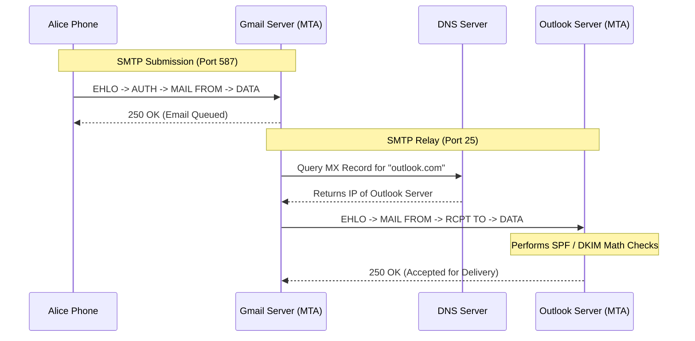

import { ConceptTemplate } from '@/features/kb/components/templates/ConceptTemplate'
import { Callout } from '@/features/kb/components/mdx/Callout'

export default function Layout({ children }) {
  return (
    <ConceptTemplate title="SMTP (Simple Mail Transfer Protocol)">
      {children}
    </ConceptTemplate>
  )
}

**SMTP (Simple Mail Transfer Protocol)** is the engine that actually *moves* email across the internet. While protocols like IMAP or POP3 are used by your phone to *retrieve* an email that is already sitting in your inbox, SMTP is the protocol used to *send* an email from your phone to the server, and critically, to route that email from your server (e.g., Google) to the recipient's server (e.g., Microsoft).

Designed in 1982 (RFC 821), it is a plain-text, command-response protocol operating over TCP Port 25 (for server-to-server routing) and Port 587 (for client-to-server submission).

## 1. Deep Dive & Mechanics

When you click "Send" in an email app, the SMTP protocol engages in a highly specific mathematical conversation:

1. **Handshake (HELO/EHLO):** The client introduces itself.
2. **Envelope Sender (MAIL FROM):** Specifies who the email is mathematically from (used for bounce messages, not what the user sees in their email app).
3. **Envelope Recipient (RCPT TO):** Specifies where the server needs to route the email.
4. **Data Transfer (DATA):** The client transmits the actual email headers (Subject, Date, To) and the payload (Body, Attachments) formatted in MIME (Multipurpose Internet Mail Extensions).
5. **Termination:** The client sends a single period (`.`) on a new line to signify the end of the data, and issues the `QUIT` command.

If the server accepts the email, it becomes an **MTA (Mail Transfer Agent)**. It performs a DNS MX record lookup for the recipient's domain, opens a new SMTP TCP connection to the recipient's server, and repeats the exact same SMTP conversation to hand off the email.

## 2. Mathematical / Theoretical Foundation

The most mathematically complex part of modern SMTP isn't the transfer itself; it is the **Spam Verification Framework**. Because SMTP originally had zero authentication (anyone could telnet to Port 25 and claim to be `president@whitehouse.gov`), modern email relies on three mathematical DNS mechanisms to verify identity:

1. **SPF (Sender Policy Framework):** A DNS TXT record that mathematically lists the exact IP addresses authorized to send email on behalf of a domain.
2. **DKIM (DomainKeys Identified Mail):** The sending server mathematically signs the email headers and body using an Asymmetric Private Key. The receiving server fetches the Public Key from DNS and verifies the cryptographic signature to ensure the email wasn't tampered with.
3. **DMARC (Domain-based Message Authentication):** A policy record that tells the receiving server exactly what to do (e.g., quarantine or reject) if the SPF or DKIM mathematical checks fail.

## 3. Real-World Implementation

You can manually send an email by simply typing SMTP commands into a raw TCP socket.

```bash
# Connect to a mail server (using telnet for Port 25, or openssl for encrypted Port 465/587)
telnet mail.example.com 25

# Server replies:
# 220 mail.example.com ESMTP Postfix

# The SMTP Conversation:
HELO mycomputer.local
# 250 mail.example.com
MAIL FROM:<alice@example.com>
# 250 2.1.0 Ok
RCPT TO:<bob@example.com>
# 250 2.1.5 Ok
DATA
# 354 End data with <CR><LF>.<CR><LF>
Subject: Hello Bob!
From: Alice <alice@example.com>
To: Bob <bob@example.com>

This is the body of the email.
.
# 250 2.0.0 Ok: queued as 4A7B2C
QUIT
# 221 2.0.0 Bye
```

## 4. Visualizations



## 5. Interview Prep

**Q: What is the difference between Port 25, Port 465, and Port 587 in SMTP?**
**A:** 
- **Port 25:** The original unencrypted port used for *Server-to-Server* relaying. (ISPs block this for residential users to prevent malware from spamming).
- **Port 465 (SMTPS):** Implicit TLS. The connection mathematically requires a TLS crypto-handshake before any SMTP commands are spoken. (Largely deprecated).
- **Port 587:** The modern standard for *Client-to-Server* submission. It uses **STARTTLS** (Explicit TLS). The client connects via plain-text, issues the `STARTTLS` command, and mathematically upgrades the connection to encrypted TLS before sending passwords or data.

**Q: In SMTP, what is the difference between the "Envelope From" and the "Header From"?**
**A:** The **Envelope From** is defined during the `MAIL FROM:` SMTP command. This is used by the servers for routing and bouncing (where to return the email if it fails). The **Header From** (`From: Alice <alice@...`) is embedded inside the `DATA` payload. This is what the end-user actually sees in their email app. Scammers often mathematically forge the Header From to look like a bank, while using a spammer's address in the Envelope From to pass SPF checks.

**Q: What is MIME, and why is it necessary for SMTP?**
**A:** SMTP is mathematically limited to 7-bit ASCII text. You cannot send an image or a PDF (which are 8-bit binary data) directly over SMTP; it will corrupt the network stream. **MIME (Multipurpose Internet Mail Extensions)** solves this by base64-encoding the binary image into a massive string of mathematically safe ASCII text, allowing it to traverse the 7-bit SMTP protocol safely.

## 6. Production Use Cases

- **Transactional Email APIs:** When a user clicks "Forgot Password" on a modern web app, the backend Node.js server doesn't usually run its own SMTP server. Instead, it uses an API to contact a service like SendGrid, Amazon SES, or Mailgun. Those services utilize highly optimized fleets of Postfix MTAs to mathematically sign the emails (DKIM) and blast them out over SMTP Port 25 to the global internet.
- **System Alerts and Cron Jobs:** Almost all Linux servers come pre-installed with a lightweight SMTP daemon. If a critical cron job fails, or a hard drive is mathematically predicted to fail (SMART errors), the Linux kernel generates an alert and uses the local SMTP agent to send a plain-text email directly to the system administrator.

<Callout icon="warning" title="Open Relays">
In the 1990s, many MTAs were configured as "Open Relays". This meant if a spammer connected to Server A, and asked Server A to send an email to Server B, Server A would blindly do it without requiring a password. Spammers exploited this mathematically to hide their tracks and distribute massive loads of spam through innocent corporate servers, getting those servers blacklisted. Today, almost all MTAs strictly require authentication for Client-to-Server submission to prevent Open Relaying.
</Callout>
